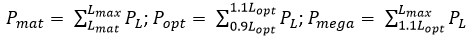

# Data-limited methods review

José A. A. De Oliveira, Piera Carpi, Nicola D. Walker, Simon Fischer, Timothy J. Earl, Sarah Davie 

## Executive Summary

A review is provided of a wide-range of data-limited methods and a selection of data moderate methods that could be useful to the DRUMFISH project. Included in the review are papers that have compared some of the methodologies, providing additional simulation-testing and real-world applications of some of these methods. Requirements for DRUMFISH are methods that are easily accessible and available for application, and that can be used for forward projections/forecasting. Two methods in particular are highlighted as meeting these criteria for data-limited and data-moderate cases, namely CMSY for the former and SPiCT for the latter, given their track record of use in the ICES advisory process and the ease of “slotting in” with current simulation tools for DRUMFISH. Nevertheless, there are a range of other methods that also meet the criteria and could be used.

## Table of Contents

[Introduction and summary](#introduction-and-summary)

[Data limited approaches: catch-only methods with supplementary information](#data-limited-approaches-catch-only-methods-with-supplementary-information)

[Data limited approaches: catch-only methods with supplementary data and information](#data-limited-approaches-catch-only-methods-with-supplementary-data-and-information)

[Data limited approaches: life-history, per-recruit and length-based approaches](#data-limited-approaches-life-history-per-recruit-and-length-based-approaches)

[Data limited approaches: qualitative and semi-quantitative approaches](#data-limited-approaches-qualitative-and-semi-quantitative-approaches)

[Comparisons and additional simulation testing](#comparisons-and-additional-simulation-testing)

[Real-world examples and applications](#real-world-examples-and-applications)

[Some data-moderate approaches](#some-data-moderate-approaches)

[Supplementary and other approaches: mixed fishery approaches](#supplementary-and-other-approaches-mixed-fishery-approaches)

[Supplementary and other approaches: MPA approaches](#supplementary-and-other-approaches-mpa-approaches)

[Supplementary and other approaches: PSA approaches](#supplementary-and-other-approaches-psa-approaches)

[Supplementary and other approaches: general](#supplementary-and-other-approaches-general)

[Simulation-tested data-limited harvest control rules](#simulation-tested-data-limited-harvest-control-rules)

[Other reviews](#other-reviews)

## Introduction and summary

This document provides a review of data-limited approaches, alternatively referred to as “data-poor”, and distinct from both data-moderate approaches, which typically include indices of biomass/abundance in addition to catch data and life-history information, and data-rich approaches, which include full analytical assessments. Data limited approaches (Section 2) cover catch-based approaches (catch-only methods with supplementary information), life-history, per-recruit and length-based approaches, and qualitative and semi-quantitative approaches. There are a number of papers that compared the performance of some of the methods and that conducted additional simulation testing, providing some useful additional insights into the methods presented (Section 3). Real-world applications are covered in Section 4, although sometimes only the abstract is provided for reference: these papers provide useful examples of application of the methods. Some data-moderate methods that may be of interest are covered in Section 5, although this section is not intended to be fully comprehensive. Supplementary and other approaches that may be of interest are covered in Section 6, including mixed fishery, MPA, PSA and other general approaches (sometimes only the abstract is supplied). Section 7 covers simulation-tested data-limited harvest control rules, not directly relevant to the DRUMFISH project, but nevertheless included for interest. Other methods’ reviews, similar to this document, and from which some inspiration was drawn (e.g. Geromont and Butterworth) are covered in Section 8 (again, sometimes only the abstract is supplied for completeness). Within each review the authorship, title and abstract is supplied, and the paper is generally summarised through the topics “data/information requirements”, “assumptions”, “outputs expected”, “method of operation”, “testing”, “caveats” and in some cases “ability to project forward/forecast” (the latter topic was added much later, so is not universally used). Some adjustments to this general structure are made for, e.g. simulation-testing papers that cover several methods.

A summary spreadsheet is available (not included here), which organises the information in a more easily digestible format, and includes links to where the software from some methods may be accessed (websites and/or github repositories). In general, the DRUMFISH project is interested in methods that are able to be used for forward projecting/forecasting, in addition to being readily available to use. These requirements whittle down the methods that would be useful to DRUMFISH. In particular, two methods that have already been used within the ICES advisory system and provide the required tools for DRUMFISH are catch-MSY [(CMSY, Martel and Froese 2013)](http://onlinelibrary.wiley.com/doi/10.1111/j.1467-2979.2012.00485.x/abstract) for data-limited cases, and the stochastic surplus production model in continuous time [(SPiCT, Pedersen and Berg 2016)](http://onlinelibrary.wiley.com/doi/10.1111/faf.12174/abstract) for data-moderate cases. These methods produce consistent outputs (they are both biomass dynamic models, and the latter can take on a Schaeffer form, which the former is hard-wired to do), and can be straight-forwardly incorporated into the simulation tools currently available for DRUMFISH.

This does not preclude other methods from being used, where appropriate, and there are a number of these that could potentially be useful, particularly for data-limited methods, although attention is drawn to Section 3, where some of these methods have been compared and simulation-tested. These tests have found that quantitative catch-only methods (DCAC, DB-SRA, CMSY, etc.) are generally highly sensitive to assumptions about depletion, and semi-quantitative catch-only methods (e.g. Froese and Kesner-Reyes, and Kleisner and Pauly) are more negatively biased on average than methods that explicitly model population dynamics with the use of additional fishing effort data. Furthermore, only those methods that dynamically account for changes in abundance and/or depletion perform well at low stock sizes. In essence, there is a high value for including additional information regarding stock depletion, historical fishing effort and current abundance when only catch data are available, but this information is often lacking. In the simulation exercise that compared catch-only methods (Rosenberg et al. 2014), CMSY with catch-only data was rated the best performer and was more effective in estimating stock status over short time scales. Furthermore, regarding SPiCT, simulation work conducted for WKLIFE 6 (ICES in prep) found that for over-exploited stocks, SPiCT was able to correctly identify an undesirable state and hence appropriately invoke a precautionary buffer when needed, thus demonstrating good performance of this model.

Despite the fact that CMSY with catch-only data can take the form of, and behave like, a Schaeffer model, a general guideline is that, if some index of biomass or abundance is available (from commercial CPUE or fishery-independent data), one should always move to a full biomass dynamic model (e.g. SPiCT, ASPIC, etc.). There is also now available (not reviewed here, since it was only published after the review was completed) a Bayesian version of CMSY that can also incorporate an index of abundance.

A final consideration is that the Robin Hood approach is commonly used in many applications. The idea has a relatively long history, but has been formally described in [Punt et al. (2011 - not reviewed here, but available in the sharepoint)](https://academic.oup.com/icesjms/article/68/5/972/653125/Among-stock-comparisons-for-improving-stock). The Robin-Hood approach refers to the practice of borrowing information from data-rich stock assessments, e.g. trends in fishing mortality and values for parameters of selectivity functions, to assess data-poor stock, which leads to stock assessments for the most data-poor stocks being informed by those for the most data-rich stocks. [Bentley (2015)](https://academic.oup.com/icesjms/article/72/1/186/822177/Data-and-time-poverty-in-fisheries-estimation) argues a similar approach where prior probability distributions are used to transfer knowledge from data-rich to data-poor fisheries. This practice has been widely recognized as effective whenever the lack of data prevents an assessment, and as such relevant for the DRUMFISH project.

## Data-limited approaches: Catch-only methods with supplementary information

### [Vasconcellos, M. and K. Cochrane (2005). Overview of world status of data-limited fisheries: inferences from landing statistics. In G.H. Kruse, V.F. Gallucci, D.E. Hay, R.I. Perry, R.M. Peterman, T.C. Shirley, P.D. Spencer, B. Wilson & D. Woodby, eds. Fisheries assessment and management in data-limited situations, pp. 1–20. Fairbanks, USA, Alaska Sea Grant College Program AK-SG-05-02.](https://seagrant.uaf.edu/bookstore/pubs/item.php?id=11958)

Abstract: Data-limited fisheries are here considered to be fisheries lacking sufficient reliable biological information to infer the exploitation status of the targeted stocks. Considering species-specific catch data as the common minimum available data for assessing the status of a stock, in this paper we use the taxonomic breakdown of the reported landings statistics to FAO to make an approximate inference of data limitation of fisheries by region, country, and taxonomic groups. The paper also explores the possibility of extracting meaningful biological information from fisheries landings by applying a Bayesian approach to two selected fisheries. The contribution of data-poor fisheries to the world landings from marine capture fisheries is relatively low, but increasing (from 20 to 30% of world landings in the last 50 years). However, data limitation can be a substantial problem at the regional and country level, especially in areas with high species diversity, small stock sizes, and where fisheries play an important role for food security. Preliminary modeling results indicate that catch data, when combined with prior information about the dynamics of similar species/stocks and fisheries, could be useful for informing fisheries management in data-limited situations

Data / information requirements:

* Time series of catch
* Priors for:
  * Intrinsic growth rate, r
  * Carrying capacity, K
  * Bioeconomic equilibrium as a proportion of K, a
  * Increase of harvest rate over time, x
* Process error variability

Assumptions:

* Fisheries follow a pattern where the relative rate of increase in catch increases rapidly during a development stage, drops to zero when a mature stage has been reached and becomes negative during a senescent phase.
* Time series of catch data contain information on both fishing effort and stock biomass dynamics.
* Initial catch is equal to the first observed catch in the time series and is assumed to be measured without error.
* Initial biomass is equal to the carrying capacity.
* Either no harvest control regulations are in place or any existing regulations have only negligible effects so that the harvest rate dynamics respond only to the economic / market stimulus.
* Observed catches follow a lognormal likelihood function.
* The variability parameter is assumed known and equal to 0.4.

Outputs expected:
* Stock status
* Production
* Exploitation rate

Method of operation:

* The model predicts catches based on a combination of a biomass dynamics model and a harvest rate dynamics model. The biomass dynamics model follows the Schaefer surplus production model and the harvest rate dynamics model follows a logistic model.
* The Bayesian algorithm sampling importance resampling is used to fit the model to the catch time series by estimating four model parameters: r, K, a and x.

### [Walters, C.J., Martell, S.J.D. and J. Korman (2006). A stochastic approach to stock reduction analysis. Can. J. Fish. Aquat. Sci 63: 212-223.](http://www.nrcresearchpress.com/doi/abs/10.1139/f05-213#.WXn85ISGO9I) 

[Abstract:](http://www.nrcresearchpress.com/doi/abs/10.1139/f05-213#.WXn85ISGO9I) Stock reduction analysis (SRA) can complement more detailed assessment methods by using long-term historical catches to estimate recruitment rates needed to have produced those catches, yet still end up with stock sizes near those estimated by the detailed methods. A longer historical perspective can also add information to the estimation of reference points such as unfished biomass (B0) or target biomass (BMSY). Deterministic SRA models provide a single stock size trajectory that is vanishingly unlikely to have actually occurred, while stochastic SRA attempts to provide probability distributions for stock size over time under alternative hypotheses about unfished recruitment rates and about variability around assumed stock–recruitment relationships. These distributions can be generated with age-structured population models by doing large numbers of Monte Carlo simulation trials and retaining those sample trials for which the stock would not have been driven to extinction by historical catches. By resampling from these trials using likelihood weights (sampling – importance resampling method), it is possible to move into fully Bayesian, state–space assessment modeling through a series of straightforward steps and to provide understandable visualization of how much the data help to reduce uncertainty about historical fishing impacts and stock status.

Data / information requirements:
* Time series of total catch data – ideally going back close to virgin biomass – preferably as numbers, if not, numbers can be estimated from total weight and mean individual weight.
* Estimate of natural mortality M
* Estimate of stock-recruit steepness at low stock size (index, cpue, tagging, etc.)

Assumptions:
* Known constant M. 
* Known stock recruit steepness at low stock size and a Beverton-Holt recruitment relationship
* Fishery selection

Outputs expected:
* Estimates of harvest ratio (catch/vulnerable biomass)
* Probability distribution of current depletion level relative to Virgin Biomass

Method of operation:
* In deterministic SRA, stock numbers at age are projected forward from an initial recruitment of R0. Using estimates of M, and historic catch data, divided among the age classes proportional to the total selected weight at each age. If there are years where catch is greater than estimated vulnerable biomass, this is a strong indication that the initial biomass or recruitment steepness are too low. This method places no upper bound on the steepness or initial biomass, but information about relative abundance may be used to inform an upper bound on these parameters.
* Bayesian fitting of the SRA model uses historic catch data to investigate a range of Virgin Biomass and recruitment assumptions to find feasible parameter space, acknowledging that recruitment is variable between years, by taking a large number of simulations with randomly generated deviations from the stock-recruit relationship. Auto-correlation can be added to these deviations. The authors suggest that the Bayesian SRA can be considered as a stepping-stone to a full assessment as more sources of data become available and are integrated into the method.

Testing:
* Fraser River white sturgeon is used as an example of fitting in the deterministic case. In this case, as well as the time series of catches, there are individual weight measurements that indicate a roughly 10-fold reduction in mean body weight due to the truncated age structure caused by past exploitation
* Data from the Fraser River white sturgeon is used for an example of deterministic stock reduction analysis. The parameters were varied to achieve a current vulnerable biomass estimate of 40,000-60,000 fish, and to follow recent trends indicated by mark-recapture analysis. This implied virgin recruitment around 21,600, which has fallen to around 7,500 in recent years. Comparable results are not shown for the Bayesian method, but they show probability distributions of output quantities such as depletion level given the assumptions about input parameters.
* The fit of the model to the data can either be judged by comparing to some measure of abundance trend, or by evaluating the probability of extinction given the observed catches – if this is high, then the initial parameter estimates should be reviewed.

Caveats:
* Auto-correlation in estimates of recruitment deviates lead to high uncertainty in stock size – this might be particularly the case if there is a regime shift due to environmental factors, where effectively one stock-recruit relationship is used to model two substantially different ones.
* Small populations may have high uncertainty if a small number of large fish contribute substantially to the biomass 

### [MacCall, A.D. (2009). Depletion-corrected average catch: a simple formula for estimating sustainable yields in data-poor situations. ICES J. Mar. Sci. 66:2267-2271.](https://academic.oup.com/isejms/article-pdf/66/10/2267/1992515/fsp-209.pdf)

[Abstract:](https://academic.oup.com/isejms/article-pdf/66/10/2267/1992515/fsp-209.pdf) The depletion-corrected average catch (DCAC) formula is an extension of the potential-yield formula, and it provides useful estimates of sustainable yield for data-poor fisheries on long-lived species. Over an extended period (e.g. a decade or more), the catch is divided into a sustainable yield component and an unsustainable “windfall” component associated with a one-time reduction in stock biomass. The size of the windfall is expressed as being equivalent to a number of years of sustainable production, in the form of a “windfall ratio”. The DCAC is calculated as the sum of catches divided by the sum of the number of years in the catch series and this windfall ratio. Input information includes the sum of catches and associated number of years, the relative reduction in biomass during that period, the natural mortality rate (M, which should be <0.2 year-1), and the assumed ratio of FMSY to M. These input values are expected to be approximate, and based on the estimates of their imprecision, the uncertainty can be integrated by Monte Carlo exploration of DCAC values.

Data/information requirements:
* The sum of catches over the time series.
* The number of years in the time series.
* The following parameters (with an associated probability distribution and standard deviation for Monte Carlo):
  * An estimate of the relative reduction in biomass over the time series (∆).
  * Natural mortality (M).
  * An assumed ratio (c) of FMSY to M.
  
Assumptions:
* Modified potential yield assumptions:
  * BMSY=0.4B0, i.e. BMSY is 0.4 times the unfished vulnerable biomass.
  * FMSY=cM where c < 1, i.e. FMSY is proportional to natural mortality.
* Assuming, on average, each year produces one unit of sustainable yield, the catch is divided into a sustainable yield component and an unsustainable “windfall” component associated with a one-time reduction in stock biomass (which is assumed to be the relative reduction in vulnerable stock biomass over the duration of the catch time-series). 
* The “windfall ratio” expresses the size of the windfall equivalent to a number of years of sustainable production (Windfall/Potential yield).
* The Depletion-corrected average catch (DCAC) divides the sum of catches by the number of years in the catch series plus the windfall ratio, to give an average (sustainable catch) that accounts for changes in the underlying resource abundance.
	
Outputs expected:
* An estimate of sustainable yield over the catch period (this is expected to be moderately high while having a low probability of greatly exceeding MSY).
* Estimates of confidence intervals (if using Monte Carlo).
	
Method of operation:
* The DCAC can be calculated as a point estimate using the most likely values of the inputs, but this is not recommended.
* Should be used with Monte Carlo exploration of DCAC estimates to provide information on precision and bias.
	
Testing:
* DCAC was used on two stocks (widow rockfish off the west coast of the United States and redfish in the Gulf of Maine and Georges Bank) where full age-structured stock assessments had been carried out. The DCAC results were compared to the independently derived estimates of MSY from the stock assessments: the DCAC performed well in both cases. In practice the DCAC is often near MSY.
	
Caveats:
* Works better for longer time-series (e.g. a decade or more).
* Should not be used if M > 0.2 year-1.
* In data-poor circumstances it can be difficult to estimate the relative depletion over the duration of the catch series.
* DCAC is not suitable for specifying catches in a stock-rebuilding plan.

### [Dick, E.J. and A.D. MacCall (2011). Depletion-based stock reduction analysis: a catch-based method for determining sustainable yields for data-poor fish stocks. Fish. Res. 110:331-341.](http://www.sciencedirect.com/science/article/pii/S0165783611001962)

[Abstract:](http://www.sciencedirect.com/science/article/pii/S0165783611001962) We describe a method for determining reasonable yield and management reference points for data-poor fisheries in cases where approximate catches are known from the beginning of exploitation. The method, called Depletion-Based Stock Reduction Analysis (DB-SRA), merges stochastic Stock-Reduction Analysis with Depletion-Corrected Average Catch. Data requirements include estimates of historical annual catches, approximate natural mortality rate and age at maturity. A production function is specified based on general fishery knowledge of the relative location of maximum productivity and the relationship of MSY fishing rate to the natural mortality rate. This leaves unfished biomass as the only unknown parameter, which can be estimated given a designated relative depletion level near the end of the time series. The method produces probability distributions of management reference points concerning yield and biomass. Uncertainties in natural mortality, stock dynamics, optimal harvest rates, and recent stock status are incorporated using Monte Carlo exploration. Comparison of model outputs to data-rich stock assessments suggests that the method is effective for estimating sustainable yields for data-poor stocks.

Data/information requirements:
* Time series of historical catches from the beginning of exploitation.
* The following parameters with an associated probability distribution and standard deviation:
  * Natural mortality (M).
  * Ratio of FMSY to M.
  * Relative biomass at maximum latent productivity BMSY/K (assumed 0.4 in DCAC above).
  * Relative depletion level in a recent year (∆ for DCAC = 1-depletion).
* Age at maturity.
	
Assumptions:
* Depletion-based stock reduction analysis (DB-SRA) is implemented using a delay-difference production model. 
* This implementation uses a hybrid Schaefer-PTF model for the latent production function; this function has the form of a Pella-Tomlinson-Fletcher (PTF) production model for abundances above a join point and the form of a Schaefer model below the join point. The value of the join point is chosen to give a good approximation to the Beverton-Holt stock recruit model.
	
Outputs expected:
* A set of plausible trajectories giving probability distributions of estimated biomass and reference points:
  * MSY
  * BMSY
  * CFMSY or OFL (overfishing limit)
	
Method of operation:
* A Monte Carlo approach is used to draw input parameters (natural mortality, FMSY/M, relative biomass at latent productivity and the relative depletion level) from prior probability distributions. Given the time series of historical catch, the delay-difference model is applied sequentially over the years of the time series, and the value of K (unfished biomass) is determined by a numerical solution that gives the recent relative depletion level. This is run 10,000 times to produce the probability distributions above.
	
Testing:
* DB-SRA was used on 31 data-rich assessed species of groundfish managed by the Pacific Fishery Management Council (PFMC) on the west coast of the United States, assuming current stock biomass is 40% of the unfished biomass. The maximum posterior density (MPD) estimates from the full stock assessment were taken as benchmarks to compare the performance of DB-SRA. 
  * Median estimates of MSY and K from DB-SRA tend to be between one half and double the assessment value. 
  * DB-SRA estimates of MSY are most consistent with data-rich results (compared to the estimates of CFMSY and K).
* The sensitivity of the model to the relative depletion level was tested by applying the model to the 31 assessed species at nine different depletion levels. 
  * Estimates of MSY, CFMSY and K based on low relative depletion levels tended to minimise the absolute relative error between the DB-SRA median and the assessment MPD.
	
Caveats:
* Well suited to cases with nearly monotonic declines in abundance.
* Gives implausibly high estimates of MSY if the stock is close to its unfished biomass in recent years. DB-SRA gives better estimates if falsely given a much lower value.
* Requires knowledge of the entire history of catches, which may be poorly documented for early years.
* Uncertainty in historical catches is not addressed adequately.

### [Cope, J.M. (2013). Implementing a statistical catch-at-age model (Stock Synthesis) as a tool for deriving overfishing limits in data-limited situations. Fish. Res. 142: 3-14.](http://www.sciencedirect.com/science/article/pii/S0165783612001257)

[Abstract:](http://www.sciencedirect.com/science/article/pii/S0165783612001257) Stock Synthesis (SS) is a likelihood-based statistical catch-at-age modeling environment allowing multiple data sources to be used to characterize population dynamics through time. While it is typically applied in data-rich circumstances, its suitability in data-limited situations is investigated in this work. Two “Simple Stock Synthesis” (SSS) approaches are outlined, each developed to mimic the Depletion-Based Stock Reduction Analysis (DB-SRA) estimation of overfishing limits (OFLs) currently applied to data-limited U.S. west coast groundfish species. SSS-MC uses Monte Carlo draws of natural mortality, steepness, and stock depletion and estimates initial recruitment, while SSS-MCMC estimates natural mortality, steepness, and initial recruitment while fitting to an artificial abundance survey representing stock depletion with an error distribution equivalent to the stock depletion prior used in DB-SRA. These approaches are applied to 45 species of unassessed groundfishes in the Pacific Fishery Management Council Groundfish Fishery Management Plan, and the OFL estimates are compared to corresponding DB-SRA estimates. Despite model structure and parameter specification differences, SSS led to results comparable to DB-SRA over a wide range of species and life histories. SSS models with sex-specific life history parameters and growth variability are also presented as examples of how the inherent flexibility of SS can be used to account for more uncertainty in derived quantities. SSS-MCMC, while exhibiting statistically undesirable traits due to the inclusion of the artificial survey, readily includes data-informed abundance surveys into an assessment framework consistent with more complex, data-informed assessments. Establishment of viable data-limited approaches in SS is a convenient first steps in “building-up” stock assessments towards fuller implementation in SS when additional data become available, while also providing a way to inform management in data-limited situations.

Data/information requirements:
* Time series of total catch weight
* Estimate of depletion level from virgin biomass as a distribution
* Growth parameters (possibly by sex)
* Weight at length
* Natural mortality (M)
	
Assumptions:
* Prior on stock-recruit steepness set to truncated beta distribution on 0.25-0.99.

Outputs expected:
* An estimate of the over-fishing limit for the stock which can be compared with that from DB-SRA.

Method of operation:
* The authors present an investigation of the utility of stock synthesis (an age-structured assessment method) for assessments of data-poor stocks, which they define as having a catch time series, and estimates of a few key biological parameters which can be implied from similar stocks. While it may seem to be a particularly complicated way to use this data, they point out that it has the advantage of being able to build up the assessment progressively if more data sources become available, providing a route towards a fully assessed stock.
* The model recognises that there is uncertainty in input parameters, this can either be used in the model by generating Monte Carlo realisations of the input parameters, and performing effectively a deterministic assessment on each set, or alternatively uncertainty in output parameters can be assessed by MCMC methods (Markov chain Monte Carlo). 

Testing:
* The model was set up to closely resemble depletion based SRA, and tested on 45 assessments where DB-SRA can also be applied. For the great majority of the stocks, SS produced higher estimates of the over-fishing limit, but there was greater uncertainty about these values than for DB-SRA in all cases. 

Caveats:
* The MCMC method of assessing uncertainty in model fit should mimic priors for parameters about which the data is uninformative – this doesn’t happen in all the stocks, in particular the posterior distribution of depletion is influenced by the prior for R0, and so the authors acknowledge that the MCMC fits need further investigation. 

### [Martell, S. and R. Froese (2013). A simple method for estimating MSY from catch and resilience. Fish Fish. 14: 504-514.](http://onlinelibrary.wiley.com/doi/10.1111/j.1467-2979.2012.00485.x/abstract)

[Abstract:](http://onlinelibrary.wiley.com/doi/10.1111/j.1467-2979.2012.00485.x/abstract) The Law of the Sea requires that fish stocks are maintained at levels that can produce the maximum sustainable yield (MSY). However, for most fish stocks, no estimates of MSY are currently available. Here, we present a new method for estimating MSY from catch data, resilience of the respective species, and simple assumptions about relative stock sizes at the first and final year of the catch data time series. We compare our results with 146 MSY estimates derived from full stock assessments and find excellent agreement. We present principles for fisheries management of data-poor stocks, based only on information about catches and MSY.

Data / information requirements:
* Time series of catch
* Prior ranges of r (intrinsic growth) and k (carrying capacity)
* A range of possible initial and current depletion levels
* Standard deviation in process errors (if including a stochastic component)

Assumptions:
* The stock-productivity relationship follows the Schaefer model.
* A stationary production function, i.e. constant model parameters.
* Process errors are assumed lognormal, independent and identically distributed.

Outputs expected:
* An estimate of MSY with error margins

Method of operation:
* The Schaefer production model is used to calculate annual biomasses for r-k pairs randomly drawn from the prior distributions. r-k pairs that have never collapsed the stock or exceeded carrying capacity, and that result in a final relative biomass estimate between the values specified in the inputs are accepted and used to calculate MSY.
* Here the prior distribution range for k was taken as the maximum catch in the times series and 100 times the maximum catch. The prior distribution range for r was obtained using resilience estimates from FishBase. However, the best available knowledge about the stocks should be used to obtain these priors.
* The geometric means of the resulting density distributions of r, k and MSY were taken as the most probable values.

Testing:
* The method was demonstrated on Greenland halibut and Strait of Georgia lingcod.
* Catch-MSY was applied to 48 Northeast Atlantic stocks and compared to independent estimates of MSY from a previous study.
  * A log-log linear regression accounted for 98.6% of the variability of Catch-MSY estimates relative to full assessment assessments of MSY, with an intercept not significantly different from zero and a gradient not significantly different from one.
  * The 95% confidence limits of MSY provided by the assessments overlapped with 42 out of the 48 stocks, suggesting that the Catch-MSY estimates were not significantly different.
* Catch-MSY was applied to 98 global stocks with MSY estimates derived from full stock assessments.
  * Suitable r-k combinations were not found for about 10 of the 98 stocks. These stocks had intermediate resilience or were very lightly exploited.
  * Most of the Catch-MSY estimates fell within a range of 0.5-1.5 of the assessment estimates.
* The r and k estimates of the Catch-MSY method were compared to related fisheries reference points.
  * The Catch-MSY method tends to overestimate k by about 10%.
  * The Catch-MSY method tends to underestimate r and derived reference points such as FMSY, but is better matched with F0.1.
  * r and k estimates strongly depend on the lower prior for r.

Caveats:
* The Catch-MSY method should not be applied to very lightly exploited fish stocks as the time series of catches will not contain sufficient information about productivity.
* It will be difficult to define the upper bound on k in a developing fishery or a fishery that has a continuous increase in catch as the maximum potential has yet to be realised.

### [Thorson, J.T., Minto, C., Minte-Vera, C.V., Kleisner, K.M. and C. Longo (2013). A new role for effort dynamics in the theory of harvested populations and data-poor stock assessment. Can. J. Fish. Aquat. Sci. 70: 1829-1844.](http://www.nrcresearchpress.com/doi/abs/10.1139/cjfas-2013-0280) 

[Abstract:](http://www.nrcresearchpress.com/doi/abs/10.1139/cjfas-2013-0280) Research shows that population status can be predicted using catch data, but there is little justification for why these predictions work or how they account for changes in fisheries management. We demonstrate that biomass can be reconstructed from catch data whenever fishing mortality follows predictable dynamics over time (called “effort dynamics”), and we develop a state-space catch only model (SSCOM) for this purpose. We use theoretical arguments and simulation modeling to demonstrate that SSCOM can, in some cases, estimate population status from catch data. Next, we use meta-analysis to estimate effort dynamics for US West Coast groundfishes before and after fisheries management changes in the mid-1990s. We apply the SSCOM using meta-analytic results to data for eight assessed species and compare results with stock assessment and data-poor methods. Results indicate general agreement among all three methods. We conclude that effort dynamics provides a theoretical basis for using catch data to reconstruct biomass and has potential for conducting data-poor assessments. However, we still recommend that index and compositional data be collected to allow application of data-rich methods.

Data/information requirements:
* A time series of catch data
* Prior distributions for model parameters
  
Assumptions:
* BMSY is equal to half of the average unfished biomass.
* Effort enters and exits the fishery as a function of the difference between current biomass and biomass at bioeconomic equilibrium, and follows semipredictable dynamics.
* There is a yield that will produce both a biological and economic (average revenue equals average costs) equilibrium.
* Nominal effort is proportional to fishing mortality, where either the catchability coefficient is constant or fluctuates around an average value due to random variation in fish vulnerability and fishing efficiency.
* Process error parameters (for effort, biomass and catchability) are independently and lognormally distributed, and have equal magnitude to each other.
* The population begins at average unfished biomass.
  
Outputs expected:
* Information regarding depletion
* An estimate of stock status and productivity
  
Method of operation:
* A two-parameter effort dynamics model is combined with a conventional surplus production model to create a coupled population- and effort-dynamics model.
* A time series of catch data is analysed using Takens’ Theorem to recover trajectories that resemble the original effort and biomass time series. The model is fit to the time series of catch data and parameters representing effort dynamics, population dynamics and catchability are estimated using standard statistical methods.
* An index of abundance or fishing effort could be added by including an additional model component.

Testing:
* Simulation was used to explore model sensitivity to the magnitude of errors and to show the performance of the model with and without a prior on final depletion.
  * Increasing the magnitude of errors causes the trajectory to become more irregular.
  * The model results in imprecise estimates of final depletion with no prior and gets progressively worse with increased variability. Including a prior results in improved estimates of final depletion and enhanced reconstruction of the entire effort and biomass trajectory.
  * MSY estimates are accurate and precisely estimated without a prior on final depletion when variability is low. Increasing the error magnitude without a prior on final depletion generally decreases the precision for all estimated parameters and increases the magnitude of bias in final depletion. Therefore, a prior on final depletion improves performance in the high variability case, but is not necessary for accurate MSY estimates in the low and medium variability cases.
*  The method was applied to US West Coast groundfishes that were subject to management changes during the time series. The results for eight species were compared to stock assessment estimates using both Stock Synthesis (data-rich method) and DB-SRA (data-limited method; [Dick and MacCall, 2011](#dick-ej-and-ad-maccall-2011-depletion-based-stock-reduction-analysis-a-catch-based-method-for-determining-sustainable-yields-for-data-poor-fish-stocks-fish-res-110331-341)). SSCOM obtains similar estimates of exploitation rate and relative biomass in the final year to both DB-SRA and the assessment.
  
Caveats:
* The model is highly dependent upon contrast in the catch time series and must reach a peak and subsequently decline.
* Data sets that egregiously violate the model assumptions of either Schaefer biomass dynamics or the effort-dynamics model (e.g. bycatch species, highly mixed fisheries and subsistence-recreational fisheries) will be poorly reconstructed.
* The performance of the model when sequentially applied in a control-rule management scenario is unknown.

### [Zhou, S. and R. Sharma (2013). Stock assessment of two neritic tuna species in Indian Ocean, kawakawa and longtail tuna using catch-based stock reduction methods. IOTC-2013-WPNT03-25.](http://www.iotc.org/documents/stock-assessment-two-neritic-tuna-species-indian-ocean-kawakawa-and-longtail-tuna-using)

Abstract: We conduct stock assessments for two Indian Ocean neritic tuna species, Kawakawa and Longtail. We used a newly developed posterior-focused catch-based assessment method. The method is based on a classical biomass dynamics model, requires only catch history but not fishing effort or CPUE. Known population growth rate will improve the assessment result. In this paper, we assume that both species in the whole Indian Ocean belong to a single stock and the population size in 1950 is the virgin biomass equal to their carrying capacities. We use recently updated catch data in the analysis.

The preliminary results show that for Kawakawa the median virgin biomass is about 358-408 thousand tonnes depending on the upper depletion level assumed in 2011. The combination of such carrying capacity and growth rate can support a maximum sustainable yield (MSY) of 128-151 thousand tonnes. This means that catch levels in recent year may have exceeded MSY.

The situations are similar for Longtail. The median virgin biomass was about 380 to 440 thousand tonnes, and the intrinsic population growth rate is about 1.14–1.26, somewhat less productive than Kawakawa. The entire stock can support a MSY of nearly 110–140 thousand tonnes. Catch levels in recent year may have been too high, and likely overfishing is occurring on the stock.

Data/information requirements:
* Catch history
* Estimated prior ranges for carrying capacity and population growth rate
* An assumed upper limit on depletion level
  
Assumptions:
* Both species (kawakawa and longtail) in the whole Indian ocean belong to a single stock.
* Virgin biomass is equal to the carrying capacity.
* Forward projections require an assumed catch.
  
Outputs expected:
* Posterior distributions for key biological parameters: K, r, MSY, BT (biomass at the end of the time series) and DT (depletion at the end of the time series)
* Biomass trajectories
  
Method of operation:
* The method applies a Graham-Shaefer surplus production model, starting with prior ranges for carrying capacity K and intrinsic growth rate r, and including available catch data:

B(t+1)=Bt</subh>+rBt (1-Bt/B0 )-Ct

* A series of assumed depletion levels is set up:

D=BT/K

* The model systematically searches through possible parameter spaces retaining feasible parameter values and discarding mathematically and biologically unfeasible values to progressively derive basic parameters.
* Stochastic simulations are carried out using the base parameters to obtain biomass trajectories and additional parameters.
* The model is projected to the future to explore alternative harvest polices.
  
Testing:
The method described uses some data poor techniques that have been developed and tested on Australian stocks in: 
[Zhou, S., et a. 2013. Quantitatively defining biological and economic reference points in data poor and data limited fisheries. Final Report on FRDC Project 2010/044.](http://www.frdc.com.au/research/Final_Reports/2010-044-DLD.pdf)

Caveats:
The results are affected by assumed depletion and the assumed upper limit on depletion.
Ability to project forward/forecast:
This method has the ability to project forward

## Data-limited approaches: Catch-only methods with supplementary data and information

### [Thorson. J.T. and J.M. Cope (2015). Catch curve stock-reduction analysis: An alternative solution to the catch equations. Fish. Res. 171: 33-41.](http://www.sciencedirect.com/science/article/pii/S0165783614001507)

[Abstract:](http://www.sciencedirect.com/science/article/pii/S0165783614001507) Legislative changes in the United States and elsewhere now require scientific advice on catch limits for data-poor fisheries. The family of stock reduction analysis (SRA) models is widely used to calculate sustainable harvest levels given a time series of harvest data. SRA works by solving the catch equation given an assumed value for spawning biomass relative to unfished levels in the final (or recent) year, and resulting estimates of recent fishing mortality are biased when this assumed value is mis-specified. We therefore propose to replace this assumption when estimating stock status by using compositional data in recent years to estimate a catch curve and hence estimating fishing mortality in those years. We compare this new “catch-curve stock reduction analysis” (CC-SRA) with an SRA or catch curve using simulated data for slow or fast life histories and various magnitudes of recruitment variability. Results confirm that the SRA yields biased estimates of current fishing mortality given mis-specified information about recent spawning biomass, and that the catch curve is biased due to changes in fishing mortality over time. CC-SRA, by contrast, is approximately unbiased for low or moderate recruitment variability, and less biased than other methods given high recruitment variability. We therefore recommend CC-SRA as a data-poor assessment method that incorporates compositional data collection in recent years, and suggest future management strategy evaluation given a data-poor control rule.

Data/information requirements:
* A time series of catch data
* Priors for life history parameters
* Catch age composition for at least the final year of catches

Assumptions:
* Fishery selection is age-specific and follows a logistic curve.
* Fishery catch-at-age follows the Baranov catch equation and population numbers decay exponentially.
* Recruitment is variable around a stock-recruit relationship. There exists some prior information regarding the strength of density-dependent recruitment and the true magnitude of variability in recruitment is known.
* Fishing mortality is variable and follows no specified parametric function.
* Abundance at age at the beginning of available catch data is from an approximately unfished state.
* Age composition sampling is available for the final year of catches. This represents a catch-curve on a synthetic cohort allowing estimation of fishing mortality in the final year. This fishing mortality estimate replaces the requirement of pre-specifying depletion in conventional stock-reduction analysis.
* Maturity-at-age and weight-at-age are known without error. 
  
Outputs expected:
* Estimates of fishing mortality
* Estimates of stock status
  
Method of operation:
* The CC-SRA model is fit to a time-series of catch data, with the estimable parameters being annual recruitment and fishing mortality rates, the stock-recruit parameters, the selectivity parameters and natural mortality (given prior). Maximum penalised likelihood is used to estimate the parameters. The implementation uses an “explicit-F” parameterisation to solve for the levels of fishing mortality that would generate the given catch time series.
  
Testing:
* Simulation modelling was used to evaluate the performance of CC-SRA, compared to catch curves and stock-reduction analysis (SRA), when estimating spawning biomass relative to unfished levels and fishing mortality. Two life history types were simulated: a “fast” or “opportunistic” type modelled on Pacific sardine, and a “slow” or “periodic” type modelled on red snapper. Three levels of recruitment variability were explored for each life history type.
  * The CC-SRA has wider confidence intervals that SRA for estimates of final spawning biomass but more closely matches the true spawning biomass relative to unfished levels for the “periodic” species. The catch curve does not provide a measure of stock status.
  * The catch curve provides the most accurate estimate of fishing mortality for the “periodic” species. CC-SRA provides a similar estimate of final fishing mortality to the SRA.
  * For the “periodic” species CC-SRA is least biased and has lowest errors given low recruitment variability. SRA produced biased estimates of spawning biomass relative to unfished levels and final fishing mortality for both life histories, but had the lowest error in estimates of terminal fishing mortality for the “fast” life history type. The catch curve was positively biased in fishing mortality for all scenarios. The CC-SRA largely eliminates this bias.
  * The catch curve and CC-SRA perform significantly worse for the “fast” life history than the “slow”.
  
Caveats:
* CC-SRA and other data-poor methods require additional testing prior to use for management of data-poor fisheries.
* Model performance will likely degrade in the following situations:
  * Fishery selection is non-asymptotic
  * Natural mortality is age specific
  * Misspecification of life history parameter priors

## Data-limited approaches: Life-history, per-recruit and length-based approaches

### [Froese, R. (2004). Keep it simple: three indicators to deal with overfishing. Fish and Fish. 5:86–91.](http://onlinelibrary.wiley.com/doi/10.1111/j.1467-2979.2004.00144.x/abstract)

[Abstract:](http://onlinelibrary.wiley.com/doi/10.1111/j.1467-2979.2004.00144.x/abstract) Three simple fisheries indicators are presented: (i) percentage of mature fish in catch, with 100% as target; (ii) percent of specimens with optimum length in catch, with 100% as target; and (iii) percentage of ‘mega-spawners‘ in catch, with 0% as target, and 30–40% as representative of reasonable stock structure if no upper size limit exists. Application of these indicators to stocks of Gadus morhua, Sardinella aurita and Epinephelus aeneus demonstrate their usefulness. It is argued that such simple indicators have the potential to allow more stakeholders such as fishers, fish dealers, supermarket managers, consumers and politicians to participate in fisheries management and eventually hold and reverse the global pattern of convenience overfishing, which is defined here as deliberate overfishing sanctioned by official bodies who find it more convenient to risk eventual collapse of fish stocks than to risk social and political conflicts.

Data/information requirements:
* Length-frequency time series.
* biological parameters: 
  * Maximum total length; 
  * Length at first maturity; 
  * K;
  * M
  
Assumptions:
* That overfishing changes the length frequency of populations
  
Outputs expected:
* Three simple and easily understood indicators that allow an effective assessment of status and trends in most fisheries by all concerned stakeholders including the general public:
  * Percentage of mature specimens in the catch (‘Let them spawn!’).
  * Percentage of fish caught at optimum length (‘Let them grow!’) i.e. the length where the number of fish in a given unfished year class multiplied with their mean individual weight is maximum and where thus the maximum yield and revenue can be obtained.
  * Percentage of old, large fish in the catch (‘Let the mega-spawners live!’), i.e. fish of a size larger than optimum length plus 10%. This indicator is a proxy for resilience against random events.
* Good for non-commercial species affected by the impacts of fishing.

Method of operation:
* Years were analysed individually, i.e. no connection between years was made and no assumption about recruitment made. Results were averaged over the available samples. 
* Actual yield was calculated by transforming length into weight multiplying weight classes with the respective frequencies, and summing over all classes. 
* For the estimation of potential yield, Lopt was derived from growth parameters as:

Lopt = L∞ x [3/(3 + M/K)]

* Frequencies in lower length classes reduced by natural mortality and added to the length class containing Lopt. Multiplying the frequency of the Lopt class with the corresponding weight gave the potential yield. Specimens in length classes above Lopt excluded. 
* A ‘Length–Frequency Wizard’ to perform these calculations is available in [FishBase](http://www.fishbase.org).
  
Testing:
* Examined Western channel cod 1994-2001 data from the ICES 2002 assessment in relation to the three indicators. Low to very low indicator values reflected the dire state of the stock and the prevalent practice of fisheries to remove large specimens first and foremost. 
* Pelagic Round sardinella (Sardinella aurita, Clupeidae): the percentage of mature specimens in the catch was above 90% since 1992, and the percentage of specimens with optimum length increased from by around 30% between 1990 and 2002. Indicate a healthy stock in-line with the traditional CPUE assessment. The percentage of mega-spawners in the catch decreased ~10-20%, this was not the result of an upper size limit, this age-structure erosion reduces the stock’s resilience. 
* Demersal White grouper (Epinephelus aeneus, Serranidae): the percentage of mature specimens decreased by 42% from the early nineties to 1999. The percentages of specimens at optimum size and of mega-spawners also decreased from about 35% to less than 20%. The indicators suggest the stock is overfished, in agreement with traditional assessment.
  
Caveats:
* Selection of parameter values used for length at maturity, growth and natural mortality affects the absolute percentages of the indicators, but not their trends.

### [O’Farrell, M.R. and L.W. Botsford (2005). Estimation of change in lifetime egg production from length frequency data. Can. J. Fish. Aquat. Sci. 62: 1626–1639.](http://www.nrcresearchpress.com/doi/abs/10.1139/f05-064)

[Abstract:](http://www.nrcresearchpress.com/doi/abs/10.1139/f05-064) The percentage of unfished lifetime egg production (LEP) has been used to represent persistence in precautionary fisheries management, but estimation of this reference point requires substantial data and it is sensitive to errors in natural mortality rate. We present an estimation method that quantifies the change in LEP by a fishery when only length frequency samples, one early in the fishery and one recent, are available for assessment. Using simulated length frequency data with known parameter values, estimates of LEP had undetectable bias when challenged with random sampling variability and sample sizes as low as 100. Simulation of artificial data with (i) growth parameters that differed from the estimation model, (ii) transient size structures, and (iii) recruitment variability led to predictably biased estimates. In a direct comparison with the spawning potential ratio reference point, fractional LEP was much less sensitive to errors in natural mortality rate. Application of this method to length frequency data for blue rockfish (Sebastes mystinus) for years between 1980 and 2003 suggests that during this interval, LEP has been reduced to levels of concern.

Data/information requirements:
* Two size distributions from the catch – one from early in the fishery (before major depletion) and one recent (after fishery development)
* An age-length relationship (e.g., von Bertalanffy)
* A length-egg production (or biomass) relationship. If not available, a length-weight relationship may be substituted, as weight can be correlated with fecundity
* An estimate of M
* Size boundaries for the selectivity of F (without independent knowledge of the selectivity ogive, the size ranges over which F operates can be arbitrarily chosen). Here lc (length at first capture) and lr</sun> (length at full recruitment) were chosen a priori based on characteristics of the catch data.
  
Assumptions:
* Constant recruitment to the earliest age-class (age 0).
* Egg production (fecundity) proportional to spawning stock biomass
* Assumed that all individuals equal to or larger than the length at 50% maturity (l50) are fecund and that fecundity was an allometric function of length.
* Size range of the F assumed
* Fishery selectivity assumed to be asymptotic - F increased with size until a length at which fish were fully recruited to the gear.
* Estimation model assumes an equilibrium size structure
  
Outputs expected:
* Estimates of fractional change in LEP (FLEP) by applying a size-structured assessment method between two (time interval) size frequency distributions. The FLEP is able to recognize a shift in size structure and resulting change in LEP, thus identifying when a fishery is fishing down the accumulated, old-growth biomass of a stock.
* FLEP estimates equivalent to SPR (spawning potential ratio) if the early size distribution taken prior to the commencement of a fishery and spawning stock biomass were proportional to egg production. 
  
Method of operation:
* This method allows a quantitative description of how changes in size structure affect persistence when sample size is not representative of total abundance. This can be done the requirement of expensive, and often unavailable, catch at age data.
* Length at age is described by the von Bertalanffy growth function (although possible to apply other growth functions if more appropriate). Growth rate variability was explicitly incorporated by making the asymptotic length parameter (L∞) a normally distributed random variable. The von Bertalanffy k parameter was fixed. The result of this form of growth variability was a normal distribution of lengths for each cohort. The degree of variation adjusted by varying the coefficient of variation (CV) of L∞. Summing the size distribution of each cohort from age 0 to the maximum age observed gives a population size structure constructed with known growth parameters and a predetermined degree of variation in length at age (CV L∞). The size structure of a population was further shaped by addition of constant recruitment (age 0) along with size dependent mortality consisting of constant natural mortality and an F at length which varied with gear.
* The estimated population size structure and length – egg production relationship were then used to calculate LEP, one for each size distributions, one from early in the fishery the other from recently. FLEP can then be determined from LEP values, whereby recent LEP is divided by the early (or earliest) LEP.
* The calculation of LEP is contingent on estimates of F, μsel (the mean of the cumulative Gaussian selectivity ogive), and σsel (the standard deviation of the selectivity ogive), which describe the harvest characteristics and the shape of population size distribution. With the size range of the F assumed, maximum likelihood estimates of these three parameters were obtained from the catch data.
  
Testing:
* Performance of the estimation method was evaluated using simulated data generated by a size-structured governing model described within the paper. All simulations used the von Bertalanffy parameter set, M estimate, maximum age, CV L∞, and length–weight allometric relationship parameters (a and b) for female blue rockfish. Monte Carlo data sets with a variety of departures from assumptions that could arise in a practical context were generated. With distributions of LEP estimates compared to the true LEP value.
  * Estimation of LEP from transient size structures (simulating an instantaneous development of a new fishery) with this equilibrium-based estimation model resulted in biases when F was abruptly increased.
  * Variable recruitment resulted in variability in egg production. The magnitude of changes in egg production was dependent on F. The varying proportions of individuals at size as large cohorts move through the size structure resulted in bias F estimations. Estimated LEP lagged behind the time series of actual egg production. Although recruitment variation resulted in estimates of LEP fluctuating about the true values of LEP, estimates of FLEP had undetectable bias. Precision of FLEP estimates depended on the level of recruitment variation. 
  * Estimation of FLEP was determined to be much less sensitive to changes in M than traditional SPR estimates.
* Authors compare FLEP and SPR estimates to sport catch length-frequencies of blue rockfish (Sebastes mystinus) in northern California. Random resampling uncertainty was accounted for by estimating on 30 bootstrapped size frequency distributions per year. Model fits to the data varied in quality. Convergence to a single minimum of the separation statistic could not be obtained for 2/21 years. The model fit poorly in cases with distinct age-class effects (possibly caused by relatively large recruitment events). However, good fits were obtained for most years where size distributions lack obvious cohort size modes. 
  
Caveats:
* The assumption that egg production is proportional to spawning stock biomass may not be correct. Fecundity may not increase with length at the same rate as biomass increase with length. Maternal age can be a better predictor of larval production than maternal size. A reduction in the number of older females owing to fishing would result a greater loss of reproductive capacity than would be expected by the equivalent loss in spawning stock biomass. 

### [Gedamke, T. and J.M. Hoenig (2006). Estimating mortality from mean length data in non-equilibrium situations, with application to the assessment of goosefish. The American Fisheries Society 135:476–487.](http://www.tandfonline.com/doi/abs/10.1577/T05-153.1)

[Abstract:](http://www.tandfonline.com/doi/abs/10.1577/T05-153.1) The Beverton–Holt length-based mortality estimator has received widespread use primarily due to its applicability in data-limited situations. The mean length of animals that are fully vulnerable to the sampling gear can be used to estimate total mortality from basic growth parameters and a known length at first capture. This method requires equilibrium conditions because the mean length of a population will change only gradually after a change in mortality. In this study, we derive the transitional behavior of the mean length statistic for use in nonequilibrium conditions. We investigate conditions affecting the reliability of the Beverton–Holt results and then develop a new procedure that allows a series of mortality rates to be estimated from mean length data representing nonequilibrium conditions in multiple years. We then examine an assessment of goosefish Lophius americanus that was criticized for its use of the Beverton–Holt estimator under nonequilibrium conditions. Using data from the 1963–2002 National Marine Fisheries Service annual fall groundfish surveys off the northeastern United States and assuming a single change in total mortality, we used the maximum likelihood method to estimate that the total mortality of goosefish in the southern assessment region increased from 0.31 to 0.60 per year in 1977. Estimates of the new mortality rate made three or more years after the change were relatively stable and only ranged from 0.55 to 0.71 per year, while estimates from the standard Beverton–Holt approach ranged from 0.37 to 1.1 per year. The results for goosefish in the northern assessment region showed that total mortality changed from 0.14 to 0.29 per year in 1978 and then to 0.55 per year in 1987. The new nonequilibrium estimator allows a change in mortality to be characterized reliably several years faster than would occur with the use of the Beverton–Holt estimator.

Data/information requirements:
* Bertalanffy growth parameters K and L∞
* Length of first capture Lc
* Mean length of animals larger than Lc
* Length frequency time series
  
Assumptions:
* For Beverton—Holt estimator
  1 asymptotic growth with known parameters K and L∞, which are constant over time
  2 no individual variability in growth
  3 constant and continuous recruitment over time
  4 the mortality rate is constant with age for all ages greater than tc;
  5 the mortality rate is constant over time
* Knife-edge selection by fisheries at Lc
  
Outputs expected:
*Estimates of historical total mortality
*Estimates about years in which changes in mortality occurred in history
  
Method of operation:
*Beverton—Holt mortality estimator
  * Extended for the case that population is not in equilibrium
* Maximum likelihood estimation 
* Year(s) of change in mortality determined either by repeating the model iteratively for all possible years or by estimating within the maximization procedure
  
Testing:
* Tested for northeast U.S. goosefish Lophius americanus (separately for Southern and Northern Management Region Data): method was able to give estimates of total mortality and about the years in which mortality changed 
* Tested for simulated data with a known change in mortality: estimate sensitive to miss-specification of L∞, less to K
  
Caveats:
* Number of changes in mortality have to be known or model has to be repeated for several number of changes in mortality and best fit has to be found
* Estimates give only one or more constant mortality values and abrupt changes between them
* Results give only total mortality estimate
* If stock not in equilibrium at the beginning of a time series, a well-defined shape of the mean length over time trajectory is required
* Variability of length measurements ignored

### [Cope, J. M. and A.E. Punt (2009). Length‐based reference points for data‐limited situations: applications and restrictions. Marine and Coastal Fisheries: Dynamics, Management, and Eco-system Science 1: 169–186.](http://www.bioone.org/doi/abs/10.1577/c08-025.1)

[Abstract:](http://www.bioone.org/doi/abs/10.1577/c08-025.1) Current fisheries management policies generally require an assessment of stock status, which is a difficult task when population and fisheries data are limited. Three simple metrics based on catch length compositions (i.e., that reflect exclusive take of mature individuals, Pmat; that consist primarily of fish of optimal size, the size at which the highest yield from a cohort occurs, Popt; and that demonstrate the conservation of large, mature individuals, Pmega) can be used to monitor population status relative to exploitation. The metrics (collectively referred to as Px) were intended to avoid growth and recruitment overfishing, but there was no quantitative linkage to stock status and calculation of future sustainable catches. We attempt to make this connection by exploring the relationship of Px measures to fishing mortality and spawning biomass (SB). The relationships are compared specifically to the current target reference point (0.4 times the virgin, or unfished, SB [SB0]) and limit reference point (0.25SB0) used for the U.S. West Coast groundfish fishery by using simulations based on a deterministic age-structured population dynamics model. Sensitivity to fishery selectivity, life history traits, and recruitment compensation (steepness) is explored. Each Px measure showed a wide range of possible values depending on fishery selectivity, steepness, and the ratio of the length at maturity (Lmat) to the optimal fishing length (Lopt). Although the values of Px may be compatible with sustainable fishing, these values are not always sufficient to ensure stock protection from overfishing. Moreover, values for Px cannot be interpreted adequately without knowledge of the selectivity pattern. A new measure, Pobj (the sum of Pmat, Popt, and Pmega), is introduced to distinguish selectivity patterns and construct a decision tree for development of stock status indicators. Heuristic indicator values are presented to demonstrate the utility of this approach. Although several caveats remain, this approach builds on the recommendations of previous literature by giving further guidance related to interpreting catch length composition data under variable fishery conditions without collecting additional information. It also provides a link to developing harvest control rules that inform proactive fisheries management under data-limited conditions.

Data/information requirements:
* Catch length composition data
* Estimates of Lmat and Lopt (length at 50% maturity and length at which the biomass of a cohort is maximized)
  
Assumptions:
* Catch length composition is representative of fishery catch at length
  
Outputs expected:
* Statement about selectivity of the fishery and whether the spawning biomass is at or above reference points
* Reference (trigger) points for Pmat, Popt and Pmega for individual stocks
  
Method of operation:
* Based on the ideas of Froese (2004), calculation of the three values:

*  

(PL is proportion of catch that is in length-class L, Lmat is length at 50% maturity, Lmax is maximum length, Lopt is the length at which the biomass of a cohort is maximized)
* Calculation of objective value: Pobj = Pmat + Popt+Pmega
* Statement about the stock by using the following decision tree:  
	
Testing:
* Tested with simulations of age-structured population dynamics models
* Model simulated different life history traits, based on data from U.S. West Coast groundfish fishery but scenarios did not represent any one species in particular
  * Simulations tested several fishing mortalities, selectivities and life history traits
  * Results indicated that Pmat, Popt and Pmega alone cannot determine the status of the stock as a wide range of values is possible and the values depend on steepness of the stock recruitment relationship and fishery selectivity
  * The combination of these values and additionally using a decision tree was able to determine the selectivity of the fishery and estimate the status of the stock in relation to reference points used in the U.S. (0.4SB0 and 0.25SB0).
  
Caveats:
* Decision tree purely based on simulated data and not on real stocks
* Simulations assumed maturity to be size based. In case of age based maturity, results might be different.
* Fishing activities might change life history traits and lead to different results
* Responsiveness of Pmat, Popt and Pmega to population status change is unknown
* In case of very low steepness of the stock recruitment curve (h < 0.3) the decision tree fails to identify a stock below a reference point

### [Brooks, E.N., Powers, J.E. and E. Cortés (2010). Analytical reference points for age-structured models: application to data-poor fisheries. ICES Journal of Marine Science, 67:165-175.](https://academic.oup.com/icesjms/article/67/1/165/595670/Analytical-reference-points-for-age-structured)

[Abstract:](https://academic.oup.com/icesjms/article/67/1/165/595670/Analytical-reference-points-for-age-structured) Analytical solutions for biological reference points are derived in terms of maximum lifetime reproductive rate. This rate can be calculated directly from biological parameters of maturity, fecundity, and natural mortality or a distribution for this rate can be derived from appropriate metadata. Minimal data needs and assumptions for determining stock status are discussed. The derivations lead to a re-parameterization of the common stock–recruit relationships, Beverton–Holt and Ricker, in terms of spawning potential ratio. Often, parameters in stock–recruit relationships are restricted by tight prior distributions or are fixed based on a hypothesized level of stock resilience. Fixing those parameters is equivalent to specifying the biological reference points. An ability to directly calculate reference points from biological data, or a meta-analysis, without need of a full assessment model or fisheries data, makes the method an attractive option for data-poor fisheries. The derivations reveal an explicit link between the biological characteristics of a species and appropriate management. Predicted stock status for a suite of shark species was compared with recent stock assessment results, and the method successfully identified whether each stock was overfished.

Data/information requirements:
* Estimates of stock-recruit relationship parameters
* Estimates of current fishing mortality and spawning stock biomass (i.e. from indices of abundance) if estimates of stock status (depletion and exploitation) required.
* A management specification about the proportion below optimal depletion where the stock is considered overfished.
  
Assumptions:
* Knowledge of the stock-recruit form, either Ricker or Beverton-Holt
* All age classes beyond recruitment are fully selected by the fishery
  
Outputs expected:
* Spawners per recruit as a function of F, allowing reference point proxies (e.g. F40%) to be estimated.
* Maximum excess recruitment (MER) – numbers that can potentially be fished (as opposed to MSY giving weight)
* Depletion at MER (SMER/S0) 
  
Method of operation:
* The authors formulate the analytical solution for SPRMER for both the Beverton-Holt and Ricker stock-recruit functions in terms of maximum lifetime reproductive rate and steepness. They then derive analytical reference points for depletion at MER (SMER/S0) for which relative indices of abundance can be compared to obtain stock status.
  
Testing:
* A simulation study was conducted to evaluate how analytical values of SPRMER compared with numerical estimation of SPRMSY. A standard age-structured population dynamics model was used for the simulation and MSY was estimated across a range of age-constant natural mortality rates and steepness levels.
  * When all ages are fully selected FMER > FMSY, although the disparity was greatly reduced at lower levels of steepness.
  * The rule of thumb that FMSY ≈ M was only true at the highest levels of steepness when all ages were fully selected.
  * When the selectivity ogive was equal to the maturity ogive there were more cases where FMSY or FMER exceed M.
  * When selectivity occurred at 75% of the age of maturity results were similar to when all ages are fully selected, except that FMSY and FMER only exceeded M for h > 0.75.
  * When the selectivity ogive was shifted to the right of the maturity ogive only the lowest levels of steepness had FMSY or FMER less than M.
* As an example the method was applied to Dusky sharks for which biological information was available to calculate the SPR-based reference points and a fisheries-independent index of abundance was available to provide information on relative depletion. The analytical prediction was compared to results from multiple stock assessment methodologies. 
  * The conclusions were in agreement with the results of the stock assessment methodologies.
* Results from recently assessed shark stocks were compared with analytically predicted spawner depletions.
  * For all nine cases the predictions from the analytic methodology consistently matched those from the stock assessments.

Caveats:
* Using the analytical result for SPRMER in place of SPRMSY produces reference points that are biased low.
* Bias in any of the life history parameter estimates could have a small effect on SPR.
* The derived values of SPRMER are deterministic but the biological parameters that go into it are expected to have variability associated with them.
* The best scientific advice about the individual components of maturity, fecundity and survival can sometimes produce implausible values for steepness.

### [Le Quesne, W.J.F. and S. Jennings (2012). Predicting species vulnerability with minimal data to support rapid risk assessment of fishing impacts on biodiversity. Journal of Applied Ecology, 49: 20-28.](https://academic.oup.com/icesjms/article/67/1/165/595670/Analytical-reference-points-for-age-structured)

[Summary](https://academic.oup.com/icesjms/article/67/1/165/595670/Analytical-reference-points-for-age-structured)
1. Large-bodied species are especially vulnerable to fishing in mixed fisheries. Their effective conservation requires predictions of sensitivity and exposure to fishing mortality, but such predictions are hard to make when the population dynamics of most of these species have not been described.
2. We present a method for assessing sensitivity and conservation management reference points using widely available life-history data. The method allows the sensitivity of all fish species in a community to be assessed in relation to conservation- and yield-based fishery reference points.
3. Knowledge of sensitivity is used to (i) rank species by sensitivity, (ii) conduct a risk assessment to identify species potentially vulnerable to current fishing pressure and (iii) examine potential tradeoffs between fishery catches and the conservation status of sensitive species.
4. The method is applied to the Celtic Sea bottom-dwelling fish community. For the species present, conservation threshold fishing mortalities ranged from 0Æ05 per year for the most sensitive large elasmobranchs to over 1 per year for small teleosts. The assessment predicts that current levels of fishing mortality may place all the elasmobranchs and over a quarter of the teleosts below conservation reference points.
5. Depending on the relative mortality rates affecting commercially targeted species and species of conservation concern, up to 65% of the potential yield-per-recruit of commercially important species may have to be forgone to reduce fishing mortality below conservation limit reference points for the most sensitive species.
6. Synthesis and applications. The method presented provides a clear objective procedure to construct ranked species sensitivity lists that can inform management, monitoring and research. The Celtic Sea case study demonstrated that limiting fishing pressure on key commercial stocks to meet fisheries production targets may be insufficient to guarantee the persistence of more sensitive species. Management actions that effectively decouple the mortality rates on commercial species and ‘conservation’ species are likely to be required to make progress in relation to conservation objectives. The method would support rapid assessment of sensitivity to fishing in many regions around the world as only taxonomic lists and estimates of body size are required.

Data/information requirements:
* Taxonomic affiliation (teleost or elasmobranch)
* Maximum body size Lmax
  
Assumptions:
* Pope’s postulate: the fishing mortality affecting non-target species is unlikely to exceed that of assessed target species, and can be taken as a precautionary upper limit for the F on non-target species.
* Population models are parameterised using generic relationships between Lmax and other life history parameters.
* Knife-edge selection by the fishery at age 1.
  
Outputs expected:
* Conservation limit and fishery reference points for F
* Ranked species sensitivity list
* SSB-per recruit as a percentage of the SSB-per-recruit expected in the absence of fishing (%SPR)
* % reproductive output-per-recruit (%RPR)
* Costs and trade-offs of meeting conservation limit reference points

Method of operation:
* Life history relationships are used to parameterise an age-structured population model, which is then used to establish reference points and the sensitivity of species to fishing mortality.
* Conservation limit reference points for reproductive output measured as %SPR or %RPR are set at 10% and fishing mortality conservation reference points (FconS and FconR) are defined as the Fs that reduce a population to 10% %SPR and %RPR. Fisheries reference points are Fmax: the fishing mortality to achieve maximum YPR and F40: The F that reduces %SPR to 40%.
* Simulations are run for Fs ranging 0 to 1 per year, incrementing in 0.01 steps, and the conservation and fisheries reference points calculated.
* Conservation reference points are compared to realised rates of F to assess vulnerability.
* Potential costs and trade-offs are calculated by comparing the YPR taken from the main commercial stocks when fishing at a rate equivalent to FconS for the species of conservation concern, with the YPR obtained from the main commercial stock when fished at their own Fmax or F40.
  
Testing:
* No simulation testing, but sensitivity analyses were carried out to assess the effects of uncertainty in the life-history relationships used.
* Estimates of FconS are sensitive to the choice of threshold conservation %SPR, and the proportion of species at risk depends on this choice.
* The estimated cost in terms of foregone yield of meeting conservation limit reference points is sensitive to the assumption of age of first capture.
* Sensitivity analysis of life-history relationships used in the population model were most sensitive to the assumed Lmax-k relationship and Lmax-Lmat relationships.
* The sensitivity of conservation limit reference points decreased with increasing Lmax.
  
Caveats:
* Species lists are compiled from trawl surveys which can contain misidentifications for non-target fish.
* Pope’s postulate may be violated for species with a morphology that leads to relatively high catchability and species that occupy a limited area within fishing grounds for target species.
* By using generic life-history relationships the analysis considers trade-offs for average species and may not pick up exceptional cases that deviate from the norm.
  
Ability to project forward/forecast:
* Used to establish reference points and compare to realised F, therefore not able to project forward.

### [Hordyk, A., Ono, K., Sainsbury, K., Loneragen, N. and J. Prince (2015a). Some explorations of the life history ratios to describe length composition, spawning-per-recruit and the spawning potential ratio. ICES Journal of Marine Science, 72(1): 204-216.](https://academic.oup.com/icesjms/article/72/1/204/815363/Some-explorations-of-the-life-history-ratios-to)

[Abstract:](https://academic.oup.com/icesjms/article/72/1/204/815363/Some-explorations-of-the-life-history-ratios-to) Evaluating the status of data-poor fish stocks is often limited by incomplete knowledge of the basic life history parameters: the natural mortality rate (M), the von Bertalanffy growth parameters (L and k), and the length at maturity (Lm). A common approach to estimate these individual parameters has been to use the Beverton–Holt life history invariants, the ratios M/k and Lm/L, especially for estimating M. In this study, we assumed no knowledge of the individual parameters, and explored how the information on life history strategy contained in these ratios can be applied to assessing data-poor stocks. We developed analytical models to develop a relationship between M/k and the von Bertalanffy growth curve, and demonstrate the link between the life history ratios and yield- and spawning-per-recruit. We further developed the previously recognized relationship between M/k and yield- and spawning-per-recruit by using information on Lm/L, knife-edge selectivity (Lc/L), and the ratio of fishing to natural mortality (F/M), to demonstrate the link between an exploited stock’s expected length composition, and its spawning potential ratio (SPR), an internationally recognized measurement of stock status. Variation in length-at-age and logistic selectivity patterns were incorporated in the model to demonstrate how SPR can be calculated from the observed size composition of the catch; an advance which has potential as a cost-effective method for assessing data-poor stocks. A companion paper investigates the effects of deviations in the main assumptions of the model on the application of the analytical models developed in this study as a cost-effective method for stock assessment [Hordyk, A. R., Ono, K., Valencia, S., Loneragan, N. R., and Prince, J. D. this issue. A novel length based empirical estimation method of spawning potential ratio (SPR), and tests of its performance, for small-scale, data-poor fisheries. ICES Journal of Marine Science].

Data/information requirements:
* Knowledge of the proportion of population that survive to some maximum age tmax in virgin state, which is used to estimate M.
* Estimate of exponent from length-weight relationship, b (typically around 3).
  
Assumptions:
* Relationship between Beverton-Holt life history invariants and YPR/SPR reference points. 
* Selectivity either flat or knife-edged
  
Outputs expected:
* Spawning potential ratio (eggs per spawner compared to virgin eggs per spawner) and length distribution.
* A ratio F/M which optimises SPR values.
  
Method of operation:
* Numbers per recruit surviving to age x can be approximated in the virgin stock by (1-L ̃_x)^(M⁄k) where L ̃_x is length relative to L_∞  and M⁄k can be inferred from similar stocks. Length at maturity is estimated from M⁄k and b. These, combined with a selectivity ogive allow yield to be calculated as a function of F, and an optimum found.
* Variation in growth between individuals can be incorporated by specifying L_∞   as being drawn from a normal distribution and solved analytically. When selectivity at length is modelled as varying, there is no known analytical solution, and numerical methods or simulation are required.
  
Testing:
* Results are based on simulation testing rather than application to particular stocks.
  
Caveats:
* Knife-edged maturity assumed at a single length dependent on M⁄k and b.
* If the knife-edged selectivity occurs at a longer length than maturity, high (effectively infinite) F values may optimise SPR.

### [Kokkalis, A., Thygesen, U.H., Nielsen, N. and K.H. Andersen (2015). Limits to the reliability of size-based fishing status estimation for data-poor stocks. Fisheries Research, 171: 4-11.](http://www.sciencedirect.com/science/article/pii/S0165783614003002)

[Abstract:](http://www.sciencedirect.com/science/article/pii/S0165783614003002) For stocks which are considered “data-poor” no knowledge exist about growth, mortality or recruitment. The only available information is from catches. Here we examine the ability to assess the level of exploitation of a data-poor stock based only on information of the size of individuals in catches. The model is a formulation of the classic Beverton-Holt theory in terms of size where stock parameters describing growth, natural mortality, recruitment etc. are determined from life-history invariants. A simulation study was used to compare the reliability of assessments performed under different information availability scenarios, from data-limited, where none of the parameters are known beforehand, to different degrees of information availability cases where one or more parameters are known. If no parameters are known it is possible to correctly assess whether the fishing mortality is below Fmsy in more than 60% of the cases, and almost always correctly assess whether a stock is subject to overfishing. Adding information about age, i.e., assuming that growth rate and asymptotic size are known, does not improve the estimation. Only knowledge of the ratio between mortality and growth led to a considerable improvement in the assessment. Overall, the simulation study demonstrates that it may be possible to classify a data-poor stock as undergoing over- or under-fishing, while the exact status, i.e., how much the fishing mortality is above or below Fmsy, can only be assessed with a substantial uncertainty. Limitations of the approach are discussed.

Data/information requirements:
* Catches of fish (numbers) as a function of size (weight) for one year (no requirement for time series, although the approach could be used to derive estimates for each year of available data). Size-based information can also come from surveys.
* Case-specific life history parameters characterising growth, mortality and recruitment, if available (otherwise a “Robin-Hood” approach, e.g. Punt et al. 2011, is used)
  
Assumptions:
* Model follows the size-based theory of exploited fish stocks (Andersen and Beyer, 2013)
* A species-independent set of life-history parameters together with asymptotic size W define a stock
* The model assumes steady-state, and uses a Beverton-Holt stock-recruit function, von Bertalanffy growth parameters, size-dependent M, and a sigmoid curve for selection.
  
Outputs expected:
* Distribution of F/Fmsy (with sensitivity intervals defined by scanning over a range of plausible physiological mortality values) for each year of available catch-at-size data
  
Method of operation:
* Given catch-at-size data and a life-history parameter set (if available), the model estimates only three parameters, namely fishing mortality, asymptotic weight W and the size at 50% retainment. All other parameters are constant during the estimation.
	
Testing:
* Simulation testing was based on 100 artificial stocks, with 20 catch-at-size data sets (each with 10 000 individuals) with varying fishing mortality (ranging from 0.1Fmsy to 2Fmsy) generated for each. The analysis was repeated for three asymptotic weights (0.1, 1 and 10 kg).
* Estimation was repeated for the case where none of the life-history parameters were known (and therefore default values assumed), where all of the life-history –parameters were known, and for cases in between (varying amounts of life-history parameters known.
* While estimation of a specific F or how much above or below Fmsy a stock was quite uncertain, simulation testing showed that the method was able to correctly classify whether the stock was undergoing over- or under-exploitation better than random classification.
* Physiological mortality, which corresponds to the classical M/K invariant, was the most important parameters in the life-history set for the estimation.
  
Caveats:
* During testing, the same model was used for simulation and estimation, so the reliability of the method is optimistic and results cannot be generalised to real situations without further investigation. However, subsequent to the paper, the method was applied to a couple of data-rich stocks for comparison, and revealed broadly similar trends in relative exploitation to the data-rich assessments. *  It has also been applied to a handful of data-poor stocks.
* Misspecification of the selection function and inaccuracies in the estimation of asymptotic size can have severe consequences for the estimation of fishing mortality and reference points.
* Asymptotic size is difficult to estimate when the largest individuals are not selected, and may need additional information (e.g. local knowledge or information from other stocks of the same species).

## Data-limited approaches: Qualitative and semi-quantitative approaches

### [Caddy, J.F. (2002). Limit reference points, traffic lights, and holistic approaches to fisheries management with minimal stock assessment input. Fish. Res. 56:133-137.](http://dx.doi.org/10.1016/S0165-7836(01)00343-5)

[Abstract:](http://dx.doi.org/10.1016/S0165-7836(01)00343-5) This is a viewpoint paper without an abstract, rather a short introduction: It is natural that scientists should follow the way concepts come to be used when they have had a hand in their development, and this applies in my case to the related ideas of limit reference points (LRPs) and the traffic light management system. One can never control where an idea leads to, but if there may be the danger of a methodology changing while retaining the original nomenclature, it seems worthwhile to point this out, and that is the purpose of the current note. It is suggested that adding bells and whistles to a simple methodology may postpone its practical implementation by stakeholders and fishery managers, which is urgently needed at the moment.

Data/information requirements:
* A series of indices as measures or proxies for exploitation rate or stock size, relating to the biology, economic, and social aspects of a fishery
* A series of limit reference points (LRPs) associated with the indices
* A fisheries department or other fisheries management body has a data storage facility from which the indices can be regularly extracted.
  
Assumptions:
* Presence of a co-management framework with a feedback loop capable of registering and taking avoidance steps when faced with dangerous situations (i.e. high risk of stock collapse). 
* The system does not require a major investment in stock assessment and complex population modelling, focus is rather on getting management feedback loop implemented.
  
Outputs expected:
* Traffic light management system applying multiple LRPs associated with relevant available indices in a cumulative fashion in a decision framework context.
* The current state of the fishery traffic light index for a particular resource is made readily available to stakeholders (e.g. over the Internet).
  
Method of operation:
*  series of LRPs are used to judge the status of a fishery as represented by a series of traffic ‘lights’, which change from green to red as the LRP to its left is infringed. The number of red lights lit is accumulated, and dictates the severity of the management response in terms of either a quota or effort limitation, which remains in effect until some or all of the red lights turn green again. 
* Applying characteristics of a fuzzy logic control system in allowing relatively smooth trajectories of exploitation.

### [Froese, R. and K. Kesner-Reyes (2002). Impact of fishing on the abundance of marine species. ICES Document CM 2002/L: 12, 15 pp.](http://www.ices.dk/sites/pub/CM%20Doccuments/2002/L/L1202.pdf)

[Abstract:](http://www.ices.dk/sites/pub/CM%20Doccuments/2002/L/L1202.pdf) The Census of Marine Life program aims to document the existence, distribution and abundance of marine organisms using all suitable data sources. In this study we analysed time series of catch data published by ICES and FAO in respect to trends in the resilience of species towards fishing. For this purpose we classified the fishing status of over 900 exploited species into undeveloped, developing, fully exploited, overfished, and collapsed or closed, where the sequence of the last three stages usually corresponds to a decline in species abundance.  In world fisheries the percentage of species being overfished within 10 years after start of full exploitation increased from 26% in the 1950ies to 35% in the 1980ies. In 1999 the status of 50% of the exploited species was overfished, collapsed or closed. The number of species with low or very low resilience to fishing has been increasing from 80 (26%) in 1950 to 155 (32%) in 1999. Of 24 species reaching full exploitation in 1998 or 1999 for the first time, 8 had low and 8 had very low resilience to fishing. Of 25 species that had sustained 30 or more years of full exploitation before 1989, 11 species reached overfished or collapsed status thereafter. An analysis of length-frequency studies of commercial landings showed that in most cases mean length was below length at first maturity. In the ICES area 46% of the species were overfished within 10 years after start of full exploitation and in 1999 the status of 60% of the species were overfished, collapsed or closed. We suggest an alternative management regime that would allow fish to spawn at least once before being caught. A census of marine life conducted in an exploited area will still largely be able to detect the evolutionary species composition, but will not be able to determine the evolutionary relative abundance of species and their respective roles in the ecosystem.

Data/information requirements:
* A time series of catch data.

Assumptions:
* Assumes a model in which catches for a fish population increase during fisheries development and subsequently decline as fisheries become increasingly exploited. 
* Given a time series of catch data, the total production per year is calculated. This is then used to classify the status of the fishery in any given year into one of the following (arbitrary) development stages:
  * Undeveloped: Ccur before Cmax and Ccur < 0.1 Cmax.
  * Developing: Ccur before Cmax and 0.1 Cmax < Ccur < 0.5 Cmax.
  * Fully exploited: Ccur > 0.5 Cmax.
  * Overfished: Ccur after Cmax and 0.1 Cmax < Ccur < 0.5 Cmax.
  * Collapsed/Closed: Ccur after Cmax and Ccur < 0.1 Cmax.
Where Ccur is the current catch and Cmax is the maximum catch in the time series.
* The first and last year are excluded as the ‘after maximum year’ and ‘before maximum year’ criteria cannot be applied to them.
* Assumes catch data are representative of changes in abundance.

Outputs expected:
* A stock-status plot showing the percentage of stocks by status over time.

Testing:
* No testing described here. Tested by [Carruthers et al. (2012)](#carruthers-tr-walters-cj-and-mk-mcallister-2012-evaluating-methods-that-classify-fisheries-stock-status-using-only-fisheries-catch-data-fish-res-119-120-66-79) below.
* Applied to time series of catch data published by FAO (Fisheries production time series 1950-1999) and ICES (catch data for NE Atlantic 1973-1999).

Caveats:
* By definition, the percentage of undeveloped or developed stocks is zero in the final year of the time series (Kleisner and Pauly, 2011).
* The stock-status plots do not take recovery into account [Kleisner and Pauly (2011)](#kleisner-k-and-d-pauly-2011-stock-status-plots-of-fisheries-for-regional-seas-in-christensen-v-lai-s-palomares-m-l-d-zeller-d-and-pauly-d-eds-the-state-of-biodiversity-and-fisheries-in-regional-seas-fisheries-centre-research-reports-193-fisheries-centre-university-of-british-columbia-pp-37-40-issn-1198-6727). Recovery is automatically classified as a ‘developing’ stock.

### Scandol, J. (2005). Use of quality control methods to monitor the status of fish stocks. In G.H. Kruse, V.F. Gallucci, D.E. Hay, R.I. Perry, R.M. Peterman, T.C. Shirley, P.D. Spencer, B. Wilson & D. Woodby, eds. Fisheries assessment and management in data-limited situations, pp. 213–231. Fairbanks, USA, Alaska Sea Grant College Program AK-SG-05-02.

Abstract: Many fisheries that are data-limited are also of low economic value. Therefore, not only are the fisheries data-limited, but there are limited human resources available for undertaking stock assessment. Qualitative methods such as “eyeballing” the data are then often used to assess such systems. Quantitative methods need to be developed that are objective, but less demanding than dynamic stock assessment models. In particular, simple methods that can signal trends in empirical stock-status indicators need to be explored. One such approach is the use of quality control methods such as Shewhart, moving-average, and CUSUM (cumulative sum) control charts. Originally designed for industrial quality control, these methods can be parameterized to detect transient or persistent causes with specific false-positive and false-negative error rates. These signals can be interpreted within a managerial context as trigger reference points.

Results of a simulated study of yellowfin bream (Acanthopagrus australis) stocks from New South Wales (Australia) are presented. Empirical stock-status indicators including catch, catch per unit effort, mean age, mean length, recruitment fraction, total mortality, and fishery-independent surveys were processed using quality control methods. Performance of these indicators and algorithms were measured with receiver-operator characteristic curves, which captured both false-positive and false-negative error rates. Biomass surveys performed best, followed by mean age and length, and recruitment fractions. Commercial catch rates and catch had the worst performance but were still acceptable. Age-based total mortality performed poorly unless very large numbers of samples were taken. Potential applications of these methods include a rapid diagnostic tool in data-limited situations, development of empirical reference points, and empirical rule-based management systems. These methods are easily applied even when there is a short time-series of low-contrast data but a range of caveats must always be considered.

Data/information requirements:
* An empirical stock-status indicator standardised using a control mean and standard deviation

* Parameters:
  * Decision interval, h, outside of which to raise a signal
  * Number of observations to average, w (moving-average control chart only)
  * Chart tolerance / variation that is ignored, k (CUSUM only)

Outputs expected:
* A quality control chart that signals uncharacteristic processes

Method of operation:
* Shewhart Control Chart: The Shewhart control algorithm raises a signal at any time when the value of the standardised indicator leaves the decision interval h. 
* Moving-Average Control Chart: The moving average control algorithm calculates the moving average of the last w observations of the indicator and applies the Shewhart control algorithm to the smoothed values, raising a signal if the absolute value of the indicator is greater than the decision interval h.
* CUSUM Control Chart: The cumulative sum control method calculates the cumulative sum of the deviations of observations from the mean and raises a signal when this is leaves the decision interval h.

Testing:
* An operating model was used to generate observations that were transformed into nine stock-status indicators: CPUE, commercial catch, biomass surveys, mean age, mean length, total mortality from age, total mortality from length and recruitment fractions by age and length. Time series of the indicators were analysed for transient and persistent causes using the three quality control (QC) methods. The overall performance of an indicator and a QC algorithm was measured as the area under the ROC curve.
  * There was a strong correlation with the survey indicator and relative biomass, but commercial catch did not indicate biomass in a robust way.
  * The choice of control chart did not have a large effect upon performance of an indicator, though the CUSUM performed marginally better.
  * Biomass surveys performed best, followed by mean age and length, and recruitment fractions. Commercial catch rates averaged lower performance across all QC methods than these previous indicators but performed better than commercial catch and total mortality from age. Total mortality from length was biased but superior to total mortality from age.
* Performance of indicators as a function of (1) the value of the relative biomass reference point and (2) the probability of an impact occurring during the historical phase was estimated using the CUSUM scheme.
  * As the effect size decreased (larger values of relative biomass) the performance of all indicators decreased except surveys. Large effects degraded the performance of the survey indicator.
  * Performance of total mortality from age degraded badly when attempting to detect small changes to the underlying stock.
  * Large amounts of historical variation degrade the performance of all indicators.
* Using the CUSUM, sensitivity analyses were carried out for the number of fish aged, the number of fish measured, recruitment variability and the steepness of the stock-recruitment parameter.
  * Increasing the numbers of fish aged and measured increased the precision and accuracy of all the age- and length-based indicators except total mortality from length which was always biased. Most of the increase in performance was obtained within 100~200 fish except for total mortality from age which continued to increase in performance until 10,000 fish.
  * Performance of indicators was robust to changes in the steepness of the stock-recruitment parameter.
  * Only very large values of the coefficient of variation of recruitment appeared to degrade the performance of the indicators.

Caveats:
* QC algorithms are simple and numerically stable but cannot provide the same insight into a fishery that a dynamic model can.

### Berkson, J., Barbieri, L., Cadrin, S., Cass-Calay, S. Crone, P., Dorn, M., Friess, C., Kobayashi, D., Miller, T.J., Patrick, W.S., Pautzke, S., Ralston, S. and M. Trianni (2011). Calculating acceptable biological catch for stocks that have reliable catch data only (Only Reliable Catch Stocks – ORCS). NOAA Technical Memorandum NMFS-SEFSC 616, 56pp.

Abstract: In response to the 2006 reauthorization of the Magnuson-Stevens Act (MSA), the National Marine Fisheries Service established National Standard 1 (NS1) Guidelines, which included a requirement to set an acceptable biological catch (ABC) that accounts for scientific uncertainty in the estimate of a stock’s overfishing limit (OFL). This is an exceedingly difficult task for the large number of stocks for which reliable catch data are the only information available, as these stocks cannot be assessed with traditional stock assessment methods. For the purpose of this document, these stocks will be called “only reliable catch stocks” (ORCS). Despite the inherent problem of setting ABCs for ORCS, the MSA requirement remains.

At the second National SSC meeting November 10-13, 2009 in St. Thomas, USVI, an ad-hoc Working Group was established to identify, suggest, and evaluate alternative approaches for the setting of ABCs for ORCS. Working Group members represent seven of the eight SSCs, five of the six NMFS Science Centers, NMFS Headquarters, as well as a regional fishery management council, academic institutions, a state agency, and an NGO. The goal of the Working Group was to develop an approach for addressing ABCs in ORCS that could potentially be applied in all jurisdictions under a flexible framework.

This report reviews existing methods for setting catch limits for ORCS. Each approach is briefly summarized followed by a description of the required data, the major assumptions and consequent cautionary advice in utilizing the particular approach, its potential for use in a risk-based decision-making framework, the status of the approach along with examples of its implementation, and the pros and cons of using the approach as viewed by the Working Group.

The Working Group also presents its own approach, designed to build on existing approaches, while strengthening the biological and population dynamics underpinnings. The method provides additional flexibility and allows policymakers to set risk levels, as required under the NS1 guidelines.

Ultimately, the Working Group recommends that the following tiered approach be used when setting ABCs for ORCS:
* Apply depletion-based stock reduction analysis (DB-SRA) to a stock, if possible. The main limitation here is the requirement for a complete time series of historical catches, which is often not available.
* If it is not possible to apply DB-SRA, apply depletion-corrected average catch (DCAC) to a stock. DCAC’s main limitation is that it is only appropriate for stocks with moderate to low natural mortality rates (≤ 0.20 yr-1).
* If DB-SRA and DCAC are not appropriate, apply the ORCS Working Group’s Approach. The main limitation with this approach is that a number of critical decisions are required before it can be made operational. Some would also view this as an advantage, as it provides flexibility in its establishment.
* Finally, in some cases none of the above methods are practical for setting ABCs for an individual stock, as specific ORCS may not be capable of being effectively managed or monitored. In these cases, it may be best to use a stock complex approach. There are many limitations of applying a stock complex approach as described in this report, and the ORCS Working Group cautions against overusing or misusing this approach, as it may result in the converse of precautionary management, exactly what MSA was designed to avoid.

It is important to note that the methods for setting ABCs for ORCS are in various stages of development and will be better understood and improved upon over time. For that reason, a list of research recommendations is included in the report that highlights the most important activities that must be supported to make substantive progress in the future.

The Working Group emphasizes that none of the methods discussed in this report are a substitute for additional data and monitoring. Therefore, all of the methods impose a certain risk and imprecision that fisheries managers must acknowledge when using the results of these methods.

Data/information requirements:
* Historical catches
* Depending on applicable attributes, biological data on the stocks
	
Outputs expected:
* Fishing quota (acceptable biological catch ABC and overfishing limit OFL)
	
Method of operation:
* Several methods were discussed and an “ORCS [only reliable catch stocks] Working Group Approach” was developed
* The method basically comprises 4 steps:
  1 Assigning stocks to exploitation categories (lightly exploited, moderately exploited, heavily exploited):
The decision is based on a table with several attributes (overall fishing exploitation based on assessed stocks; presence of natural or managed refugia; schooling, aggregation, or other behaviour responses affecting capture; morphological characteristics affecting capture; targeted species or bycatch, and rarity; natural mortality compared to targeted species in the fishery; value or desirability; trend in catches and effort. A stock is assessed in as many attributes as applicable and allocated a value (1, 2 or 3) for each attribute. Depending on the unweighted average of the attributes the stock is assessed as lightly exploited (< 1.5), moderately exploited (1.5—2.5) or heavily exploited (> 2.5).
  2 Determining an appropriate catch statistic for OFL (overfishing limit) calculation
In the next step a guidance on an appropriate catch statistic for an overfishing limit calculation is given, such as using an average of recent catches
  3 Obtaining OFL scalars for different exploitation categories
Depending on the exploitation and catch trend a value is chosen which decreases (0.5), maintains (1.0) or increases (2.0) the OFL
  4 Obtain an ABC (acceptable biological catch) as a proportion of the OFL
Decision about appropriate buffer between OFL and ABC, based on scientific knowledge and uncertainty. Depending on the productivity of the stock and several possible alternatives a value between 0.5 and 0.9 is chosen.
	
Testing:
* The method per se has not been (simulation) tested by [Berkson et al. (2011)](#berkson-j-barbieri-l-cadrin-s-cass-calay-s-crone-p-dorn-m-friess-c-kobayashi-d-miller-tj-patrick-ws-pautzke-s-ralston-s-and-m-trianni-2011-calculating-acceptable-biological-catch-for-stocks-that-have-reliable-catch-data-only-only-reliable-catch-stocks--orcs-noaa-technical-memorandum-nmfs-sefsc-616-56pp) but some of the values recommended in this method are based on simulation studies.
	
Caveats:
* Assignment of stock exploitation status mainly based on expert judgement
* The described method is more a set of vague guidelines than a real management strategy

### [Karnauskas, M., McClellan, D.B., Wiener, J.W., Miller, M.W. and E.A. Babcock (2011). Inferring trends in a small-scale, data-limited tropical fishery based on fishery-independent data. Fish. Res. 111: 40-52.](http://www.sciencedirect.com/science/article/pii/S016578361100227X)

[Abstract:](http://www.sciencedirect.com/science/article/pii/S016578361100227X) Size-based indicators have emerged as useful tools to analyze the status of fisheries which lack fishery dependent data over long time series, such as many coral reef fisheries. In this study, we calculate a number of size-based indicators for the Haitian fishery at the remote Navassa Island, where a reef fish visual census (RVC) data set is available over an 8-year study period (2002–2009). We also calculate the slope of the size spectrum indicator within a Bayesian framework, which allows for potential biases inherent in the RVC method to be accounted for in credibility intervals around parameter estimates. Results of our analyses suggest that stocks targeted by traps declined from 2002 to 2004, followed by a period of increase from 2006 to 2009. The slope of the size spectrum declined from 2002 to 2004 and remained constant for the remainder of the study period, and this pattern was driven by a decrease in abundance of larger species targeted by hook-and-line. Analysis of the Lmax spectrum also indicated a decrease in the occurrence rates of larger species throughout the study period. Our methods can be applied to fisheries in other areas where limited fishery-independent data and no fishery-dependent data are available.

Data/information requirements:
* Limited fishery-independent data
  * Number of fish
  * Minimum, maximum and average size observed
  * Observations of fishing activity (optional: used here to define sub-communities)
	
Assumptions:
* The size distribution of fish species is assumed to follow a Poisson distribution with the mean equal to the average size observed and with maximum and minimum values truncated according to observations.
* The observed number of individuals in each length bin for fish communities is assumed to follow a multinomial distribution.
	
Outputs expected:
* Size-based indicators (SBIs)
  * Time series of mean length and density for individual species
  * Time series of density for fish communities
  * Slope of size spectrum indicator for fish communities
  * Lmax spectra for fish communities
	
Method of operation:
* A three-way mixed-effects analysis of variance (ANOVA) is used to analyse changes in length for each species.
* A three-way ANOVA was used on log-transformed densities to analyse changes in mean density over time for the entire fished community and some sub-communities. For individual species and one sub-community the delta lognormal method was used to test for trends due to the large number of zero counts.
* The size spectrum slope indicator is calculated using a Bayesian hierarchical model to account for potential biases inherent in the sampling method.
* Fish species were assigned to one of six Lmax classes. The changes in mean density were analysed for each group using a three-way ANOVA and the delta lognormal method on log-transformed densities.
* The analysis was run using both the full data set from the unbalanced survey design and on a balanced subsample of the data set. There was little difference in the results.
* Five models were considered for the slope of the size spectrum for the entire fished community. The final model was chosen based on the lowest deviance information criterion (DIC) value.
	
Testing:
* The analysis was applied to the Haitian fishery at Navassa Island using a reef fish visual census (RVC) data set over an 8-year period.
	
Caveats:
* Trends at the species level can be detected only when occurrence is high (>20%).
* The slope of the size spectrum should only be calculated for size classes well-selected by the sampling methodology, often excluding upper and lower size classes. Therefore this indicator is unable to account for information contained in some of the larger size classes that are excluded due to poor representation in the survey.
* Length distributions and densities of individual fish populations may fluctuate dramatically due to a range of factors in addition to fishing pressure e.g. large stochastic recruitment and environmental conditions. Community level indicators may be less influenced by stochastic recruitment and may be more favourable over species-specific indicators to detect fishing impacts in data-limited situations.

### Kleisner, K. and D. Pauly (2011). Stock-status plots of fisheries for regional seas. In: Christensen, V. Lai, S., Palomares, M. L. D., Zeller, D. And Pauly, D. (Eds.). The State of Biodiversity and Fisheries in Regional Seas. Fisheries Centre Research Reports 19(3). Fisheries Centre, University of British Columbia, pp. 37-40, ISSN 1198-6727.

Abstract: Stock-status plots are bivariate graphs summarizing the status (‘underdeveloped’, ‘developing’, ‘fully exploited’, ‘overexploited’, etc.), through time, of the multispecies fisheries of an area or ecosystem. Given that the limitations of these plots are understood, they are very useful for communicating, at a glance, the evolving status of multispecies fisheries in Regional Seas. Here, we present a new version of this approach that addresses some previous concerns.

Data/information requirements:
* A time series of catch data.
	
Assumptions:
* This model makes the same assumptions and uses the same classification system as Froese and Kesner-Reyes (2002), except:
  * There is no ‘undeveloped stage’. This is combined with the ‘developing’ stage.
  * Stocks that have a peak in catch in the final year of the time series are classified as ‘developing’.
  * An additional category ‘recovery’, which is a form of stock (re-) development, is defined as: Ccur & Cmin after Cmax, Ccur after Cmin, Cmin < 0.1 Cmax and Ccur < 0.5 Cmax. Where Cmin is a ‘post-maximum minimum’, i.e. the minimum landing occurring after the maximum landing.
	
Outputs expected:
* A stock-status plot showing the percentage of stocks by status over time.
* A stock-catch status plot showing percentage catch by stock-status over time.
	
Method of operation:
* A three-year running average was used to smooth curves and remove anomalous peaks in the stock-status plots.

Testing:
* No testing described here. Tested by [Carruthers et al. (2012)](#carruthers-tr-walters-cj-and-mk-mcallister-2012-evaluating-methods-that-classify-fisheries-stock-status-using-only-fisheries-catch-data-fish-res-119-120-66-79) below.
* Applied to the Norwegian Exclusive Economic Zone (EEZ) as an example. 

Caveats:
* Interpretation of stock-catch status plots can be problematic as they are based on catch, and not population size estimates.

### [Costello, C., Ovando, D., Hilborn, R., Gaines, S.D., Deschenes, O. and S.E. Lester (2012).Status and solutions for the world’s unassessed fisheries. Science, 338(6106): 517–520.](http://science.sciencemag.org/content/338/6106/517)

[Abstract:](http://science.sciencemag.org/content/338/6106/517) Recent reports suggest that many well-assessed fisheries in developed countries are moving toward sustainability. We examined whether the same conclusion holds for fisheries lacking formal assessment, which comprise >80% of global catch. We developed a method using species’ life-history, catch, and fishery development data to estimate the status of thousands of unassessed fisheries worldwide. We found that small unassessed fisheries are in substantially worse condition than assessed fisheries, but that large unassessed fisheries may be performing nearly as well as their assessed counterparts. Both small and large stocks, however, continue to decline; 64% of unassessed stocks could provide increased sustainable harvest if rebuilt. Our results suggest that global fishery recovery would simultaneously create increases in abundance (56%) and fishery yields (8 to 40%).

Data / information requirements:
* Time series of catch
* Broad life-history and fishing history information

Assumptions:
* The status of a population is a function of its life-history traits and harvest history, and the manner in which these variables collectively affect fishery status is consistent across species with similar characteristics.

Outputs expected:
* An estimate of B/BMSY with 95% confidence intervals

Method of operation:
* mPRM is a regression model that estimates log(B/BMSY) from predictors of stock status, and  was trained on a subset of assessed fisheries from the [RAM Legacy database](http://www.ramlegacy.org/). This model is used to predict the status of unassessed fisheries using the same regression coefficients as estimated for the assessed species.
* The mPRM only uses the “developed” period of a fishery, which is defined as the period that begins once catch exceeds 15% of the maximum catch recorded for that fishery.
* It is necessary to correct for a retransformation bias as mPRM predicts log(B/BMSY).

Caveats:
* This approach is not suitable for formal assessment as it does not produce precise estimates for individual fisheries.

## Comparisons and additional simulation testing

### Dorn M., Berkson, J., Punt, A. and K. Stokes, (2011). Assessment Methods for Data-Poor Stocks. Report of Methodology Review Panel Meeting. National Marine Fisheries Service (NMFS), Southwest Fisheries Science Center (SWFSC), Santa Cruz, California, 25-29 April 2011.

[Note, this paper also covers data-moderate approaches]
Overview: The requirement in the re-authorized Magnuson-Stevens Act of 2006 to set annual catch limits (ACLs) based on science recommendations implies some kind of basic assessment is required for all stocks in Fishery Management Plans (FMPs). This mandate has lead to an increased focus on assessing “data-poor” stocks. Many data-poor stocks are of minor economic importance and assessing all of them using size/age structured models would be difficult given data limitations and resources required. Simple assessment methods that use historical catches and available trend or size-composition information could potentially be applied to many data-poor stocks. These methods could be used to set ACLs, and to identify stocks which may be at risk of depletion that would be elevated to high priority for more detailed assessments. 

With just a few exceptions, Overfishing Limits (OFLs) for all of the stocks in the Pacific Council’s Groundfish FMP were developed for 2011-2012 biennial specifications process during January to June, 2010 using new assessment methods designed for data-poor stocks. These methods included Depletion-Corrected Average Catch (DCAC) and Depletion-Based Stock Reduction Analysis (DB-SRA). The methods were applied by Southwest Fisheries Science Center staff and reviewed by the Groundfish Subcommittee of the PFMC’s Scientific and Statistical Committee (SSC), and endorsed by the full SSC. However the methods and their application did not receive the level of review afforded by a formal Stock Assessment Review (STAR) panel process, and in June, 2010, the PFMC requested a formal review of data-poor methodologies: 

“The Council also requested a formal review of methodologies for determining harvest specifications for data-poor stocks. Such methods include catch-based approaches as well as those that might be considered rudimentary assessments, and should include the methodology used in the current biennial specifications process as well as reasonable alternatives to that methodology.” 
[Source](http://www.pcouncil.org/wp-content/uploads/0610decisions.pdf): http://www.pcouncil.org/wp-content/uploads/0610decisions.pdf 

The Panel met during the week of April 25-29, 2011, in Santa Cruz, California. Based on the Council’s request, the primary objective of the review meeting was to provide a list of endorsed methods for use with data-poor or data-limited stocks in the Groundfish FMP. DCAC and DB-SRA were reviewed during the meeting. In addition, the Panel reviewed a method based on the Stock Synthesis assessment platform that is comparable to DB-SRA. Several methods that utilize survey indices or time series of length composition data in simple assessments models were also reviewed. For each method reviewed, a set of key questions/issues were addressed by the Panel as follows:
1. What are the data requirements of the method? 
2. What are the conditions under which the method is applicable? 
3. What are the assumptions of the method? 
4. Is the method correct from a technical perspective? 
5. How robust are model results to departures from model assumptions and atypical data inputs? 
6. Does the model provide estimates of uncertainty? How comprehensive are those estimates? 
7. What level of review is appropriate for assessments conducted using the method?
Assessment methods presented to the Panel consisted of two broad categories, methods that utilize removal data and minimal life history information (catch-only methods), and methods that include catch, life history information and time series of either survey indices or length composition data (simple assessment methods). The methods that were reviewed by the Panel were (by acronyms):

*Catch-only Methods* 
*DCAC*—Depletion-Corrected Average Catch. 
*DB-SRA*—Depletion-Based Stock Reduction Analysis. 
*SS-CO*—Simple implementation of the Stock Synthesis platform that uses only a time series of catches. 

*Simple Assessment Methods* 
*XDB-SRA*—Depletion-Based Stock Reduction Analysis extended using survey index data. 
*SS-CL*—Simple implementation of the Stock Synthesis platform that uses catch and a time series of length composition data. 
*SS-CI*—Simple implementation of the Stock Synthesis platform that uses catch and a time series of survey indices. 

This report is organized as follows. For each assessment method, the report provides a short description of the method and the Panel’s conclusions and recommendations pertaining to the method. Short responses are given to the list of seven key questions identified above. Each section concludes with a list of the requests made to the technical team and summarizes the responses. Several issues that extend across methods are discussed in separate sections. An Appendix includes a list of the primary background documents that were provided to the Panel in advance of the meeting via email and on an FTP site. Wireless access to the FTP site was intermittent during one day of the meeting, but for the most part functioned well. 

The Panel endorses the use of DCAC, DB-SRA and SS-CO for determining OFLs for data-poor groundfish stocks, but makes several recommendations that could improve these methods in the future. Much progress has been made in developing and testing methods that use survey index or length composition data. However none of the methods reviewed by the Panel was found to be ready for implementation without further development and technical review. This report outlines the additional steps that will need to be taken to apply these methods to data-poor stocks for the 2015-2016 management cycle. Evaluation of DCAC, DB-SRA and other simple assessment models was greatly facilitated by a simulation testing analysis of these methods presented by Chantel Wetzel. Further work using this approach is strongly encouraged by the Panel.

Data/information requirements:
* Catch-only methods (DCAC, DB-SRA, SS-CO) require catch, minimal life history information and prior distributions on the parameters.
* All simple assessment methods (XDB-SRA, SS-CL, SS-CI) require catch and life history information. In addition, XDB-SRA and SS-CI require survey indices and SS-CL requires a time series of length composition data.
	
Assumptions:
* Catch-only methods (DCAC, DB-SRA, SS-CO) are covered elsewhere. 
* Stock synthesis methods (SS-CO, SS-CL, SS-CI) have the standard assumptions of category 1 SS3 assessments, but also assume deterministic recruitment, growth is time-invariant, and selectivity is asymptotic and stationary.

Outputs expected:
* This review focuses on methods for setting catch limits (ACLs and OFLs)

Method of operation:
* Catch-only methods (DCAC, DB-SRA, SS-CO-1) are covered elsewhere.
* The panel identified technical concerns with the method as described by Cope (2013; termed SS-CO-1) and developed a similar method during the workshop (SS-CO-2) that, instead of sampling parameter vectors from priors specified within SS, generates priors external to SS3.
* SS-CL implements Stock Synthesis using a time series of length composition data.
* Extended DB-SRA (XDB-SRA) updates the joint prior distribution on which DB-SRA is based by taking indices of abundance into account. It finds the maximum likelihood estimate for q for relative abundance indices, calculates the joint likelihood for the data, and sets weights assigned to each draw from the prior based on the relative likelihood.
* SS-CI is an extended version of the SS-CO-1 method which includes abundance indices to help inform OFLs.

Testing:
* Testing of catch-only methods (DCAC, DB-SRA, SS-CO-1) is described elsewhere.
* Simulations for SS-CL suggest the method can perform well if the assumptions are not violated. It is therefore necessary to have data on length-composition that are representative of the catches.
* XDB-SRA was applied to cowcod, bocaccio and darkblotched rockfish.
* SS-CO-1 and SS-CI were applied to three category 1 species with approved assessments (lingcod, canary rockfish and greenstriped rockfish). Application of SS-CI produced OFL estimates similar to the category 1 assessments.

Caveats:
* The approach used to implement the priors in SS-CO-1 and SS-CI results in placing two priors on one parameter. Hence SS-CO-2 was developed as an improvement on SS-CO-1.
* In the case of SS-CL, there are concerns that length-data are not sufficient to obtain reliable estimates of quantities of management interest (e.g. depletion and OFL).

Other relevant information:
* The panel endorses the use of the catch-only methods (DCAC, DB-SRA, SS-CO) for determining overfishing limits (OFLs).
* Development of XDB-SRA and SS-CI is progressing well and these methods could be used in category 2 assessments following further development, application to category 1 species and simulation testing.

Ability to project forward/forecast:
* Model based methods (DB-SRA, XDB-SRA and the SS methods) will provide this functionality.

### [Wetzel, C.R. and A.E. Punt (2011). Model performance for the determination of appropriate harvest levels in the case of data-poor stocks. Fish. Res. 110:342-355.](http://www.sciencedirect.com/science/article/pii/S0165783611001731)

[Abstract:](http://www.sciencedirect.com/science/article/pii/S0165783611001731) The determination of harvest limits for data-poor and data-limited stocks poses unique challenges for traditional complex stock assessment methods. Simulation is used to examine the performance of two new data-poor assessment methods, Depletion Corrected Average Catch (DCAC) and Depletion-Based Stock Reduction Analysis (DB-SRA), and a more complex catch-at-age method, Stock Synthesis (SS), in terms of estimating harvest levels for two life-history types (U.S. west coast flatfish and rockfish) under varying mis-specifications of parameter distributions. DCAC and DB-SRA are fairly robust to mis-specification of the distributions for natural mortality and the productivity parameter (the fishing mortality rate that corresponds to maximum sustainable yield relative to natural mortality) for the flatfish life-history, but led to greater error for the rockfish life-history when estimating harvest levels that would not result in overfishing. SS estimates of the harvest level increased when natural mortality was set to a higher value than the true value for both life-histories. Both DCAC and DB-SRA were highly sensitive to the assumed distribution for the ratio of the current to starting biomass and provided overestimates of the harvest level when based on an overly optimistic value for this ratio.

Summary:
The aim of this paper was to use simulation to test the performance of Depletion-Corrected Average Catch (DCAC; MacCall, 2009), Depletion-Based Stock Reduction Analysis (DB-SRA, [Dick & MacCall, 2011](#dick-ej-and-ad-maccall-2011-depletion-based-stock-reduction-analysis-a-catch-based-method-for-determining-sustainable-yields-for-data-poor-fish-stocks-fish-res-110331-341)), and the more complex catch-at-age method Stock Synthesis (SS) in terms of estimating harvest levels (HLs) under mis-specifications of the parameter distributions. 

Testing:
An operating model was used to simulate the population dynamics of two life-histories, flatfish and rockfish, common on the US west coast. The HLs estimated by DCAC, DB-SRA and SS (10,000 parameter draws) were compared to the true overfishing level (OFL) for each life-history.
* Four cases were created to explore the effect of mis-specifications of the biology-based parameters (natural mortality, M, and the ratio of FMSY to M) for the two life-histories: (1) M and FMSY/M were centred about the true values, (2) FMSY/M was centred about an incorrect value, (3) M was centred about an incorrect value and (4) M and FMSY/M were centred about incorrect values. Three catch histories were used to examine the effect of catch history on estimation performance: (1) constant catch, (2) ramp up and (3) ramp and decline. Three additional analyses were applied to DCAC to explore the implications of truncating the catch history: use only the years where the catches were at least (1) 10%, (2) 20% and (3) 30% of the maximum.
  * DCAC and DB-SRA were robust to mis-specification of the biology-based parameters for the flatfish life-history with estimates of the HL low relative to the true OFL values.
  * DCAC and DB-SRA were more sensitive to mis-specification of the distribution of M for the rockfish life-history, especially when both biology-based parameters were mis-specified. 
* A fifth case was created to examine the effect of an underestimation in the final depletion.
  * Both DCAC and DB-SRA were highly sensitive to the assumed distribution of final depletion, and the probability of overestimating the HL greatly increases when this is assumed incorrectly.
* Performance of each model was evaluated by calculating relative errors based on a summary statistic that compares the median value of the 10,000 model estimates with 100 operating model values.
  * Both DCAC and DB-SRA were ranked poorly by the performance statistic. However, the authors acknowledge that their statistic may not be the most appropriate for judging model performance.
  
Method of operation:
* Multiple runs examining the impact of assumed depletion should be conducted routinely to determine the potential range of HLs when using DCAC or DB-SRA.
* The analysis should examine various parameter distributions for the biology-based parameters (natural mortality and the ratio FMSY/M).

### [Carruthers, T.R., Walters, C.J. and M.K. McAllister (2012). Evaluating methods that classify fisheries stock status using only fisheries catch data. Fish. Res. 119-120: 66-79.](http://www.sciencedirect.com/science/article/pii/S0165783611003894)

[Abstract:](http://www.sciencedirect.com/science/article/pii/S0165783611003894) Methods that use only fisheries catch records to determine the status of exploited fish populations have been used to draw important conclusions regarding the world’s fisheries. The reliability of two such approaches is evaluated by simulating a range of fisheries development and overfishing scenarios. The success rate and bias of stock status classification by two catch-based methods is compared with those of two stock assessment methods that explicitly model population dynamics and use additional fishing effort data. On average the catch-based methods correctly classified the status of stocks in 31% and 34% of the cases considered. Two simple stock assessments successfully classified stock status in 57% and 59% of the cases. The catch-based methods and the surplus production stock assessment were negatively biased and on average provided overly pessimistic conclusions regarding stock status. Catch-based methods were more negatively biased on average than the stock assessment approaches.

The aim of this paper was to use simulation to test the reliability of the Froese and Kesner-Reyes (2002) and Kleisner and Pauly (2011) catch-based methods, and compare this to the reliability of two stock assessment methods that use additional fishing effort data.

Testing:
This paper evaluates the reliability of the [Froese and Kesner-Reyes (2002)](#froese-r-and-k-kesner-reyes-2002-impact-of-fishing-on-the-abundance-of-marine-species-ices-document-cm-2002l-12-15-pp) and [Kleisner and Pauly (2011)](#kleisner-k-and-d-pauly-2011-stock-status-plots-of-fisheries-for-regional-seas-in-christensen-v-lai-s-palomares-m-l-d-zeller-d-and-pauly-d-eds-the-state-of-biodiversity-and-fisheries-in-regional-seas-fisheries-centre-research-reports-193-fisheries-centre-university-of-british-columbia-pp-37-40-issn-1198-6727) catch-based methods under a range of simulated fishery development and exploitation scenarios. Success rate and bias were quantified by comparing the stock status (final year) conclusions of the two catch-based methods to reference points (BMSY and FMSY) obtained from the simulated ‘truth’.
* Success rate was calculated as the fraction of simulations the methods correctly classified.
  * The success rate of the Froese and Kesner-Reyes (2002) method was 34% and the success rate of the Kleisner and Pauly (2011) method was 31%. Hence both methods are error-prone, but average success rates are above the 20% that could be expected by random selection of stock classification.
  * Both models were unable to achieve success rates appreciably higher than random selection when the current spawning stock level is higher than 10% unfished biomass.
* Stock status was ranked in terms of depletion and used to quantify bias of the two catch-based methods.
  * Both methods were generally pessimistic (negatively biased).
  * The method of Kleisner and Pauly (2011) was slightly less biased on average than Froese and Kesner-Reyes (2002).
  * To some extent both methods were on average positively biased when ‘crashed’ stocks were simulated, as there is no classification level below ‘crashed’. The Kleisner and Pauly (2011) method was more biased and erroneously reported ‘recovering’ in the majority of these cases.
  * Because both methods tend to draw ‘overexploited’ and ‘crashed’ (pessimistic) conclusions, the methods were least biased and most successful when simulated conditions were ‘crashed’ or ‘overexploited’.
* A linear model was fitted to the final half of the effort time series to assess whether classification success or bias is affected by the general trajectory of recent fishing effort.
  * With increasing effort the success rate of Froese and Kesner-Reyes (2002) was 35% and the success rate of Kleisner and Pauly (2011) was 30%.
  * The success rate of Kleisner and Pauly (2011) decreased to 25% under decreasing effort trends.
  * On average, both methods were pessimistic (negatively biased) under all three effort scenarios.
* The performance of two stock assessment models (a non-equilibrium time-dynamic Schaefer model and a delay-difference model) was evaluated to provide a reference for the catch based methods.
  * The surplus production and delay-difference methods had success rates 57% and 59% respectively.
  * Stock classification by the surplus production model was generally negatively biased, but to a lesser extent than the catch-based methods.
  * The success rates of the stock assessments were negatively related to the effort trajectory, unlike for the catch-based methods.

### [Carruthers, T.R., Punt, A.E., Walters, C.J., MacCall, A., McAllister, M.K., Dick, E.J. and J. Cope (2014). Evaluating method for setting catch limits in data-limited fisheries. Fisheries Research 153: 48-68.](http://www.sciencedirect.com/science/article/pii/S0165783613003081)

[Abstract:](http://www.sciencedirect.com/science/article/pii/S0165783613003081) The majority of global fish stocks lack adequate data to evaluate stock status using conventional stock assessment methods. This poses a challenge for the sustainable management of these stocks. Recent requirements to set scientifically based catch limits in several countries, and growing consumer demand for sustainably managed fish have spurred an emerging field of methods for estimating overfishing thresholds and setting catch limits for stocks with limited data. Using a management strategy evaluation framework we quantified the performance of a number of data-limited methods. For most life-histories, we found that methods that made use of only historical catches often performed worse than maintaining current fishing levels. Only those methods that dynamically accounted for changes in abundance and/or depletion performed well at low stock sizes. Stock assessments that make use of historical catch and effort data did not necessarily out-perform simpler data-limited methods that made use of fewer data. There is a high value of additional information regarding stock depletion, historical fishing effort and current abundance when only catch data are available. We discuss the implications of our results for other data-limited methods and identify future research priorities.

Data/information requirements:
Adapted from the paper (P* is the probability of overfishing):
Type	Methods considered	Scalers	Catch	Depletion	Fmsy/M	Bmsy/B0	M	Age at 50% mat	Current biomass	Von Bert. K	Length at 1st mat
Catch-based static	Mean Catch 3 
Median catch 10 years
3rd highest catch	None	X								
Catch-based dynamic	DACS (depletion-adjusted catch scaler)	75%
100%	X	X							
Depletion-based static	DB-SRA with depletion fixed at 40% B0	69.4%
83.4%
91.3%	X		X	X	X	X			
	DCAC with depletion fixed at 40% B0	69.4%
83.4%
91.3%	X		X	X	X				
Depletion-based dynamic	DB-SRA with depletion adjusted	25% P*
50% P*	X	X	X	X	X	X			
	DCAC with depletion adjusted	25% P*
50% P*	X	X	X	X	X				
Abundance-based dynamic	Life history analysis
(Beddington and Kirkwood 2005)	75%
100%							X	X	X
	Fmsy/M assumed low (0.5)
Fmsy/M assumed high (0.8)	75%
100%					X		X		
Reference cases	Static:
Current Catch
Current Effort	None	X					X		X	X
	Dynamic:
Delay difference^	75%
100%	X					X		X	X
^Note, this method also included effort data

| Type  |Method considered |Scalars  |Catch |Depletion |FMSY/M |BMSY/B0 |M |Age at 50% mat |Current B |VB K  |L at 1st mat   |   |   |
|---|---|---|---|---|---|---|---|---|---|---|---|---|---|
| Catch-based static   | Mean catch 3  | None   | x  |   |   |   |   |   |   |   |   |   |   |
|                      | Median catch 10 yrs   | None   | x  |   |   |   |   |   |   |   |   |   |   |
|                      | 3rd highest catch     | None | x  |   |   |   |   |   |   |   |   |   |   |
|  Catch-based dynamic | DACS( depletion adjusted catch scalar  |75%/100%   | x  | x  |   |   |   |   |   |   |   |   |   |
|   |   |   |   |   |   |   |   |   |   |   |   |   |   |
|   |   |   |   |   |   |   |   |   |   |   |   |   |   |
|   |   |   |   |   |   |   |   |   |   |   |   |   |   |
|   |   |   |   |   |   |   |   |   |   |   |   |   |   |
|   |   |   |   |   |   |   |   |   |   |   |   |   |   |
|   |   |   |   |   |   |   |   |   |   |   |   |   |   |
|   |   |   |   |   |   |   |   |   |   |   |   |   |   |
|   |   |   |   |   |   |   |   |   |   |   |   |   |   |
|   |   |   |   |   |   |   |   |   |   |   |   |   |   |

Assumptions:
See description of methods elsewhere

Outputs expected:
See description of methods elsewhere

Method of operation and testing:
This paper simulation tests three classes of data-poor methods: catch-based, depletion-based and abundance-based. For the first two of these, it considers static and dynamic versions. For the catch-based methods (e.g. median catch over last 3 years), either no catch scaler (static) or a depletion-adjusted catch scaler (dynamic) is applied (double, no change, or half, depending on an estimate of depletion) in addition to two further scalers (1 or 0.75) in order to derive the ABC (acceptable biological catch) from the OFL (overfishing level). For the depletion-based methods (DCAC and DB-SRA), the static version assumes a fixed depletion (40% B0) and fixed scalers (69.4%, 83.4%, 91.3%) applied to the median of the OFL distribution to obtain the ABC, whereas the dynamic version uses an estimate of depletion and the full distribution of the OFL, calculating the 25th and 50th percentile of the OFL distribution to obtain the ABC. Only a dynamic version is considered for the two abundance-based methods tested, the first comprising a method for calculating Fmsy using length at first capture and information on maximum growth rate of individuals (Beddington and Kirkwood 2005), while the second assumes a fixed value for Fmsy/M; both abundance-based methods are considered dynamic because they rely on current estimates of absolute abundance, and both are subject to scalers of 1 or 0.75 to derive the ABC. Reference cases are included for the static (current catch/effort with no scalers) and dynamic (delay-difference model with scalers of 1 or 0.75) categories in order to provide a yardstick for performance of the methods tested.
A management strategy evaluation (MSE) framework is used for the testing, based on an operating model parameterised for six life-history types, representing a diversity of life-history characteristics and geographic regions (mackerel, butterfish, snapper, porgy, sole and rockfish). Simulations project forward based on the ABC recommendations from each of the methods tested.

Main conclusions:
* All methods performed poorly when their fundamental assumptions were invalid are input strongly misspecified.
* Catch-based methods perform comparably to other methods if it can be established that the stock is above Bmsy. However, these methods often perform worse than assuming status-quo catches or effort when biomass is below Bmsy.
* Additional information regarding depletion, historic effort or current abundance can be very valuable, with large gains in yields for all stock types (except the high-M butterfish) by including this information when stocks are heavily depleted, or more modest gains when they are less depleted. Obtaining such information in data-poor circumstances is challenging, however (the paper provides some ideas in the final section).
* A large quantity of data is no guarantee of reliable information on which to base management decisions; for example, a smaller amount of data used in a simpler method to provide information about current stock status may be more valuable than using a greater amount of historical data in a more complex method where model assumptions are at greater risk of being violated (e.g. for short-lived species such as butterfish).
* The simulation of spatial population and fishery dynamics had minimal impact on performance, with all methods being relatively insensitive to variability in simulated targeting, stock viscosity and spatial heterogeneity; an MSE with no spatial dynamics led to very similar results. This suggests that problems with inaccuracy and imprecision of key inputs dominate any subtleties related spatial stock dynamics.
* Considerable imprecision in depletion estimates does not lead to dramatic loss of yield or increase in probability of overfishing; however, bias in depletion strongly determines performance.

Reference:
[Beddington, J.R. and G.P. Kirkwood (2005). The estimation of potential yield and stock status using life history parameters. Philos. Trans. R. Soc. Lond. B: Biol. Sci. 360,163–170.](https://www.ncbi.nlm.nih.gov/pmc/articles/PMC1636111/)

### Rosenberg, A.A., Fogarty, M.J., Cooper, A.B., Dickey-Collas, M., Fulton, E.A., Gutiérrez, N.L., Hyde, K.J. W., Kleisner, K.M., Kristiansen, T., Longo, C., Minte-Vera, C., Minto, C., Mosqueira, I., Chato Osio, G., Ovando, D., Selig, E.R., Thorson, J.T. and Y. Ye (2014). Developing new approaches to global stock status assessment and fishery production potential of the seas. FAO Fisheries and Aquaculture Circular No. 1086. Rome, FAO. 175 pp.

Abstract: Stock status is a key parameter for evaluating the sustainability of fishery resources and developing corresponding management plans. However, the majority of stocks are not assessed, often as a result of insufficient data and a lack of resources needed to execute formal stock assessments. The working group involved in this publication focused on two approaches to estimating fisheries status: one based on single-stock status, and the other based on ecosystem production.

For the single-stock status work, a fully factorial simulation testing framework was developed to assess four potential data-limited models. The results suggest that Catch-MSY, a catch-based method, was the best performer, although the different models performed similarly in many cases. Catch-MSY was more effective in estimating status over short time scales and could be particularly applicable for use in developing countries where data time series are often shorter. Harvest dynamics was the most important explanatory variable in determining performance, which emphasizes the importance of having accurate information on fishing effort and total removals.

For the ecosystem-level production analysis, the working group used satellite-based estimates of primary productivity by size classes and a more complete food web, which included more complete microbial pathways than earlier approaches. The working group also assembled estimates of ecological transfer efficiencies from a large number of energy flow network models to characterize uncertainty. The first-order estimates of fishery production potential indicated a potential yield of up to 180 million tonnes of fish, which could vary depending on the capacity to sustainably diversify the suite of species that are currently exploited. Planktivorous species provide the largest scope for growth. However, consideration of factors such as the ecological impact on other food web components, profitability of harvest operations, and marketability for these species must first be resolved. The realized production potential for planktivores may be much lower than their potential levels depending on the outcome of these considerations. The working group estimated that up to 50 million tonnes of benthic production could be potentially harvested, although this estimate is subject to similar constraints as those for planktivores. The greatest scope for growth in the benthic component may be found in the mariculture sector, subject to suitable environmental safeguards.

Ecosystem exploitation rates should not exceed 20–25 percent of available production, considering basic energetic constraints in marine ecosystems. Current harvest levels for benthivorous and piscivorous species (principally fish) exceeded these levels in higher-latitude ecosystems (subarcticboreal and temperate) and were near or slightly below them in lower latitudes and upwelling systems. The estimates of the ratio of current catches to available production for planktivorous species are substantially lower, reflecting the production potential of currently underutilized species. However, targeted harvesting of selected planktivorous species does lead to relatively high exploitation rates for some species. Together, these results provide globally applicable methods for estimating fish stock status and fishery production potential.

Summary:
This document tests the performance of four data-limited models: modified panel regression (mPRM), catch-MSY (CMSY), catch only model – sampling importance resampling model (COM-SIR) and state-space catch only model (SSCOM).

Modified panel regression (mPRM):
See review of Costello et al. (2012). This implementation was modified here to omit all life-history information except fixed effects for three life-history categories: demersal, small pelagic and large pelagic.

Catch-MSY (CMSY):
See review of [Martell and Froese (2013)](#martell-and-froese-(2013)).
The implementation here assumes zero process errors, so the model is deterministic. 
The model was extended to produce biomass and B/BMSY time series.

Catch only model – sampling importance resampling (COMSIR):

See review of Vasconcellos and Cochrane (2005). This implementation uses sampling importance resampling to estimate the parameters.

State-space catch only model (SSCOM):

See review of [Thorson et al. (2013)](#thorson-jt-minto-c-minte-vera-cv-kleisner-km-and-c-longo-2013-a-new-role-for-effort-dynamics-in-the-theory-of-harvested-populations-and-data-poor-stock-assessment-can-j-fish-aquat-sci-70-1829-1844).

Testing (all models):
A fully factorial two-stage simulation testing framework with both a deterministic and a stochastic set of simulations was developed to assess the four data-limited models. 72 stocks were generated for full factorial interactions between life history (three levels), initial depletion (three levels), harvest dynamics (four levels) and time series length (two levels). Stochasticity was incorporated through recruitment variability (two levels), autocorrelation on recruitment residuals (two levels) and measurement error on catch (two levels). A total of 5,760 stocks were simulated for the stochastic set.

Proportional error (PE) and mean proportional error (MPE) were used to estimate the bias of the methods. Absolute proportional error (APE) and mean absolute proportional error (MAPE) were used to estimate both the bias and the precision of the methods.

* Overall performance:
  * All models had positive bias as judged by the MPE. CMSY had the smallest bias, followed by mPRM, COM-SIR and then SSCOM.
  * CMSY had the lowest MAPE. mPMR and COM-SIR had similar MAPEs and SSCOM had the largest MAPE. CMSY, COM-SIR and SSCOM all had similar median absolute proportional errors while mPMR had a larger median absolute proportional error.
  * CMSY performs the best as judged by the mean PE or APE. COM-SIR had the lowest bias when median proportional errors were used.
* Frequency of best performance:
  * CMSY had the highest frequency of best performance when MPE was used, followed by COM-SIR and mPRM, then SSCOM. 
  * CMSY remained the top-performing method when using MAPE, and was the best performer when using MAPE and MPE over the last five years of the time series. 
* Tile plots:
  * According to MAPE and MPE the CMSY performed the best for short time-series (20 years), except for flat harvest dynamics when COM-SIR was the best performer.
  * CMSY was also the best performer for scenarios with long time series (60 years), one-way trip harvest dynamics and no autocorrelation. With addition of autocorrelation the mPRM performed the best.
  * The mPRM performed best for long time series and rollercoaster harvest dynamics.
  * There are no models that dominate as the top performer within the majority of stochastic scenarios.
* Performance maps:
  * CMSY was the most frequent best performer when looking at performance maps for both the full time series and the last five years.
  * No model was clearly superior in all scenarios.
  * CMSY performed best in cases of high initial depletion as the other methods (COM-SIR and SSCOM) assume no initial depletion.
* Performance across models – Regression trees:
  * Harvest dynamics was the factor that contributed the most to the variability, followed by time series length across all years, and life history for the last five years.
  * For the MPE tree model choice explained some of the variability in only 6% scenarios. For APE model choice was not a factor.
* Determinants of performance for each of the four models – regression tress:
  * Modified panel regression model (mPMR):
    *	Harvest dynamics was the most important explanatory variable affecting performance for PE and APE.
    * For APE the strength of autocorrelation in recruitment was the most important variable explaining performance over the last five years and was of secondary importance for PE as well.
  * Catch-MSY (CMSY)
    * No variables appeared to affect performance consistently for APE, or PE in the last five years.
    * Harvest dynamics was the only variable affecting performance in PE for all years; the performance for rollercoaster harvest dynamics was considerably poorer with the method overestimating relative biomass by an average of 68%.
  * Catch-only model (COM-SIR):
    * Harvest dynamics was the main variable that affected performance of the COM-SIR.
    * Time series length was the second most important variable as judged by PE and APE across all years only. No variables other than harvest dynamics affected the performance of COM-SIR over the last five years of the time series.
  * State-space catch only model (SSCOM):
    * Harvest dynamics was the main variable influencing the performance of SSCOM, with rollercoaster harvest dynamics resulting in the lowest performance for all years and both rollercoaster and one-way trip harvest dynamics having low performance for the last five years of the time series.

### [Arnold, L.M. and S.S. Heppell (2015). Testing the robustness of data-poor assessment methods to uncertainty in catch and biology: a retrospective approach. ICES J. Mar. Sci., 72(1): 243-250.](https://academic.oup.com/icesjms/article/72/1/243/824522/Testing-the-robustness-of-data-poor-assessment)

[Abstract:](https://academic.oup.com/icesjms/article/72/1/243/824522/Testing-the-robustness-of-data-poor-assessment) The quality and quantity of data affect the reliability of all stock assessments. Over time, we expect data to improve and assessment predictions to become more reliable. There is a potential for strong bias in estimates of sustainable yield if the available data are not a good representation of stock dynamics, particularly for catch-based data-poor methods that rely on limited information and assumptions about stock status. We retrospectively investigated the interaction of data quantity and quality through time using the “real-world” data for a stock as it progressed from data-poor to data-rich. For this analysis, we chose a currently data-rich and overfished stock with historical assessments representing both a data-poor and data-moderate state, the canary rockfish (Sebastes pinniger). We asked how changes in the catch history and biological parameters over time affected the estimates of sustainable yield and the overfishing limit (OFL) predicted by two data-poor assessment tools, depletion-corrected average catch (DCAC) and depletion-based stock reduction analysis (DB-SRA). We found that both of these methods underestimated the “true” OFL in simulations with catch error alone. While there was slightly less bias for DB-SRA than DCAC, increasing error in the catch led to a more rapid increase in the variance of the DB-SRA harvest limit (HL). Our retrospective analysis showed that the expectation for a more accurate HL estimate between the data-poor and data-moderate canary rockfish assessments does not come from an increase in the quantity or quality of the catch data alone; a decrease in the quality of the biological data between assessments had the greatest impact. By evaluating these methods with historical data, our retrospective approach highlighted the impact of change in data quality and quantity on HL estimates for a long-lived rockfish, and could be used to define the amount and type of error included in simulation studies that further evaluate data-poor methods.

Summary:
The aim of this paper was to test the robustness of the Depletion-Corrected Average Catch (DCAC; [MacCall, 2009](#maccall-ad-2009-depletion-corrected-average-catch-a-simple-formula-for-estimating-sustainable-yields-in-data-poor-situations-ices-j-mar-sci-662267-2271)) and Depletion-Based Stock Reduction Analysis (DB-SRA, [Dick & MacCall, 2011](#dick-ej-and-ad-maccall-2011-depletion-based-stock-reduction-analysis-a-catch-based-method-for-determining-sustainable-yields-for-data-poor-fish-stocks-fish-res-110331-341)) methods using a retrospective analysis of a data-rich stock (canary rockfish) using the data that were available to past assessments, when the stock was considered data-moderate or poor.

Assumptions:
* The current data-rich assessment is considered the truth and serves as the baseline to compare DCAC and DB-SRA harvest limits (HLs).
	
Testing:
* The effect of error on performance of DCAC and DB-SRA was evaluated by using the true canary catch history to simulate catch histories with increasing error. The error scenarios considered were biological parameter error (PE) only, catch error (CE) only and combined catch and parameter error (CPE).
  * Both DCAC and DB-SRA underestimated the true OFL in CE simulations alone. There was slightly less bias for DB-SRA but increasing catch error led to a more rapid increase in the variance of the DB-SRA HL.
  * In the PE and CPE simulations, DCAC was a less biased estimator of the OFL and was less sensitive to the addition of PE.
* The retrospective analysis estimated harvest limits (HLs) using DCAC and DB-SRA with the biological parameters and catch data that were available in the years of the first (1984, data poor) and second (1990, data moderate) assessments. The response of the model estimated HLs was investigated under the three types of error above (PE, CE and CPE) and two levels of biomass change (∆, low=0.6, high=0.8). The performance of each model was assessed by comparing the true overfishing limit (OFL) to the estimated HLs with a percent relative error statistic.
  * DCAC and DB-SRA HLs are robust to error in the catch time-series, but overestimate the true OFL with mis-specified biological and production parameters. An increase in the quantity and quality of data from the 1984 to the 1990 assessment did not improve the HL estimates when paired with parameter misspecification (M).
  * DCAC provides a more conservative HL with less sensitivity to the type of error and assumed depletion when biological parameters are highly uncertain.
  * DB-SRA provides a more precautionary HL when the stock was highly depleted. The relative influence of the error scenarios is reduced at high depletion for DB-SRA.

Other relevant information:
The DCAC and DB-SRA methods are approved by the Pacific Fisheries Management Council (PFMC) for the evaluation of data-poor stocks on the US west coast, and they are the first two methods recommended for Only Reliable Catch Stocks (ORCS) by the National Oceanic and Atmospheric Administration. 

### [Hordyk, A., Ono, K., Valencia, S., Loneragan, N. and J. Prince (2015b). A novel length-based empirical estimation method of spawning potential ratio (SPR), and tests of its performance, for small-scale, data-poor fisheries. ICES Journal of Marine Science, 72(1): 217-231.](https://academic.oup.com/icesjms/article/72/1/217/815772/A-novel-length-based-empirical-estimation-method)

[Abstract:](https://academic.oup.com/icesjms/article/72/1/217/815772/A-novel-length-based-empirical-estimation-method) The spawning potential ratio (SPR) is a well-established biological reference point, and estimates of SPR could be used to inform management decisions for data-poor fisheries. Simulations were used to investigate the utility of the length-based model (LB-SPR) developed in Hordyk et al. (this issue. Some explorations of the life history ratios to describe length composition, spawning-per-recruit, and the spawning potential ratio. ICES Journal of Marine Science) to estimate the SPR of a stock directly from the size composition of the catch. This was done by (i) testing some of the main assumptions of the LB-SPR model, including recruitment variability and dome-shaped selectivity, (ii) examining the sensitivity of the model to error in the input parameters, and (iii) completing an initial empirical test for the LB-SPR model by applying it to data from a well-studied species. The method uses maximum likelihood methods to find the values of relative fishing mortality (F/M) and selectivity-at-length that minimize the difference between the observed and the expected length composition of the catch, and calculates the resulting SPR. When parameterized with the correct input parameters, the LB-SPR model returned accurate estimates of F/M and SPR. With high variability in annual recruitment, the estimates of SPR became increasingly unreliable. The usefulness of the LB-SPR method was tested empirically by comparing the results predicted by the method with those for a well-described species with known length and age composition data. The results from this comparison suggest that the LB-SPR method has potential to provide a tool for the cost-effective assessment of data-poor fisheries. However, the model is sensitive to non-equilibrium dynamics, and requires accurate estimates of the three parameters (M/k, L, and CVL). Care must be taken to evaluate the validity of the assumptions and the biological parameters when the model is applied to data-poor fisheries.

Summary:
This paper tests the LB-SPR method developed in Hordyk et al. (2014a) using an age structured operating model with constant selectivity.

Testing:
* Operating model:
  * Beverton Holt Stock recruitment with lognormally distributed error
  * Length at age modelled with Von Bertalanffy growth curve with increasing variability at longer lengths
  * Maturity at age follows logistic pattern, converted to maturity at length
  * Selectivity at age was either asymptotic or dome shaped, and converted to length
* Parameter values used by assessment model
  * Chosen to be typical of sand sole, Puget Sound rockfish, yellowtail rockfish and Pacific Saury
  * Generally the model was provided with OM values of M⁄k, L_∞  and 〖CV〗_(L_∞  ), except where sensitivity to these parameters was being tested, in which case they varied randomly between 75% and 125% of the OM value.
recruitment variability set to 0, except where being explicitly investigated
* Simulation results:
  * The model is very sensitive to mis-specification of L_∞ , which can results in any value of the SPR between 0 and 1 for a 30% error in L_∞.
  * M⁄k mis-specification leads to a smaller, but still substantial error in SPR, but the estimates of SPR are relatively insensitive to a mis-specified 〖CV〗_(L_∞ ). 
  * Errors in F⁄M followed a similar pattern to the errors in SPR. 
  * Large variability in recruitment led to poor estimates of F⁄M, but generally lower errors in estimating SPR. 

### [Wetzel, C.R. and A.E. Punt (2015). Evaluating the performance of data-moderate and catch-only assessment methods for U.S. west coast groundfish. Fisheries Research 171: 170-187.](http://www.sciencedirect.com/science/article/pii/S016578361500185X)

[Abstract:](http://www.sciencedirect.com/science/article/pii/S016578361500185X) The estimation of sustainable harvest limits for stocks that have never been assessed and have limited data available can be challenging. Harvest limits for previously un-assessed U.S. west coast groundfish have been set using catch-only methods (Depletion Corrected Average Catch [DCAC] and Depletion-Based Stock Reduction Analysis [DB-SRA]) for data-limited stocks, as well as catch and index based methods (Extended Depletion-Based Stock Reduction Analysis [XDB-SRA] and Extended Simple Stock Synthesis[XSSS]) for data-moderate stocks. To account for uncertainty and to prevent overfishing the harvest levels for U.S. west coast groundfish are reduced based upon the estimation method and the amount of data used. A management strategy evaluation was applied to evaluate the performance of each estimation method to provide benchmark harvest levels for two life-history types (U.S. west coast flatfish and rockfish) under varying misspecifications of the parameter distributions used by these methods. Both, data-moderate and catch-only (data-limited) methods, resulted in overfishing > 0.50 (except XSSS in select scenarios) when the simulated stock was below the relative biomass target for both life-histories. Each of the data-moderate methods (XDB-SRA and XSSS) that applied biomass index data failed to estimate the correct stock status in the first assessment when an overly optimistic prior distribution about the stock status was assumed. However, during the projection period as the biomass index lengthened, the estimates of current stock size improved for both of these estimation methods, reducing the probability of overfishing to <0.50 (except XSSS for one scenario). The ability to incorporate index data by the data-moderate methods resulted in improved estimates, as the data became more informative, for stock status and the subsequent harvest limits, that when reduced to account for uncertainty resulted in population stock sizes that either remain stable or rebuild toward the biomass targets for both life-histories. A notable exception was the performance of XDB-SRA for the flatfish life-history when the stock was at the target level and the prior was assumed correctly. In this instance the index data were non-informative, resulting in overfishing due to overly optimistic estimates of relative population size.

Data/information requirements:
See [MacCall (2009)](#maccall-ad-2009-depletion-corrected-average-catch-a-simple-formula-for-estimating-sustainable-yields-in-data-poor-situations-ices-j-mar-sci-662267-2271) for DCAC, [Dick and MacCall (2011)](#dick-ej-and-ad-maccall-2011-depletion-based-stock-reduction-analysis-a-catch-based-method-for-determining-sustainable-yields-for-data-poor-fish-stocks-fish-res-110331-341) for DB-SRA and Cope (2013) for SSS (but note, only the extension to this, XSSS, was tested). An additional requirement for the extensions XDB-SRA and XSSS is incorporating observed biomass indices that are used to update input prior distributions based on model fits to these indices (using adaptive importance sampling); the additional requirement classifies these extended methods as data-moderate rather than data-poor.

Assumptions:
See descriptions elsewhere, as indicated above.

Method of operation and testing:
Testing of the methods was done within a management strategy evaluation framework. Two life-history types common to U.S. west coast groundfish were tested: a fast-growing, short-lived flatfish, and a slow-growing, long-lived rockfish. The operating model was defined to be a specified proportion of virgin biomass at the start of management-based projections, depending on life-history and simulation scenario. Scenarios comprised one where all prior distributions were centred about their true values and the relative biomass at the start of projections was at the management target, and the remaining scenarios being variations of this, with priors (for depletion and productivity) being over-optimistically specified (i.e. biased in a negative direction relative to their true distributions); for these remaining scenarios, the relative biomass at the start of projections was always below the management target. OFLs were calculated for each of the methods tested, and ABCs derived from these by applying a buffer factor (0.69 for DCAC and DB-SRA, and 0.83 for XDB-SRA and XSSS). The OFL was calculated only once for DCAC at the start of the projection, because this method defines a one-time only calculation of yield. Although the OFL is calculated each year for DB-SRA, the estimation is only applied once (deriving a vector of OFLs for the future) and prior distributions are not updated. The data-moderate methods (XDB-SRA and XSSS) estimate biomass and OFLs for the subsequent four years (mirroring the management cycle) based on the available index data.

Main conclusions:
* DCAC and DB-SRA generally avoided overfishing when depletion was correctly assumed to be at the target level (0.25B0 for flatfish and 0.4B0 for rockfish) at the start of the projection period. However, under this scenario, XDB-SRA set OFLs and ABCs that were well above the true OFLs, resulting in poor outcomes for each stock; this is partly explained by an initially non-informative biomass index, with the buffer reduction not large enough to prevent overfishing. XDB-SRA performed particularly poorly in the flatfish case with rapid population dynamics and little contrast in the biomass index.
* All estimation methods, except DCAC, resulted in overfishing when the prior on depletion at the start of the projection period was misspecified (i.e. assumed more optimistic than the true level) and the stock was below the target level at the start of projections. This was most notable for DB-SRA. However, XDB-SRA and XSSS were able to utilise the index data such that, within 10-15 years, the updated prior distributions for depletion at the start of projections resulted in OFLs and ABCs that allowed stock rebuilding. DCAC generally resulted in increasing or flat population trajectories, but overfishing still occurred for portions of the trajectory when parameters were misspecified, despite application of a higher buffer (0.69) to account for uncertainty. 
* DCAC and DB-SRA performed somewhat better for the rockfish scenarios because these methods tend to estimate the “windfall” biomass of the older age classes associated with long-lived species. However, long-term application of these methods could have undesirable effects compared to XDB-SRA and XSSS because of the lack of ability to update priors based on data. Nevertheless, these methods could be useful for management in the short term (≤10 years), particularly for stocks that have low historical exploitation.

Ability to project forward/forecast:
All the methods apart from DCAC can be used for projections.

## Real-world examples and applications

### [Patrick, W.S., Spencer, P., Ormseth, O., Cope, J. Field, J., Kobayashi, D., Gedamke, T., Cortés, E., Bigelow, K., Overholtz, W., Link, J. and P. Lawson (2009). Use of productivity and susceptibility indices to determine stock vulnerability, with example applications to six U.S. fisheries. U.S. Dep. Commer., NOAA Tech. Memo. NMFS-F/SPO-101, 90 p.](https://www.pifsc.noaa.gov/library/pubs/tech/NOAA_TM_NMFS_F-SPO_101.pdf)

Executive Summary: In response to congressional action, the U.S. National Oceanic and Atmospheric Administration’s National Marine Fisheries Service (NMFS) in 2009 revised the National Standard 1 (NS1) guidelines that govern federal fisheries management in the United States. The term “vulnerability” is referenced in sections of the NS1 guidelines that deal with: 1) differentiating between “fishery” and “ecosystem components” stocks, 2) assembling and managing stock complexes, and 3) creating management control rules. NMFS created a Vulnerability Evaluation Work Group (VEWG) in January 2008 to provide a methodology for determining vulnerability. While quantitative modelling provides the most rigorous method for determining whether a stock is vulnerable to becoming overfished or is currently experiencing overfishing, insufficient data exist to perform such modelling for many of the stocks managed by NMFS. These relatively data-poor stocks highlight the need to develop a flexible semi-quantitative methodology that can be applied broadly to many fisheries and regions. The methodology developed and six example applications to U.S. fisheries are contained in this document. The vulnerability of a stock to becoming overfished is defined in the NS1 guidelines as a function of its productivity (“the capacity of the stock to produce MSY and to recover if the population is depleted”) and its susceptibility to the fishery (“the potential for the stock to be impacted by the fishery, which includes direct captures, as well as indirect impacts to the fishery”). Upon review of several risk assessment methods, the Productivity and Susceptibility Assessment (PSA) was chosen as the best approach for determining the vulnerability of data-poor stocks. The PSA evaluates an array of productivity and susceptibility attributes for a stock, from which index scores for productivity and susceptibility are computed and graphically displayed. The PSA methodology described in this document scores attributes on a three-point scale (i.e., 1 = low, 2 = moderate, 3 = high). The weighted average of each factor’s attribute scores is plotted in an x-y scatter plot and the vulnerability score of the stock is calculated by measuring the Euclidean distance of the datum point from the origin of the plot. Stocks that receive a low productivity score and a high susceptibility score are considered to be the most vulnerable, while stocks with a high productivity score and low susceptibility score are considered to be the least vulnerable. The PSA methodology contains several modifications to previously published examples, including: 1) expanding the number of attributes scored from 13 to 22 to consider both direct and indirect impacts; 2) redefining the attribute scoring bins to align with life history characteristics of fish species found in U.S. waters; 3) developing and attribute weighting system that allows users to customize the analysis for a particular fishery; 4) developing a data quality index based on five tiers of data quality, ranging from best data to no data, to provide an estimate of information uncertainty; and 5) developing a protocol for addressing stocks captured by different sectors of a fishery (e.g., different gear types, different regions). The PSA was applied to six U.S. fisheries, containing 162 stocks that exhibited varying degrees of productivity, susceptibility, and data quality. The PSA was capable of broadly distinguishing between stocks based on fishing pressure, as stocks that were known to be overfished or undergoing overfishing in the past had significantly higher vulnerability scores (P = 0.002) than other stocks, and post hoc analysis of four potential candidates for ecosystem component stocks had some of lowest vulnerability scores. However, the vulnerability of non-target stocks was not significantly different from target stocks for three of the example applications (Hawaii longline-tuna sector, Hawaii longline-swordfish sector, and Atlantic shark complex), highlighting the need to carefully examine non-target stocks when determining ecosystem component stocks. Thresholds for low, moderate, and high vulnerability that could be used to distinguish ecosystem component stocks will likely depend on the nature of the fishery to which the PSA is applied. It is recommended that the fishery management councils and their associated scientific and statistical committees jointly determine these thresholds to aid in their decision making process. The degree of consistency within the productivity and susceptibility scores was determined from correlations of a particular attribute to its overall productivity or susceptibility score (after removal of the attribute being evaluated). High correlation scores were observed for the majority (i.e., 20 of 22 attributes) of the productivity and susceptibility attributes, indicating a high degree of consistency with the productivity and susceptibility attributes. The PSA developed for this report considers missing data as an endpoint in a continuum of data quality. Data availability in the example applications was generally high for the majority of the attributes examined, averaging 88% and ranging from 30% to 100%. Data quality is a consideration in interpreting the vulnerability scores, and it is recommended that managers employ the precautionary approach when evaluating a PSA with limited or poor data. Resources for conducting a vulnerability analysis can be found at [www.nmfs.noaa.gov/msa2007/catchlimits.htm/vulnerability](http://www.nmfs.noaa.gov/msa2007/catchlimits.htm/vulnerability).

Data/information requirements:
* The same data required for PSA methodology.

Assumptions:
* All assumption from PSA analysis.

Outputs expected:
* The same of PSA (among those, index of how vulnerable the managed stocks are to becoming overfished and guidance to help determine the needed strength of conservation measures and the degree of precaution to apply in management measures).

Method of operation: 
* PSA: used 35 attributes of the 75 proposed by [Hobday et al. (2004)](http://www.afma.gov.au/wp-content/uploads/2010/07/r01_0934.pdf) and Rosenberg et al. (2007), after removal of attributes perceived as redundant or pertaining more to risk analyses for fishing impacts on habitat quality or overall ecosystem health. 
* Evaluation of the attributes in a two-phase process: 
  * individual scores (i.e., “yes”, “no”, or “maybe”) to determine whether each attribute was: i) scientifically valid for calculating productivity or susceptibility of a stock, ii) useful at different scales and iii) capable of being calculated for most fisheries. Attributes receiving a majority of “yes” scores for all three factors were retained. 
  * attributes receiving mixed scores, as well as new attributes that had not been previously identified, were evaluated and 18 (9 productivity, 9 susceptibility) of the 35 attributes were selected and four new attributes were added, including: i) recruitment pattern, ii) management strategy, iii) fishing rate relative to natural mortality, and iv) desirability/value of the fishery. Overall, 22 attributes (10 productivity, 12 susceptibility) were selected for the analysis.
* Default weight of 2 for the productivity and susceptibility attributes, where attribute weights can be adjusted within a scale from 0 to 4 (based on the relevance of the attribute rather than data availability). 
* Productivity: information on maximum length, maximum age, age at maturity, natural mortality, and von Bertalanffy growth coefficient were available from 140+ stocks considered to be representative of U.S. fisheries. For these attributes, analysis of variance (ANOVA) was used to define attribute scoring thresholds that produced significantly different bins of data.
* Susceptibility: catchability (likelihood of a stock’s capture by a particular fishery, 7 attributes) and management attributes (how the fishery is managed, 5 attributes) treated as subcategories under the susceptibility factor.
* A data quality index was developed that provides an estimate of uncertainty for individual vulnerability scores based on five tiers ranging from high belief to little belief in the score. The data quality score is computed for the productivity and susceptibility scores as a weighted average of the data quality scores for the individual attributes, and denotes the overall quality of the data or belief in the score. In the case of missing data for an attribute (data quality score of 5), this attribute would not be used in the computation of the vulnerability score but would be reflected in the computation of overall data quality score.
* To evaluate the effect of fishing pressure on vulnerability: Kruskall-Wallis tests to explore if significant differences in susceptibility and vulnerability scores between stocks that had been overfished or undergone overfishing in the past and those that had not.

Testing:
* 6 U.S. fisheries: 1) Northeast Groundfish Multi-species Fishery; 2) Highly Migratory Atlantic Shark Complexes; 3) California Nearshore Groundfish Finfish Assemblage; 4) California Current Coastal Pelagic Species; 5) Skates (Rajidae) of the Bering Sea and Aleutian Islands Management Area; 6) Hawaii-based Longline Fishery: A Comparison of the Tuna and Swordfish Sectors.

Caveats:
* All caveats of PSA.

### [Dick, E.J. and A.D. MacCall (2010). Estimates of sustainable yield for 50 data-poor stocks in the Pacific Coast Groundfish Fishery Management Plan. NOAA Technical Memorandum NMFS, June 2010. NOAA-TM-NMFS-SWFSC-460: 208pp.](https://swfsc.noaa.gov/publications/FED/01044.pdf)

[Abstract:](https://swfsc.noaa.gov/publications/FED/01044.pdf) The Magnuson-Stevens Fishery Conservation and Management Reauthorization Act of 2006 requires Regional Fishery Management Councils to set annual catch limits for all stocks or stock complexes in Federal fishery management plans beginning in 2011. Most species listed in the Pacific Coast Groundfish Fishery Management Plan have not been assessed, in large part due to data limitations. Estimates of sustainable yield for many these species were previously based on undocumented, ad-hoc analyses. We present estimates of sustainable yield for 50 of these stocks using two recently developed models designed to inform management of data-poor stocks. These models rely on recently reconstructed time series of historical catch for west-coast groundfish species and species-specific information related to stock productivity. For this set of data-poor stocks, recent landings statistics reflect shifts in the relative importance of certain species to west-coast fisheries (e.g. increased catches of nearshore and slope rockfish species relative to shelf species), largely due to recent regulatory actions. We provide estimates of overfishing limits (OFLs) for each of the 50 stocks along with comparisons to recent catch levels. Our results suggest that status quo harvest levels range from light exploitation of some stocks to potential overfishing of others. This information could help inform decisions regarding prioritization of future stock assessments for unassessed species. OFLs are expressed as probability distributions, reflecting our uncertainty in model parameters. We select median values as point estimates of OFL, as this statistic is most consistent with National Standard 1 guidelines.

### [Field, J., Cope, J. and M. Key (2010). A descriptive example of applying vulnerability evaluation criteria to California nearshore finfish species. Managing Data-Poor Fisheries: Case Studies, Models & Solutions 1:235–246.](https://swfsc.noaa.gov/publications/CR/2010/2010Field.pdf)

[Abstract:](https://swfsc.noaa.gov/publications/CR/2010/2010Field.pdf) In light of ongoing crises in fisheries and marine ecosystem management, a growing body of literature has highlighted the need for biologists and resource managers to develop and apply methodologies that are capable of identifying species or populations at greater risk of overexploitation and extirpation. One increasingly popular approach is a productivity and susceptibility analysis (PSA), originally developed for Australian prawn fisheries, in which the vulnerability of a given stock is based on a combination of the estimated or perceived productivity of the stock plotted against the susceptibility to overfishing. This manuscript provides an example of this type of analysis developed for the 19 species included in the California Nearshore Fishery Management Plan (NFMP). The methodology is based on a version of the PSA approach being developed by the NOAA Fisheries Vulnerability Evaluation Working Group (VEWG), which is currently in the process of preparing draft technical guidance for conducting vulnerability assessments for species managed under Fishery Management Plans implemented by the regional Fishery Management Councils. Results of this case study in particular indicate that the more vulnerable species in the NFMP include China, copper, quillback and blue rockfishes, of which only the latter has been evaluated in a formal stock assessment. More importantly, we suggest that additional and more rigorous analysis of these or of other species managed by either (or both) the State of California and the Pacific Fishery Management Council, may aid managers and stakeholders in setting research and assessment priorities, considering management alternatives and strategies, developing or revising species assemblages for multispecies management systems, and evaluating how precautionary catch limits should be based.

Data/information requirements:
* Measures that reflect the potential for stock growth and recovery from perturbations (VB growth coefficients, natural mortality, maturity, fecundity…); measures of impact on stocks (relative fishing mortality rate, survival rates of bycatch, behavioural responses of the stock, etc…).

Assumptions:
* All assumption from PSA – Productivity: low productivity for stock with slow growth, low natural mortality, late age at maturity and therefore assumption that are intrinsically more vulnerable to long term impacts of overexploitation. Susceptibility: based on assessment of the impacts of fishing on stock abundance and habitat. Highly vulnerable stock: low productivity and high susceptibility. 

Outputs expected:
* Measure of vulnerability based on overall scores for productivity and susceptibility.

Method of operation: 
* PSA.
* In this paper, ranges for several attributes differ slightly from the guidelines recommended from Patrick et al (2009) to allow a greater resolution and increase contrast. 
* Overall scores are based on the average of each attribute scores. 

Testing:
* California nearshore finfish assemblage: a complex of 19 nearshore species with a unique history of landings. Additional 13 species of groundfish which occupy deeper continental shelf or slope habitats, but are often encountered in the recreational fishery or commercial fishery.

Caveats:
* All caveats of PSA.
* Many of these attributes are unknown for most data-poor species. Possible approaches: excluding unknowns in a given analysis, use of Delphi approaches for arriving at consensus-based qualitative estimates, assignment of average values for unknown species, use of other data poor methodologies to develop proxies (this last option is beneficial since an integration of several data-poor approaches could potentially be more robust than any given approach individually). 
* May be covariation among different attributes (however, found that redundancy among key attributes was typically minimal).
* Some attributes might be difficult to interpret meaningfully (can be left out). 

### [Reuter, R.F., Conners, M.E., Dicosimo, J., Gaichas, S., Ormseth, O. and T.T. Tenbrink (2010). Managing non-target, data-poor species using catch limits; lessons from the Alaskan groundfish fishery. Fisheries Management and Ecology, 17: 323-335.](http://onlinelibrary.wiley.com/doi/10.1111/j.1365-2400.2009.00726.x/full)

[Abstract:](http://onlinelibrary.wiley.com/doi/10.1111/j.1365-2400.2009.00726.x/full) The 2006 reauthorisation of the Magnuson-Stevens Fishery Conservation and Management Act requires annual catch limits for all target and non-target species within federally managed fisheries in the United States. In Alaska, both target and non-target species in the Alaska groundfish fisheries have been managed using catch limits since the early 1990s. Non-target species that are caught incidentally in a fishery require monitoring to ensure that the population is not negatively impacted by commercial fishing. Resource assessment scientists have been challenged with obtaining sufficient data to recommend an acceptable catch level for management of these species. This paper reviews three case studies where a catch limit is determined for non-target species when certain data are limited: (1) varying levels of biomass and catch data for all species within a species group or complex; (2) adequate catch data but no biomass data; (3) emerging target fishery of data-poor species, plus an example of how a complex of ecosystem component species is managed.

### [Berkson, J. and J. Thorson (2015). The determination of data-poor catch limits in the United States: is there a better way. ICES Journal of Marine Science., 72(1): 237-242.](https://academic.oup.com/icesjms/article/72/1/237/825263/The-determination-of-data-poor-catch-limits-in-the)

[Abstract:](https://academic.oup.com/icesjms/article/72/1/237/825263/The-determination-of-data-poor-catch-limits-in-the) Methods for determining appropriate management actions for data-poor stocks, including annual catch limits (ACLs), have seen an explosion of research interest in the past decade. We perform an inventory of methods for determining ACLs for stocks in the United States, and find that ACLs are assigned to 371 stocks and/or stock complexes with 193 (52%) determined using methods involving catch data only. The proportion of ACLs involving these methods varies widely among fisheries management regions, with all the 67 ACLs in the Caribbean determined using recent catch when compared with 1 of 33 ACLs in the New England region (US Northeast). Given this prevalence of data-poor ACLs, we recommend additional research regarding the potential effectiveness of simple management procedures for data-poor stocks that are currently managed using ACLs. In particular, simple management procedures may allow a broader range of data types and management instruments that better suit the particulars of individual regions and stocks.

Summary:
A review of existing Annual Catch Limits showed that there were 371 ACLs for management (some covering multiple species), of which 193 were based on catch only methods. The authors consider that catch only methods are incompatible with an MSY approach unless additional data is included (catch composition or an index of abundance), an alternative would be to base targets on achieving high average yield and/or low risk of depletion. 

An alternative to a full assessment is to use a simple management plans (Butterworth, 1997; Rademeyer et al., 2007) based on an indicator (such as average length), although this still needs an operating model to estimate suitable action points. As with catch only assessments, these would not be compatible with an MSY approach, but could be part of a risk based approach. The reason that simple management plans may be more suitable than assessments for some stocks is that they can use a wider variety of data than is used in traditional stock assessments.

Methods:
* Scaling past catches, e.g. 75% of previous catches over past decade, depending on judgement of stock state.
* DCAC ([MacCall, 2009](#maccall-ad-2009-depletion-corrected-average-catch-a-simple-formula-for-estimating-sustainable-yields-in-data-poor-situations-ices-j-mar-sci-662267-2271))
* DB-SRA ([Dick and MacCall, 2011](#dick-ej-and-ad-maccall-2011-depletion-based-stock-reduction-analysis-a-catch-based-method-for-determining-sustainable-yields-for-data-poor-fish-stocks-fish-res-110331-341))
* Taking biological parameters from other stocks

Caveats:
* To calibrate a model-free management plan, it is necessary to create some model of the stock to test the plan, so assumptions about the stock and fishery still need to be made.

## Some data-moderate approaches

### [Deriso, R.B. (1980). Harvesting strategies and parameter estimation for an age-structured model. Can. J. Fish. Aquat. Sci. 37:268–282.](www.nrcresearchpress.com/doi/abs/10.1139/f80-034)

[Abstract:](www.nrcresearchpress.com/doi/abs/10.1139/f80-034) An age-structured model with knife-edge recruitment describes the dynamics of exploited, seasonally breeding populations. For management strategy, an equation is derived that characterizes the economic optimal state of exploitation of a modeled stock. A further generalization is derived to account for those species where recruitment to the mature stock occurs over many age-categories. Since the parameters all have phenomenological definitions, they can be estimated from information independent of the model. These parameters can also be estimated by regression of the model to catch and effort data. Test regressions of the general model are made on catch and effort data from three exploited fish stocks: the yellowtail flounder of New England, the Pacific halibut of Area II, and the haddock of Georges Bank; the corresponding R2 values are 0.75, 0.87, and 0.86. Although the confidence intervals for individual parameter estimates are very large, the estimates compare favorably with published parameter values. Since only certain combinations of parameters from the general model appear to have low sensitivity to small perturbations to the data, some guiding suggestions are made that may lead to an improved robustness in the statistical procedures.

Data/information requirements:
* Catch and effort data

Assumptions:
* Knife-edged recruitment
* Seasonally breeding stock
* Catchable adults experience a common annual mortality
* Very few adults reach maximum age (infinite number of age classes)
* Recruitment is a function of escapement spawning stock biomass

Outputs expected:
* Estimates and trend about stock parameters, such as stock size, exploitation pattern and MSY values
* An economic optimal state of exploitation and an optimal equilibrium catch of a modelled stock

Method of operation:
* Definition of an age-structured delay-difference model with knife-edge recruitment for seasonally breeding populations
  * A form of the Brody weight equation is used to model age-specific weights of the catchable adults in the population
* Optimal harvesting strategy assessed by considering marketplace effects (balance current allocation of the resource against future economic benefits)
* The basic delay-difference model assumes knife-edge recruitment but adjustments to the model allow deviations
* Model parameters are estimated by regression of the delay-difference model with catch and effort data

Testing:
* The model was tested with three stocks (yellowtail flounder of New England, Pacific halibut of Area II, haddock of Georges Bank)
* The results from the regression for the three species resulted in R2 values of 0.75, 0.86 and 0.87.
* The estimated trends and parameters resembled results from other publications.

Caveats:
* Model is based on heavy assumptions
* Optimal harvesting strategies solely based on the delay-difference model

### [Prager, M.H. (1992). ASPIC – A surplus-production model incorporating covariates. Col. Vol. Sci. Pap. ICCAT, 38: 218-229.](https://www.iccat.int/Documents/CVSP/CV038_1992/CV038000218.pdf)

[Abstract:](https://www.iccat.int/Documents/CVSP/CV038_1992/CV038000218.pdf) Surplus-production modelling has often assumed equilibrium conditions, although stocks are rarely thought to be in equilibrium. This paper describes a simple non-equilibrium approach (ASPIC) to fitting a logistic production model to catch and effort data. From such data, ASPIC provide estimates of the two logistic parameters r and K, catchability q, and the stock biomass B1 in the first year of the time series. From these four quantities, estimates can be made of MSY, stock size at MSY, optimal effort at MSY, optimal fishing mortality at MSY, and the time series of stock biomass levels, surplus production levels, and fishing mortality levels. The general optimization approach is similar to that used by Pella and Tomlinson in their GENPROD computer program; however ASPIC uses an analytical solution of the yield equation, a revised loss function, and incorporates several other refinements including bootstrap estimates of variability. The method handles missing data, (years with no fishery) correctly without modification and is extremely flexible in handling different pattern of fishing, such as (i) two or more simultaneous fisheries with different types of gear, (ii) a fishery that ends and then resumes with a different type of gear, (iii) density-dependent catchability; and (iv) time trends in catchability. The model can be adopted easily to use auxiliary information (e.g. external estimates of population biomass) to tune the model. The major advantages of the ASPIC model are as follows; it is a true non-solution of the production equations; it retains true population persistence; it eliminates the need to use catch-per-unit-effort as an index of abundance, a practice that has been criticized on statistical grounds; and it can be modified easily. The paper describes the structure of the model and its performance on several simulated and real data sets. 

Data/information requirements:
* Yield (harvest in weight);
* Fishing effort (f);
* Starting estimates for B1 (initial biomass), r (intrinsic growth rate of the population), K (carrying capacity) & q (catchability).

Assumptions:
* K & r assumed constant over time.
* Fishing mortality rate (F) is proportional to the fishing effort rate f, with proportionality constant q (F=qf).
* B1 < K

Outputs expected:
* Biomass level;
* Stock’s production during each period of time; 
* Estimates of the four parameters (k, q, r, and B1); 
* MSY, stock size at MSY, F at MSY, effort at MSY.

Method of operation:
1. Obtain starting estimates of the four parameters (B1, K, r, q);
2. Starting with current estimates of B1, simulate the population through time according to the following equation: 
B_(t+1)=(-B_t K(qf_t-r)e^(r-qf_t ))/(B_t re^(r-qf_t )+r(K-B_t )-qf_t K)

3. For each year, compute estimated yield:
Y ̂_t=(qf_t K)/r ln⁡((B_t re^(r-qf_t )-qf_t K+Kr-B_t r)/(Kr-qf_t K))

4. During the simulation, a loss function on yield is minimized (best option is an additive proportional loss function with penalty to avoid B1 > K, i.e.:
loss=∑_(t=1)^t〖((Y_t-Y ̂_t)/Y_t )^2+dw_B (2 (B ̂_1-K)/(B ̂_1+K))^2 〗

An alternative is a loss function on effort: 
loss=∑_(t=1)^t〖((f_t-f ̂_t)/f_t )^2+dw_B (2 (B ̂_1-K)/(B ̂_1+K))^2 〗

* The variability in the estimated quantities is implemented using bootstrap method with resampled residuals.
* Auxiliary series of population biomass estimates can be incorporated, either as absolute values or index of biomass.

Testing: 
* 2 simulated populations (fishery following logistic dynamics): 
  1. 15% proportional noise added to the observed values of yield;
  2. 15% proportional noise added to the observed values of yield and to the observed values of effort.
* 1 real population: yellowfin tuna in East Atlantic (Fonteneau, 1989).
* The additive proportional loss function with penalty is the best option, since constrains the estimates of B to more reasonable values but not degrades the other parameters. 
* Estimates of MSY and effort at MSY seems to be quite robust to error in the data. 
* Even in the presence of substantial errors in both catch and effort, the model’s estimates of the population trajectories is quite close to the simulated population from which the catch and effort data were simulated.

Caveats:
* Large errors on Yield estimates during period of high yield to be expected due to the additive proportional error structure.
* Bias in the estimates may occur from errors in effort (advisable therefore loss function on effort instead of loss function on yield).
* The estimation of absolute levels of stock biomass Bt and fishing mortality rate Ft are usually not so precise. Also, the estimation of the starting biomass in the first year is quite imprecise.
* May not be suitable for species with marked seasonality in growth, reproduction and harvest. Also, may not work well when applied to stocks with large recruitment fluctuations unrelated to population size, especially when catch-effort series is short.
* No process error implemented (assumption that the production of biomass is a deterministic function of the current biomass).

### [Prager, M.H. (1994).A suite of extensions to a nonequilibrium surplus-production model. Fishery Bulletin 92: 374-389.](http://fishbull.noaa.gov/922/prager.pdf)

[Abstract:](http://fishbull.noaa.gov/922/prager.pdf) Surplus-production models, because of their simplicity and relatively undemanding data needs, are attractive tools for many stock assessments. This paper reviews the logistic production model, starting with the basic differential equation and continuing with a description of the model development without the equilibrium assumption. It then describes several extensions, including "tuning" the model to a biomass index; partitioning fishing mortality by gear, time, or area; and making projections. Computation of confidence intervals on quantities of interest (e.g. maximum sustainable yield (MSY), effort at MSY, level of stock biomass relative to the optimum level) can be done through bootstrapping, and the bootstrap can also be used to construct nonparametric tests of hypotheses about changes in catchability. To fit the model, an algorithm that uses a forward solution of the population equations can be implemented on a small computer. An example of the utility of surplus-production models (illustrating several of these extensions) is given. The example is loosely based on swordfish (Xiphias gladius) in the North Atlantic Ocean, but is not intended to describe the actual status of that stock.

Data/information requirements:
* Yield (harvest in weight);
* Fishing effort (f);
* starting estimates for B1 (initial biomass), r (intrinsic growth rate of the population), k (carrying capacity) & q (catchability).
	
Assumptions:
* K & r assumed constant over time.
* Fishing mortality rate (F) is proportional to the fishing effort rate f, with proportionality constant q (F=qf).
* B1 < K
	
Outputs expected:
* Biomass level;
* Stock’s production during each period of time; 
* Estimates of the four parameters (k, q, r, and B1); 
* MSY, stock size at MSY, F at MSY, effort at MSY.
	
Method of operation:
* To the formulation described in Prager (1992) the following extensions are possible:
  * Missing data: years with no effort (and therefore no catch) can easily be treated by defining the residual to be zero. When effort is known to have existed, but for which the data are missing or highly, effort levels can be estimated, simultaneously with the other parameters, for a limited number of such years within the series.
  * Analysis of two or more gear types either the same year or serially. 
  * Need to define effort (f) and yield (Y) time-variant and catchability (time-invariant) per each gear.
  * Total instantaneous fishing mortality is:
  * F_t=∑_(j=1)^J▒〖q_j F_jt 〗
  * And the Yield will be: 
Y ̂_jt=(q ̂_j F ̂_jt)/F ̂_t  Y ̂_t
The total contribution will be composed from the sum of squared residuals for each fishery with non-zero effort.
Incorporation of an external series of population biomass estimates. The external estimates are compared to the population estimates derived within the production model and the residuals incorporated in computation of the objective function. 
Varying catchability: different catchability coefficients for segments of a single time series, treated as different fisheries (see option above on different gear types) each having nonzero catch and effort data only during its respective time period. Or possibility to incorporate other model into the estimation framework (e.g. linear model).
Bootstrap estimates of bias and variability, or to estimate bias corrections and bias corrected confidence intervals for any estimated quantity (e.g. MSY, fMSY, the population biomass in the final year, f0.1, projections of biomass levels, etc.).
Projections using the recruitment function and based on hypothetical catch or effort quotas. The modelled population can be projected forward in time by using the population equations and a proposed set of yields or effort rates.

Testing: 
* North Atlantic swordfish; 2 analyses: one without and one with tuning index. Loss function on effort. Projections on 5 years. Bootstrap of 1000 iterations.
* Similar results between the 2 analyses; greatest difference in last year, since tuning index gives different signals compared to CPUE, therefore the final estimate is a compromise between the two. Estimated median biases were small in both analyses.

Caveats:
* Large errors on Yield estimates during period of high yield to be expected due to the additive proportional error structure.
* Bias in the estimates may occur from errors in effort.
* The estimation of absolute levels of stock biomass Bt and fishing mortality rate Ft are usually not so precise. Also, the estimation of the starting biomass in the first year is quite imprecise.
* May not be suitable for species with marked seasonality in growth, reproduction and harvest. Also, may not work well when applied to stocks with large recruitment fluctuations unrelated to population size, especially when catch-effort series is short.
* No process error implemented (assumption that the production of biomass is a deterministic function of the current biomass). 

### Brandao, A. and D.S. Butterworth (2008). A “Replacement Yield” Model Fit to Catch and Survey Data for he South Coast Kingklip Resource of South Africa. 2008:WG-Dem:K:05.

Abstract: A “Replacement Yield” model is applied to the total annual catches and the survey abundance estimates for the South African kingklip component of the South coast over the 1986 to 2007 period. A replacement yield (RY) of some 1 670 tonnes is estimated. An average decline of about 7% per year in the abundance of kingklip in the South coast over the last five years is indicated.

### Brandao, A. and D.S. Butterworth (2013). A "Replacement Yield" Model fit to catch and survey data for the South and West Coasts Kingklip resource of South Africa. FISHERIES/2013/SEP/SWG-DEM/51.

Abstract: A Bayesian “Replacement Yield” model is applied to the total annual catches and the survey abundance estimates for the South African kingklip resource off the South coast and that off the West coast over the 1986 to 2012 period. A posterior median replacement yield (RY) of 1 412 tonnes is estimated for the South coast and of 4 526 tonnes for the West coast; these values are suggested as upper bounds for the catch limit recommendations. Setting the catch limit at the 25th percentile of the posterior distribution results in 1 408 t and 3 856 t for the South and West coasts respectively. The corresponding posterior median rates of increase over the last five years are estimated at 2% and 3% for the South and West coasts respectively.

Data/information requirements:
* Annual catches
* Survey abundance indices, including coefficient of variation for each annual index value
	
Assumptions:
* Replacement Yield constant over the period considered
	
Outputs expected:
* Replacement yield
* Biomass time series trend over last 5 years
	
Method of operation:
* Simple biomass population dynamics model:
* B_(y+1)=B_y+RY-C_y(B = biomass, RY = replacement yield, C = catch)
* Model is then fitted to survey abundance indices, assuming a log-normally distributed observation error
* Fitting performed by using Bayesian estimations and Markov Chain Monte Carlo (MCMC) algorithm (to generate random draws from model parameters, prior distribution of estimable parameters).
	
Testing:
* Method not simulation tested but applied for south African stocks (South Coast Kingklip, West Coast Kingklip)
	
Caveats:
* Simple method
* Stock trend estimated only over a short time period (last 5 years)
	
Ability to project forward/forecast:
* The assumptions of constant replacement yield (RY) limits the use of this method for forward projections/forecasting.

### Jonsen, I.D., Glass, A., Hubley, B. and J. Sameoto (2009). Georges Bank ‘a’ Scallop (Placopecten magellanicus) Framework Assessment: Data Inputs and Population Models. DFO Can. Sci. Advis. Sec. Res. Doc. 2009/034. iv + 76 p.

Abstract: This research document presents a summary of relevant data inputs and an evaluation of a proposed population model for the assessment of sea scallops (Placopecten magellanicus) on the Canadian portion of Georges Bank, zone 'a'. This document was presented as a working paper as part of the advisory process for developing a new assessment framework for Georges Bank 'a' scallops.
Until 2007, the status of the Georges Bank scallop stock has been assessed using a cohort analysis tuned to a commercial catch rate-stratified survey index and a commercial catch per unit effort index. This model suffered both from strong retrospective effects, which resulted in inconsistent estimates of biomass from year to year, and from a lack of recent, reliable aging data, which were used to construct the catch at age matrix. Georges Bank scallops are difficult to age reliably due primarily to the high prevalence of shock marks that are difficult to distinguish from annual growth rings. Consequently, an alternate population model that placed less reliance on aging data was thought to be a more appropriate candidate for assessment of this stock.

A delay-difference population model fit to both the survey and commercial catch rate indices was proposed. This model was implemented in a Bayesian state-space framework, accounting for observation error and process variability separately. Model parameters were estimated using Metropolis-within-Gibbs sampling, a type of Markov chain Monte Carlo sampling method. Scallop growth rates were parameterized from previously published von Bertallanfy growth parameters for the Georges Bank scallop stock. Biomass estimates from this model were compared with estimates from both the cohort analysis and from a surplus production model. These comparisons indicated that the delay-difference model produced biomass estimates that were more consistent with the pattern suggested by both the survey and commercial catch rate indices than did the cohort analysis. Although the biomass trajectories estimated by the delay difference and surplus production models were similar, the survey catchability estimates from the delay-difference model were more consistent with estimates from the US scallop dredge survey.

Development of a biological reference point was explored in the context of scallop growth rates, natural mortality and exploitation. We show that exploitation rates required for no change in stock biomass can be considered a function of scallop growth rate, discounted for natural mortality. The reference exploitation should then change as the growth rate changes, primarily through changes in average stock size. This approach can be considered precautionary as scallop recruitment to the fishery, which is currently modeled as a log-normal random process, in most years would reduce the realized exploitation level. Posterior distributions of projected biomass under different harvest scenarios, and the associated probabilities of a decrease in biomass, were used to evaluate in-season increases to the interim total allowable catch limit.

Data/information requirements:
* Survey biomass indices for fully recruited and recruit size animals
* Commercial CPUE index
* Commercial catch
* Estimates of growth parameters
* Natural mortality (assumed 0.1 here)
* Prior distributions for model parameters (proportionality coefficients, K and precision terms) 

Assumptions:
* The increase of body size with age follows a linear relationship.
* Knife-edged selection to the fishery.
* All fully-selected individuals experience the same natural mortality rate.
* Stochastic recruitment.
* Log-normal random variables for process variability and observation error.
* Proportional relationships between observed indices and true biomass.

Outputs expected:
* Biomass estimates
* Fishing mortality estimates
* Posterior distributions for model parameters

Method of operation:
* The method consists of two coupled models that comprise a state-space model. 
* Scallops are divided into three size classes based on shell height: Fully-recruited, recruits and pre-recruits. The process model uses a delay-difference model to model the biomass of fully recruited scallops in terms of natural mortality, growth, catch and recruits entering the fishery.
* The observation model relates the unobserved biomass to observed indices.
* The parameters and biomass states are estimated within a Bayesian state-space approach performed using MCMC integration via Gibbs within Metropolis-Hastings sampling. The biomass terms are rescaled to improve convergence of the Gibbs sampler.
* A replacement exploitation level that allows for variable growth potential, discounted by constant natural mortality, through changes in stock size structure that are indexed by the average weight is determined by rearranging the delay-difference process model and setting Bt+1=Bt. This precautionary approach ignores recruitment and stochastic perturbation.

Testing:
* Sensitivity analyses were carried out to determine the effect of growth rate assumptions on biomass estimates and projections, and the sensitivity of the model fit to priors.
* The model was sensitive to the range of growth parameters considered, with relative differences in biomass ranging from ~ -11% to 12%.
* The model fits did not change substantially when changing from informative priors on precision terms to uninformative priors on variance or standard deviations.
* Model results were compared to those of a simple surplus production model and to the ADAPT VPA model that was used to provide management advice for the stock in the past.
* The biomass trajectories estimated by the delay-difference model and the surplus production model were similar, but the catchability estimates from the delay-difference model were more consistent with estimates from the US scallop dredge survey.
* Biomass estimates produced by the delay-difference model were more consistent with the patterns suggested by the commercial and survey indices than the ADAPT VPA model.
* Retrospective and prospective analyses were carried out, and show a sensitivity to initial conditions and a tendency to overestimate biomass and underestimate F during periods of peak biomass. Otherwise biomass and F estimates were similar to the default model fit.
* The models predictive ability was assessed by comparing one-year ahead biomass predictions to the biomass estimates for the same year. The one-year ahead predictions tend to be lower than the estimates as the stock increases and higher than the estimates as the stock declines.

Caveats:
* The model has difficulty estimating biomass in unusual years, e.g. peaks in biomass.
* The model fits closer to the commercial catch rate index than to the survey indices.

Ability to project forward/forecast:
* The model provides this functionality.

### [Jiao, Y., Cortes E., Andrews, K. and F. Guo (2011). Poor-data and data-poor species stock assessment using a Bayesian hierarchical approach. Ecological applications 21, 2691–2708.](http://onlinelibrary.wiley.com/doi/10.1890/10-0526.1/full)

[Abstract:](http://onlinelibrary.wiley.com/doi/10.1890/10-0526.1/full) Appropriate inference for stocks or species with low-quality data (poor data) or limited data (data poor) is extremely important. Hierarchical Bayesian methods are especially applicable to small-area, small-sample-size estimation problems because they allow poor-data species to borrow strength from species with good-quality data. We used a hammerhead shark complex as an example to investigate the advantages of using hierarchical Bayesian models in assessing the status of poor-data and data-poor exploited species. The hammerhead shark complex (Sphyrna spp.) along the Atlantic and Gulf of Mexico coasts of the United States is composed of three species: the scalloped hammerhead (S. lewini), the great hammerhead (S. mokarran), and the smooth hammerhead (S. zygaena) sharks. The scalloped hammerhead comprises 70–80% of the catch and has catch and relative abundance data of good quality, whereas great and smooth hammerheads have relative abundance indices that are both limited and of low quality presumably because of low stock density and limited sampling. Four hierarchical Bayesian state-space surplus production models were developed to simulate variability in population growth rates, carrying capacity, and catchability of the species. The results from the hierarchical Bayesian models were considerably more robust than those of the nonhierarchical models. The hierarchical Bayesian approach represents an intermediate strategy between traditional models that assume different population parameters for each species and those that assume all species share identical parameters. Use of the hierarchical Bayesian approach is suggested for future hammerhead shark stock assessments and for modeling fish complexes with species-specific data, because the poor-data species can borrow strength from the species with good data, making the estimation more stable and robust.

Data/information requirements:
Data for multiple species:
Catch/landings for all the species in exam;
Survey data: one species should have fairly good-quality data. The other species can have limited, low-quality data. The bayesian model will improve the assessment of the species with poor data by allowing them to borrow strength from the species with good quality. 
Priors:
rk = population growth rate of species k (normal distributed in the example); 
Kk = carrying capacity of species k (uniform distribution in the example);
N1 = abundance in the first modelled year (lognormal distribution in the example).

Assumptions:
* Abundance indices are assumed to be directly proportional to stock biomass;
* Constant q over time.

Outputs expected:
Variance/covariance matrix at the mode of the posterior distribution;
Posterior mean, standard deviation (SD), coefficient of variation (CV) and 5th, Median and 95th percentiles for parameters and management quantities of interest (Bt, r, K, MSY, BMSY, alphaB0, cat0, FMSY, Ft);
Probabilistic statements about the condition of the stock with respect to various indices of policy performance are then generated for different projection time intervals thus conveying the uncertainty associated with alternative harvesting strategies (in the specific case they used (i) the probability of F being larger than FMSY, i.e., P(F > FMSY) to define the risk of overfishing and (ii) the probability of N being smaller than NMSY, i.e., P(N < NMSY) to define the risk of a population being overfished.

Method of operation:
When the species-specific data were treated as hierarchically structured, instead of assessing each species separated, the species are assessed together through a Bayesian hierarchical model. 
State-space (to account for process error) surplus production (where no data on size, age or stage structure are necessary) model as the basic model structure:
E(N_(k,t) )=N_(k,t-1)+G_(k,t-1)-C_(k,t-1)
E〖(I〗_(i,k,t))= q_(i,k) N_(k,t)
Where k = species, i= abundance index, G = production function, N = abundance, C = total catch, q = catchability (units can be different between indices). 
Production function is a Schaefer model. 
The hierarchical model is implemented as follow (simple case when only r was modelled to be hierarchically structured):
G_(k,t)=r_k N_(k,t) (1-N_(k,t)⁄K_t )         Simple production equation where:
K_k~U(K_(min,k),K_max)
r_k~N(r ̅,〖[〖CV〗_1*r ̅]〗^2
Now is where the hierarchical model kicks-in: mean r ̅ and coefficient of variation 〖CV〗_1 are hyperparameters. 
r ̅~N(a_1,a_2)
〖CV〗_1~U(b_1,b_2)
Inclusion of observation-process-error estimators, which considers both the process error in the function of population size and the observation error in the function of abundance indices (A lognormal error structure was used for both the process and observation errors). 
The Bayesian approach was used to estimate both the uncertainty in parameter estimates and population abundance.
A nonhierarchical Bayesian model for each species specifies a posterior density for parameters (p(θ|I)) using Bayes’ theorem.
MCMC for model fitting.
Goodness of fit: DIC (hierarchical modelling generalization of the AIC and BIC, particularly useful when posterior distributions of the models have been obtained by MCMC simulation) between models.

Testing: 
The method was applied to 3 shark species and several tests have been carried out:
Sensitivity analysis to specified priors and different hierarchical models (more and more complex);
Here, three methods determine when random draws in MCMC have converged to the posterior distribution: (i) monitoring the trace for key parameters, (ii) diagnosing the autocorrelation plot for key parameters, (iii) using the Gelman and Rubin statistic (Gelman and Rubin 1992, Spiegelhalter et al. 2004).
Use of less informative priors for the means of r, K, or q and associated variances consistently yielded robust results with the hierarchical models.
The sensitivity analyses conducted showed that hierarchical Bayesian models (with a multilevel prior of r, r and q, r and K, or r, K, and q) provided a more robust fit to the data than nonhierarchical models.
The number of levels of priors will depend on the parameters of interest and biological reality. Since the mean of rk can be different among species, a multilevel prior of r reflects the biology of the fish species and allows the data-poor species to borrow strength from data-rich species.
The resulting distributions of rk for both data-rich and data-poor species were more stable and showed uncertainty reduction when hierarchical models were used.
The hierarchical population growth model can simulate population growth rate variation caused by the hierarchy of growth rates, which has been related to regime shifts and changes in productivity regimes in some cases.

Caveats:
* Informative priors influence the results of both model parameters and model fit (DIC values). Therefore, the use of informative priors and model choice may also need to be justified based on an understanding of the biology of each species in the fish complex.

### [McAllister, M.K. and E.A. Babcock (2014). Bayesian surplus production model with the Sampling Importance Resampling algorithm (BSP): a User’s Guide.](https://www.researchgate.net/profile/Elizabeth_Babcock/publication/228531160_Bayesian_surplus_production_model_with_the_Sampling_Importance_Resampling_algorithm_BSP_a_user%27s_guide/links/542417eb0cf238c6ea6e8f27/Bayesian-surplus-production-model-with-the-Sampling-Importance-Resampling-algorithm-BSP-a-users-guide.pdf)

Abstract: The BSP program fits either a Schaefer model or a Fletcher / Schaefer model to CPUE data using the Sampling /Importance Resampling algorithm. Required inputs are catch for all years (missing catch data in the first years of the fishery are allowed), at least one catch rate (CPUE) index of abundance, with CV’s if available (missing data are allowed). The parameters that can be fit are carrying capacity (K), the intrinsic rate of population growth (r), the biomass in the first modeled year defined as a ratio of K (alpha.b0), the shape parameter for the surplus production function for the Fletcher/Schaefer fit (n), the average annual catch for years before catch data were recorded (cat0), variance parameters for each CPUE series, depending on the method used to weight the CPUE series, and the catchability (q) for each CPUE series. Priors can be used for all of the fitted parameters for a Bayesian fit. The program can be used to project the biomass trajectory under any constant catch or constant F harvest policy, with confidence bounds. Program outputs include decision tables showing the probability of stock rebuilding and other indicators of policy performance at specified time horizons.

Data/information requirements:
Catch for all years (missing catch data in the first years of the fishery are allowed);
One catch rate (CPUE) index of abundance with CV’s -if available (missing data are allowed).
Priors:
Lognormal on alpha.b0 (biomass in the first modelled year);
Lognormal on cat0 (the average annual catch for years before catch data were recorded);
Intrinsic growth rate r (can be lognormal, t-distributed or multivariate t-distributed);
If Fletcher/Schaefer fit, multivariate t-distribution on n (shape parameter);
Uniform on log(K) (carrying capacity);
lognormal on the variance parameters (sigma) for some weighting methods;
uniform on log(q) if q is estimated.

Assumptions:
CPUE index data assumed to be lognormally distributed;
Abundance indices are assumed to be directly proportional to stock biomass;
Constant q over time.

Outputs expected:
Variance/covariance matrix at the mode of the posterior distribution;
Posterior mean, standard deviation (SD), coefficient of variation (CV) and 5th, Median and 95th percentiles for parameters and management quantities of interest (Bt, r, K, MSY, BMSY, alphaB0, cat0, FMSY, Ft);
Probabilistic statements about the condition of the stock with respect to various indices of policy performance are then generated for different projection time intervals thus conveying the uncertainty associated with alternative harvesting strategies.

Method of operation:
This Bayesian Surplus Production model program (BSP) fits either a Schaefer model or a Fletcher/Schaefer model to CPUE data using the Sampling/Importance Resampling (SIR) algorithm.
Schaefer model: 
(dB_t)/dt=rB_t-r/K B_t^2-F_t B_t

Fletcher formulation: 
(dB_t)/dt=gm B_t/K-gm(B_t/K)^n-F_t B_t
Where g=n^(n/(n-1))/(n-1)

	The Fletcher-Schaefer model is a composite model in which:
	For n>2, the original Fletcher model applies;
	For n<2 and Bt/BMSY>1, the original Fletcher model applies;
	For n<2 and Bt/BMSY<1, the functional form of the Schaefer model applies:
(dB_t)/dt=rB_t-r/h B_t^2-F_t B_t
where h=2ɸK, and ɸ=B_MSY/K=(1/n)^(1⁄(n-1))

The parameters can be estimated either through a Bayesian estimation method, or through a maximum likelihood estimation only. If the Bayesian approach is used, the program approximates the posterior distribution using a numerical integration method called the sampling-importance resampling (SIR) algorithm.
10 methods to weight CPUE data points are available; each method differs in how they estimate the variance associated with each CPUE data point and hence the weight.
The projections are done by using the parameter values drawn from each of the sub-sampled importance draws, along with the catch data (up to the present year) and the management policy (in the future) to predict the biomass in each year.
The available harvest policies are TAC, constant F, constant fraction of the median FMSY, and constant fraction of the FMSY calculated for each simulation.

Testing: 
The method has not been tested in the paper in exam, which is only a user manual. However, BSP has been applied before to several stocks, such as the North and South Atlantic Swordfish in 1999 [(McAllister et al., 2000)](https://www.iccat.int/Documents/CVSP/CV051_2000/no_5/CV051051523.pdf), the Western Atlantic bluefin tuna in 2001 (McAllister et al., 2001), the Pacific Blue Marlin (Kanaiwa, 2013), just to cite some.
I report below the conclusion and main advantages of a first application of this model on South and North Atlantic Swordfish (McAllister et al, 2000):
“First, the use of the Fletcher-Schaefer model can help to avoid the potentially overly optimistic predictions about surplus production that may result from the Fletcher and Pella-Tomlinson models. 
Second, the new formulation is much more conducive to parameter estimation than the previous formulations for generalized surplus production. The shape parameter, n, that determines the inflection point of the surplus production function is a parameter not estimable from relative abundance data and this has been the main reason why Pella-Tomlinson formulations have not been applied. Furthermore, MSY, a key parameter in the Fletcher model, is not a quantity that can be readily estimated using data or information other than stock assessment data on relative abundance. Therefore it would not be ordinarily possible to construct an informative prior distribution for this parameter to aid parameter estimation. In contrast, the application of new formulation in combination with Bayesian methods, allows the use of demographic data to estimate a joint prior distribution for the surplus production parameters r and n. However, care must be taken to ensure that the inputs to the prior for r and n are sensibly constructed to avoid overly precise or strongly biased results. 
Third, providing that the joint prior for r and n is carefully constructed, this approach provides an improvement to the Schaefer surplus production function which may often incorrectly assume that the inflection point is at 0.5K.”

Caveats:
Considers observation error only (even though a recent version, i.e. BSP2, models both process error in the dynamics equations (to account for the effects of, for example, interannual variation in recruitment), and error in predicted observations. (McAllister, 2014)).
High sensibility of the results as well as of the projections to the value assumed for BMSY/K.

### [Jardim, E., Millar, C.P., Mosqueira, I., Scott, F., Osio, G.C., Ferretti, M., Alzorriz, N. and A. Orio (2015a). What if stock assessment is as simple as a linear model? The a4a initiative. ICES J. Mar. Sci., 72(1): 232-236.](https://academic.oup.com/icesjms/article-pdf/72/1/232/8876949/fsu050.pdf)

[Abstract:](https://academic.oup.com/icesjms/article-pdf/72/1/232/8876949/fsu050.pdf) This manuscript discusses the benefits of having a stock assessment model that is intuitively close to a linear model. It creates a case for the need of such models taking into account the increase in data availability and the expansion of stock assessment requests. We explore ideas around the assessment of large numbers of stocks and the need to make stock assessment easier to run and more intuitive, so that more scientists from diverse backgrounds can be involved. We show, as an example, the model developed under the European Commission Joint Research Center’s ‘Assessment for All’ Initiative (a4a) and how it fits the a4a strategy of making stock assessment simpler and accessible to a wider group of scientists.

Data/information requirements:
Exploitation
Volume of catch
Length frequencies of the catches, landings or discards
Nominal effort (optional)
Biology
Estimated maturity ogive
Estimated growth model and parameters
Estimated length-weight relationship
Abundance
Index of abundance

Assumptions:
The statistical catch-at-age model is based on the Baranov catch equation.
Population numbers are assumed to decay exponentially.
Errors of catches and abundance indices are assumed lognormal.

Outputs expected:
Two output objects may be obtained. The basic model output class (a4aFit) contains fitted values of:
Stock numbers
Fishing mortality
Catch numbers 
Indices
The full assessment model output class (a4aFitSA) contains model summaries and the model parameters in addition to the fitted values above.
Commands are available to obtain:
The standardised residuals.
A stock summary plot showing time series of recruitment, SSB, catch and fishing mortality.

Method of operation:
The stock assessment model framework is a nonlinear statistical catch-at-age model implemented in R, making use of the FLR platform and using automatic differentiation in ADMB.
Submodels for fishing mortality (F), survey catchability (Q) and recruitment (R) have to be given structure by the user, in the form of log-linear models. This choice should be based on knowledge of the biology of the stock, environmental conditions of the region, fishing gears and major management events. 

Testing:
It is stated that “The methods being developed are subject to extensive testing to evaluate their performance and to identify the appropriate configurations for different situations, as well as robust default settings”. However, no further details are given.

Caveats:
The flexibility introduced in the model increases the possibility of over-parameterisation.
Users will need to know how to operate R.

### [Pedersen, M.W. and C.W. Berg (2016). A stochastic surplus production model in continuous time. Fish and Fisheries. DOI: 10.1111/faf.12174.](http://onlinelibrary.wiley.com/doi/10.1111/faf.12174/abstract)

[Abstract:](http://onlinelibrary.wiley.com/doi/10.1111/faf.12174/abstract) Surplus production modelling has a long history as a method for managing data limited fish stocks. Recent advancements have cast surplus production models as state-space models that separate random variability of stock dynamics from error in observed indices of biomass. We present a stochastic surplus production model in continuous time (SPiCT), which in addition to stock dynamics also models the dynamics of the fisheries. This enables error in the catch process to be reflected in the uncertainty of estimated model parameters and management quantities. Benefits of the continuous-time state-space model formulation include the ability to provide estimates of exploitable biomass and fishing mortality at any point in time from data sampled at arbitrary and possibly irregular intervals. We show in a simulation that the ability to analyse subannual data can increase the effective sample size and improve estimation of reference points relative to discrete-time analysis of aggregated annual data. Finally, subannual data from five North Sea stocks are analysed with particular focus on using residual analysis to diagnose model insufficiencies and identify necessary model extensions such as robust estimation and incorporation of seasonality. We argue that including all known sources of uncertainty, propagation of that uncertainty to reference points and checking of model assumptions using residuals are critical prerequisites to rigorous fish stock management based on surplus production models.

Data/information requirements:
Time series of Catches and an index of biomass. 
Auxiliary information, if available: priors for some of the parameters (e.g. ratio between observation and process error, the shape of the production curve n, r, m or K).

Assumptions:
Unobserved processes Bt and Ft are treated as random effects. 
Informative priors, if any.
Bt represents the biomass of the exploitable part of the stock (therefore when calculating index of biomass from scientific survey need to make sure to include only the size-classes targeted by the fishery).
Assumption that the objective function is quadratic around the optimum: in a data-limited scenario this might not hold resulting in decreased coverage of confidence intervals. It is therefore advisable to verify confidence interval coverage using bootstrap or likelihood profiles.

Outputs expected:
Estimates of Bt and Ft;
Reference points estimation, both in absolute and relative terms…
Method of operation:
For the biomass estimation, the Pella and Tomlinson (1969) generalized surplus production model, as in the parametrization proposed by Fletcher (1978), was used and modified to include a stochastic process noise terms:
dZ_t=(γm/K-γm/K [e^(Z_t )/K]^(n-1)-F_t-1/2 σ_B^2 )dt+σ_B dW_t
Ft as well is modelled as a separate and unobserved process, and this allows F to be estimated at any time even when catch observations are unavailable. So the general model for Ft is the product of a random component Gt and a seasonal component St. 
F_t=S_t G_t
Where:				 	dlogG_t=σ_F dV_t
	Two models for seasonal variation: i) a cyclic spline and ii) a system of SDEs whose solutions oscillate periodically. 
	The observed catch in log are written as an integral in continuous time (Prager 1994) plus noise: 
log⁡(C_t )=log⁡(∫_t^(t+∆t)▒〖F_s B_s ds〗)+ϵ_t
	The indices of biomass are regarded as “snapshots” related to the time point t, given as:
log⁡(I_(t,i) )=log⁡(q_i B_t )+ϵ_(t,i)
	The ratio between observation and process error is also defined (α=σI/σB, β=σC/σF), and in case where it is not possible to separate process and observation error, a common simplification is to assume process error of Bt and observation error of It to be equal, that is to fix α=1.
Model check through One-Step ahead residuals (OSA). 

Testing: 
South Atlantic Albacore.
2 simulations study: 
The first to estimate the stability, the precision, the coverage of 95% CIs and the median bias of estimates. 
The second to assess the difference in estimation performance between a continuous-time model fitted to quarterly data containing within year seasonal variation and a discrete-time model fitted to annual data obtained by aggregating the quarterly data.
5 North Sea fish stocks in the period 1975-2006.

Caveats:
Data scarcity can lead to problems with estimation instability and model identifiability.
Reliable parameter estimation requires sufficient contrast in data.
Estimating both process and observation noise is difficult.
The previous caveats apply when n=2 (i.e. Schaefer model), but are likely exacerbates when n≠2, i.e. with increased non linearity. 

 
## Supplementary and other approaches: mixed fishery approaches

### [Zhou, S., Smith, A.D.M., and M. Fuller (2011). Quantitative ecological risk assessment for fishing effects on diverse data-poor non-target species in a multi-sector and multi-gear fishery. Fisheries Research 112: 168-178](http://www.sciencedirect.com/science/article/pii/S0165783610002481) 

[Abstract:](http://www.sciencedirect.com/science/article/pii/S0165783610002481) Assessment of ecological sustainability for all species impacted by fishing is one of the most important and practical steps towards an Ecosystem Approach to Fisheries. We extend methods for Sustainability Assessment for Fishing Effects (SAFE) to assess diverse bycatch species in a multi-sector and multi-gear fishery. We develop methods for estimating fishing mortality rate, based on limited data, for demersal trawl, Danish seine, gillnet, and longline. The general approach involves estimating spatial overlap between species distribution and fishing effort distribution, catchability resulting from probability of encountering the gear and size-dependent selectivity, and post-capture mortality. We define three reference points (Fmsm, Flim, and Fcrash) and use six methods to derive these reference points. As an example, we apply this method to nearly 500 fish species caught in the Southern and Eastern Scalefish and Shark Fishery, a multi-sector and multi-gear fishery in Australia. We assess sustainability risk for all captured fish species in each sub-fishery and the cumulative impact across all the sub-fisheries. The results indicate that chondrichthyans are more vulnerable to fishing impact than teleosts, and that impact differs among sectors of the fishery. This method could be easily applied to other fisheries. However, the results may require fine tuning by other means such as expert judgment.

Data/information requirements:
For estimation of F: Fishery distribution; Area affected by fishing gear; Species distribution; Habitat dependent encounterability; Size dependent catchability; Post capture mortality. 
For reference points estimation: biological parameters, depending on the method used (e.g. r, Linf, k, average annual water temperature, average age at maturity).

Assumptions:
Individuals of species i are evenly distributed within their distribution range.
Fish densities are the same between fished and unfished areas within species distribution range. 
When calculating the overall F (as sum of all sub-fisheries f), assumption that sub-fisheries within the jurisdiction impose impact on the same stock for each species (might not hold if big areas).
Assumptions on qih (=habitat dependent encounterability) and qiλ (= size and behaviour dependent selectivity), and Si (=post-capture mortality rate; convention of assuming Si = 0 – i.e. no survival – when no evidence of the contrary).
For variances estimation, a binomial distribution is assumed for individual fish encountering fishing gear, being retained, and surviving after discard.

Outputs expected:
Estimation of fishing impacts by different gear types and of cumulative impacts on population from different fisheries.
Reference points: Fmsm (=instantaneous fishing mortality rate that corresponds to the maximum number of fish in the population that can be killed by fishing in the long term); Flim (= instantaneous fishing mortality rate that corresponds to the limit biomass Blim, where Blim is assumed to be half of the biomass that supports a maximum sustainable fishing mortality); Fcrash (= minimum unsustainable instantaneous fishing mortality rate that might lead to the extinction of the population in the long term). 

Method of operation:
Estimation of fishing impacts as annual instantaneous fishing mortality rate, in which the fishing mortality is basically the fraction of overlap between fished area and species distribution area within the jurisdiction, adjusted by catchability and post-capture mortality. The estimation therefore changes depending on the gear used, due to the differences in the estimation of the area covered by the fishery. 
	General equation for estimation of F:
F=  (q_(i )^h  q_i^λ (1-S_i ) ∑_t▒〖L_(t,i) W〗)/A_i 
Where, ∑_t▒〖L_(t,i) W〗 is the total area fished (width of trawl * trawl length) and Ai the area occupied by the species.
	For gillnet the equation modifies to account for the “effective fishing area”, i.e. the area where all the individuals have 100% probability of encountering the net, and the relative gear selectivity on sizes λ, given the size range λ1 and λ2 caught by the gillnet. The overall encounter probability is a function of the gillnet length, soak time and swimming speed of fish. 
	For longline, an additional parameter ρ is included as a correction factor in the equation to account for the combination of affected area (due to bait odour dispersion and fish movement), probability of responding to bait, probability of encountering the hooks, gear efficiency after encountering, ecc… 
	Quantification of uncertainty around fishing mortality including variances in encounterability, selectivity, survival rate, fishing effort, ecc…
	Cumulative fishing mortality:
F_i^c= ∑_f▒F_(i,f) 
	Reference point estimation (Fmsm, Flim, Fcrash) from different methods, and then estimation of mean and ranges for the 3 reference points considered.
	Use of reference points for inclusion of each species into ecological risk categories (e.g. Low risk, medium risk, high risk…) to link with harvest strategy policy.

Testing: 
The method was applied to the Southern and Eastern Scalefish and Shark Fishery (SESSF) in Australia, to 5 major sub-fisheries (South East Otter Trawl fishery -440 species-, Great Australia Bight Trawl fishery – 204 species-, Danish Seine Fishery -71 species-, the Shark Gillnet fishery -195 species- and the Longline Fishery -160 species-). 

Caveats:
If spatial information on species distribution are poor, the method can underestimate fishing mortality rate for species that aggregate. 
No variation or uncertainty is considered for the species distribution. 
In the case of gears that use bait to attract fish, estimation of affected area can be really challenging and inaccurate.
Major uncertainty arises from spatial distribution of species and stocks relative to fishing effort. 
Can be demanding in terms of data. 

## Supplementary and other approaches: MPA approaches

### [Wilson, J.R., Prince, J.D. and H.S. Lenihan (2010). A management strategy for sedentary near-shore species that uses marine protected areas as a reference. Marine and Coastal Fisheries: Dynamics, Management, and Ecosystem Science, 2: 14–27.](http://www.tandfonline.com/doi/abs/10.1577/C08-026.1)

[Abstract:](http://www.tandfonline.com/doi/abs/10.1577/C08-026.1) Classical approaches to fisheries stock assessment rely on methods that are not conducive to managing data-poor stocks. Moreover, many nearshore rocky reef species exhibit spatial variation in harvest pressure and demographic rates, further limiting traditional stock assessment approaches. Novel management strategies to overcome data limitations and account for spatial variability are needed. With the ever-increasing implementation of no-take marine protected areas (MPAs), there is great potential for improving decision making in management through comparisons of fished populations with populations in MPAs at spatially explicit scales. We developed a management strategy that uses a combination of data-based indicators sampled inside and outside of MPAs as well as model-based reference points for data-poor, sedentary nearshore species. We performed a management strategy evaluation of this MPA-based decision tree model for a hypothetical population of grass rockfish Sebastes rastrelliger in California. We introduced process, observation, and model uncertainty in numerous scenarios and compared these scenarios with the precautionary approach currently used to manage data-poor species. Our model consistently improved total catches while maintaining the biomass and spawning potential ratio at levels well within acceptable thresholds of management. We suggest further exploration of this MPA-based management approach, and we outline a collaborative research program in the California Channel Islands that may well be suited for testing an experimental management procedure.

Data/information requirements:
	Catch data:
	Size distribution, decomposed into three class (recruits, prime, old)
	cpue for size classes (cpueprime, cpueold, cpuerecruits)
	reference level spawning potential ratio (SPR), maturity ogives and estimates of natural mortality
	
Assumptions:
	stock recruitment relationship function known
	
Outputs expected:
	Annual fishing quotas
	
Method of operation:
	The method is almost identical to Prince et al. (2011)
	Size distribution obtained from catch data from inside and outside of MPAs
	The method targets an MSY proxy at 40% of SPR (SPR40):
	References values are determined from the data from within MPAs
	Hierarchical decision tree with 4 levels
	Level 1: an initial quota is set by a slope-to-target rule based on CPUEprime
	Level 2: the status of the rate of change of CPUEprime is assessed (rising, stable, falling)
	Level 3: CPUEold and Proportionold are assessed relative to a SPR target (above and below respectively, 4 possible levels)
	Level 4: depending on the outcome of level 2 and 3 and on the state of CPUErecruits the initial quota is decreased or affirmed
	There are some differences compared to Prince et al. (2011), such as:
	Reference values are obtained by data from MPAs
	In level 1 the number of years over which the slope of CPUEprime is calculated is 10 instead of 5 years
	In level 4 high recruitment is defined as 80% of initial recruitment instead of 70% and in the decision there are differences in handling stable and falling CPUEprime states
 
Testing:
	The method (decision tree) was simulation tested with a simple age-structure population model based on grass rockfish (U.S. and Mexican coast) and incorporating an error model (Monte Carlo simulation).
	The simulation included MPA where no fishing occurred but with only minimal spillover.
	The simulations proved that the method is relatively robust to errors and was able to recover and maintain the SPR around or above targeted levels (SPR40)
	Furthermore, using triennial quotas did not reduce the performance and resulted in an increasing SPR until the end of the simulated period (30 years)
	
Caveats:
MPAs required for obtaining reference values 
Data from both inside and outside MPAs required
Only tested in one simulation based on one particular stock.
Method assumes a linear relationship between CPUE and abundance. As data from commercial vessels are (or could be) used nonlinear relationships are possible and could undermine the entire approach.
Some of the parameter values used in the decision tree were chosen by maximizing the catch while maintaining SPR40. In reality this data might not be available and hence reduce the performance of the method.

### [Babcock, E.A. and A.D. MacCall (2011). How useful is the ratio of fish density outside versus inside no take marine reserves as a metric for fishery management control rules? Canadian Journal of Fisheries and Aquatic Sciences, 68, 343–359.](http://www.nrcresearchpress.com/doi/abs/10.1139/F10-146#.WXr4RoSGO9I)

[Abstract:](http://www.nrcresearchpress.com/doi/abs/10.1139/F10-146#.WXr4RoSGO9I) A management strategy evaluation (based on five species in the California, USA, nearshore fishery) of control rules that reduce relative fishing effort as a function of the ratio of fish density outside versus inside no-take marine reserves (as a measure of depletion) showed that although the control rules allowed effort to increase at first, in the long term, they were effective at maintaining spawning stock biomass and yield for all simulated species, including depleted ones. Scenarios with fish movement, illegal fishing in the reserve, or post-dispersal density dependence in recruitment required higher density ratio targets, such as 60% of mature fish or 80% of all fish, to avoid stock depletion. The effort allowed by multispecies density-ratio control rules depended on the relative weight given to more or less depleted species. High variability in recruitment or in monitoring data caused the allowable effort to fluctuate. Density-ratio control rules have the advantages that they require no historical data, they can be used at local spatial scales, and they adjust to changing environmental conditions.

Data/information requirements:
Monitoring data (fish densities) from inside and outside of MPAs (e.g. scuba monitoring program)

Assumptions:
Fish density recorded in a monitoring program is representative of stock size
No fishing activity in MPA

Outputs expected:
Ratio of fish density that is used for calculating allowed effort for one year

Method of operation:
A ratio of fish densities outside reserves to inside reserves is calculated (average number of fish per transect outside the reserve divided by the average number of fish per transect in the reserve).
This can be done species specific or in a multispecies approach where the ratios for several species are.
A control rule is used that specifies the amount of fishing effort allowed in each year based on the density ratio from the previous year.
A target density ratio is defined, e.g. 60% of mature fish or 80% of all fish.
Above this ratio fishing effort is maintained (or increased with a limit of a 10% increase per year).
If the density is lower than the target value, the effort is decreased linearly to zero at a minimum density ratio such as 20%.
To allow the effort to increase after it was set to zero, a reference value of 10% of the last effort > 0 is used for the calculations in the following year

Testing:
Babcock and MacCall (2011) performed a MSE simulation of their approach with five hypothetical species with differing life history and fishery characteristics, based on species from the California nearshore fishery. The MSE included a spatially explicit operating model with 20% MPAs. Various options of the control rule were tested (different ratios, mature or all fish, uncertainty, migration).
Target density ratios of 60% of mature fish and 80% of all fish performed well for a wide range of life history characteristics. These ratios caused the SSB to equilibrate at around 40% of unfished levels and achieved yields around 75-90% of yields under a F40% policy. Most options resulted in around 40% of unfished SSB irrespective of the initial depletion level.
More precautionary density ratio target rules were effective sooner and had lower fluctuations. There were always some fluctuations in effort and this was not reduced by using density ratios from last three years instead of just one year. Movements of fish from the MPA weakened the performance of the method. Illegal fishing in the MPAs caused fluctuations and resulted in an overall lower biomass. Smaller sample sizes lead to higher variations but this effect could be ameliorated by pooling the density ratio of the last three years instead of just using the value from last year.
The performance of multispecies runs depended on the species. For some species multispecies ratios lead to a more conservative management, for other species to less conservative management.

Caveats:
Only relative values are use, no absolute reference points
Risk of depletion if fish biomass declines in the MPA
The method is more suitable for fish species which do not migrate far and are equally distributed in the area and for small scale fisheries and areas, due to monitoring requirements (e.g. scuba diving)
Model assumes selectivity and relative catchability (for multispecies fishery) are constant over time. In reality this might not be true.
The simulated control rules managed effort and not absolute catch
Density-ratio control rule could be an incentive for illegal fishing in order to reduce the ratio.
High variability in recruitment and/or low sample sizes lead to high variations in density ratios from year to year

## Supplementary and other approaches: PSA approaches

### [Osio, G.C., Orio, A. and C.P. Millar (2014). Assessing the vulnerability of Mediterranean demersal stocks and predicting exploitation status of un-assessed stocks. Fisheries Research 171: 110-121.](http://www.sciencedirect.com/science/article/pii/S0165783615000429)

[Abstract:](http://www.sciencedirect.com/science/article/pii/S0165783615000429) According to the Common Fisheries Policy, all commercial fish stocks in the Mediterranean and Black Sea should be managed at MSY by 2015–2020. However, currently 95% of assessed stocks are overexploited and 73% of demersal species are not assessed. To explore the risk of overexploitation to un-assessed stocks, vulnerability scores were constructed using Productivity Susceptibility Analysis (PSA) for 151 Mediterranean demersal fish species. Out of 151 species, 58 displayed low vulnerability, 20 medium vulnerability, 25 high vulnerability and 48 were considered of major concern. More than half of stocks showed a risk of being overfished (termed “vulnerability”), greater than that of the stocks currently assessed in the Mediterranean Sea. Most of the cartilagineous fish fell into the high and major concern areas. The quality of data used for the PSA was scored and these scores could be used to improve future collection of data. Vulnerability scores are well correlated with IUCN red list classification. To rank the priority of commercial stocks still to be assessed, vulnerability scores were scaled with landings and mean price per stock. Eight of the top fifteen ranking stocks are currently not assessed. When the vulnerability of cartilaginous fish was tested against rate of decline estimated from trawl survey time-series, no strong correlation was found. The exploitation ratio (F/Fmsy) of assessed stocks was regressed, using generalized mixed models, against PSA scores and area and a significant relationship was found. Using this result, assessed stocks were used as a training set to predict the exploitation of un-assessed stocks. F/Fmsy was predicted for 151 species in 14 management areas (GSAs). The results over all areas is that 39 species-area combinations are exploited sustainably, all occurring in area 20 (Greece), while the remaining 2075 are exploited unsustainably with respect to Fmsy (F/Fmsy> 1). This prediction model, albeit after further refinement with more data and testing, could be used to predict exploitation ratio when no information on stock status is available. We predict that ≈98% of the unassessed demersal fish species are potentially overexploited in the evaluated areas. This makes it clear that strong management action will be required to achieve the targets of the Common Fisheries Policy in the next 1–5 years.

Data/information requirements:
The same data required for PSA methodology.
Ratio F/FMSY for data-rich stocks.
Yearly rate of change from survey. 

Assumptions:
All assumption from PSA analysis.
Fishing effort applied to demersal stocks of commercial value in a given area generates an equivalent fishing mortality on the stocks that are part of the same multispecies fishery and are available to bottom trawl gear.
Differences in productivity and vulnerability across GSAs are negligible.
Stock assessments and F reference points are correct.
Assessed stocks are a random subset of all stocks.
Fisheries targeting is on demersal assemblage as a whole and not on specific stocks.

Outputs expected:
Measure of vulnerability and species ranking based on overall scores for productivity and susceptibility.
Predictions on the exploitation of un-assessed stocks, based on area and productivity scores. 

Method of operation: 
PSA to estimate risk of overfishing and to produce ranking of species with high vulnerability. The ranking is weighted multiplying total landings by species by the mean economic price, and then scaling it by the vulnerability scores from the PSA. To deal with lack of information for some attributes, two different approaches have been tested: i) borrow information from similar taxa or “best guess” based on expert knowledge and ii) use the value that produces the highest vulnerability score as a precautionary approach. 
Comparison with annual rate of change methods: 
standardized annual rates of change estimated for cartilaginous fish from time series of scientific trawl surveys from the Tyrrhenian Sea and Adriatic Sea were modelled, using GAMM, as a function of susceptibility, productivity and area. 
Qualitative comparison between PSA scores and IUCN red list classification.
Comparison to Fratio methods: susceptibility, productivity and area of assessed data-rich stocks was tested against the exploitation ratio assessed in the stock assessments (Fyear/Fmsy) through GAMM.
Predicting fishing mortality relative to Fmsy (F/Fmsy) for un-assessed stocks: using the best model trained on the data-rich assessed stocks, the F/Fmsy for the un-assessed stocks was predicted using productivity, susceptibility and area (GSA) as covariates in GAMM models.

Testing:
Mediterranean stocks.

Caveats:
All caveats of PSA.
The comparison with annual rate of change is restricted to cartilaginous fish.
The predicted exploitation rates do not account for the uncertainty in the estimates of F and Fmsy. 
The level of exploitation in a GSA strongly affects the prediction.
Strong assumptions when predicting the exploitation rate for un-assessed stocks and high uncertainty in the obtained estimations. 

### [Cope, J.M., Thorson, J.T., Wetzel, C.R. and J. DeVore (2015). Evaluating a prior on relative stock status using simplified age-structured models. Fish. Res., 171: 101-109.](http://www.sciencedirect.com/science/article/pii/S0165783614002513)

[Abstract:](http://www.sciencedirect.com/science/article/pii/S0165783614002513) Fisheries management aimed to support sustainable fisheries typically operates under conditions of limited data and analytical resources. Recent developments in data-limited analytical methods have broadened the reach of science informing management. Existing approaches such as stock reduction analysis and its extensions offer simple ways to handle low data availability, but are particularly sensitive to assumptions regarding relative stock status. This study develops and introduces a prior on relative stock status using Productivity-Susceptibility Analysis vulnerability scores. Data from U.S. west coast ground-fish stocks (n = 17) were used to develop and then test the performance of the new relative stock status prior. Traditional simulation testing via an operating model was not possible because vulnerability scoring could not be simulated; we instead used the “best available scientific information” (BASI) approach. This approach uses fully-realized stock assessments (deemed the best available scientific information by management entities) and reduces data content available to simpler models. The Stock Synthesis statistical catch-at-age framework was used to nest within the full assessment two simpler models that rely on stock status priors. Relative error in derived estimates of biomass and stock status were then compared to the BASI assessment. In general, the new stock status prior improved performance over the current application of stock status assumed at 40% initial biomass. Over all stocks combined, stock status showed the least amount of bias, while initial biomass was better estimated than current biomass. The BASI approach proved a useful and possibly complimentary approach to simulation testing with operating models in order to gain insight into modelling performance germane to management needs, particularly when system components (e.g., susceptibility scoring) cannot be easily simulated.

Data / information requirements:
Time series of catches
Priors on:
Natural mortality
Steepness
Relative stock status – derived from Productivity-Susceptibility Analysis (PSA) vulnerability scores
An index of abundance (optional)

Assumptions:
Frees the assumptions of previous stock reduction analysis (SRA) type models. Those being (1) that stock status is defined in the final year of the time series and (2) relative stock status is set at 40% of the initial stock biomass.
The relationship of vulnerability to stock status assumes that a long period of relatively constant vulnerability has occurred.

Outputs expected:
Spawning stock biomass
Relative stock status

Method of operation:
Data limited and moderate assessments were ran with the nested Stock Synthesis models Simple Stock Synthesis (SSS; catch only data) and extended Simple Stock Synthesis (XSSS; index of abundance available) using a PSA derived prior for relative stock status.
A Productivity-Susceptibility Analysis (PSA) is carried out on stocks with full assessments to obtain retrospective vulnerabilities for a year prior to any significant management impact on removals. A logit-linear model can then constructed to predict relative stock status from retrospective vulnerability, and fit to the assessed species data using Markov Chain Monte Carlo sampling. This model is used to formulate the stock-status priors for the data limited and moderate assessments.

Testing:
The vulnerability-based stock status priors for each of 17 fully assessed US West Coast groundfish species were compared to the defaults assumed in standard SRA type models (mean of 0.4 and standard deviation 0.2).
The vulnerability stock status priors showed appreciable differences across stocks to the default priors and demonstrated similar or greater uncertainty.
The performance of the vulnerability-based stock status prior was tested in data-reduced applications of the Stock Synthesis framework. The framework reduced the data content of the full stock assessment to that of an SRA-type analysis that uses either catch-only (SSS) or catch and biomass index data (XSSS). Model performance was compared against the fully-specified assessment for several model-derived outputs (initial and terminal spawning biomass and stock status) under the two different stock status priors: the vulnerability stock status prior and the commonly applied mean of 0.4 and standard deviation of 0.2.
Models using the vulnerability-based stock status priors generally produced less biased or more negatively biased results relative to the full stock assessment when compared to the default prior, translating to better or more conservative performance. These results were most apparent in stocks with higher vulnerability or lower relative stock status.
Variance in relative error tended to decrease when using the vulnerability-based stock status prior.
XSSS models typically produced results with less bias and variance in error relative to the SSS models. Cases which did not show much difference between XSSS and SSS are indicative of uninformative biomass indices.
Initial spawning biomass and relative stock status showed less bias and variance compared to the terminal year biomass.
Relative stock status was the best performing of the derived quantities across all prior types and modelling approaches.

## Supplementary and other approaches: general

### A’mar, Z.T. and A.E. Punt (2005). Minimum stock size thresholds: how well can we detect whether stocks are below them? In G.H. Kruse, V.F. Gallucci, D.E. Hay, R.I. Perry, R.M. Peterman, T.C. Shirley, P.D. Spencer, B. Wilson & D. Woodby, eds. Fisheries assessment and management in data-limited situations, pp. 487–569. Fairbanks, USA, Alaska Sea Grant College Program AK-SG-05-02.

Abstract: Management of marine fisheries in U.S. waters is based on the Magnuson-Stevens Fishery Conservation and Management Act. Rebuilding plans need to be developed for fish stocks that have been depleted to below a minimum stock size threshold, MSST. Whether a stock is below MSST is based on the results from a stock assessment. Two types of error can arise when a stock is assessed relative to MSST: (a) it can be assessed to be above MSST when it is not, or (b) it can be assessed to be below MSST when it is not. Simulation is used to assess the likelihood of making these two types of errors as a function of the true status of the resource, the stock assessment method applied, and the quality and quantity of the data available for assessment purposes. All three of the methods of stock assessment considered in this study (two age-structured methods and a production model) make the two errors, especially when the true status of the resource is close to MSST. The major factor influencing the likelihood of under- and over-protection errors is the extent of variability in recruitment, the impact of which is larger than that of data quality and quantity, at least within the range for data quality and quantity considered in this paper.

Summary:
This paper uses simulation to assess the likelihood of three models (two age-structured models and a surplus production model) assessing a stock to either be below the minimum stock size threshold (MSST) when it is not or above the MSST when it is not as a function of the true stock status, the stock assessment method and the quality and quantity of the data available.

Methods:
Age-structured assessments
Schaefer surplus production model

Testing:
An artificial data set was generated for which the true status of the stock relative to SMSY (spawning output) and MSST (0.5 SMSY) is known. It was assessed how often each assessment method correctly determined the status of the stock relative to the true SMSY and MSST and their proxies (0.4 S0 is the proxy for SMSY and 0.25 S0 is the proxy for MSST).
The fully integrated age-structured population model was run with four levels of available data: data-rich, data-moderate, data-poor and no-age data.
The probability of an under-/over protection error is greatest when the actual depletion is close to the threshold depletion level.
There was little difference among the data scenarios for the probability of being below SMSY. The performance of the no-age data scenario was worse than that of the other scenarios for the other three thresholds (MSST and the two proxies).
Performance at detecting whether the resource is below the proxies is superior to detecting whether the resource is below SMSY and MSST for the three age-data scenarios.
The distributions for the estimates of the depletion of the stock are wider for the data-poor scenario than for the data-rich scenario.
The performance of the three models (two age-structured models and a Schaefer surplus production model) was compared for the data-rich scenario. The results for the data-moderate and data-poor scenarios were qualitatively identical.
The Schaefer model assesses the stock to be below SMSY much more frequently than the two age-structured models, resulting in less frequent under-protection errors and more frequent over-protection errors.
The Schaefer production model estimates the resource to be below the two proxies more frequently than the two age-structured models, but the effect is much smaller than for SMSY and MSST.
Analyses were conducted in which: (a) the values of MSYR (the ratio of MSY to BMSY) and MSYL (the ratio of exploitable biomass at MSY to the average exploitable biomass in an unfished state) were varied, (b) the extent of variation in recruitment was changed, (c) the catch history was changed and (d) the age-at-maturity and the age-at-50%-recruitment were changed in the operating model.
The impact of different values for recruitment variability is case-specific with much larger impacts for the data-rich scenario compared to the data-poor scenario.
Changing MSYL, the age-at-maturity and the age-at-50%-recruitment have almost no impact on the ability to correctly detect whether a resource is above or below any of the thresholds.
The frequency with which the resource is found to be below all four thresholds gets lower when the resource is less productive, but the size of the effect is small.
The results are insensitive to the catch series, although the frequency of determining the resource to be below SMSY is higher for a stable catch history (compared to an increasing catch history or an increase followed by a decline).

### [Daan, N., Gislason, H., Pope, J.G. and J.C. Rice (2005). Changes in the North Sea fish community: evidence of indirect effects of fishing? ICES Journal of Marine Science, 62, 177–188.](https://academic.oup.com/icesjms/article-pdf/62/2/177/6757590/62-2-177.pdf) 

[Abstract:](https://academic.oup.com/icesjms/article-pdf/62/2/177/6757590/62-2-177.pdf) We investigate changes in the North Sea fish community with particular reference to possible indirect effects of fishing, mediated through the ecosystem. In the past, long-term changes in the slope of size spectra of research vessel catches have been related to changes in fishing effort, but such changes may simply reflect the cumulative, direct effects of fishing through selective removal of large individuals. If there is resilience in a fish community towards fishing, we may expect increases in specific components, for instance as a consequence of an associated reduction in predation and/or competition. We show on the basis of three long-term trawl surveys that abundance of small fish (all species) as well as abundance of demersal species with a low maximum length (Lmax) have steadily and significantly increased in absolute numbers over large parts of the North Sea during the last 30 years. Taking average fishing mortality of assessed commercial species as an index of exploitation rate of the fish community, it appears that fishing effort reached its maximum in the mid-1980s and has declined slightly since. If the observed changes in the community are caused by indirect effects of fishing, there must be a considerable delay in response time, because the observed changes generally proceed up to recent years, although both size and Lmax spectra suggest some levelling off, or even recovery in one of the surveys. Indeed, significant correlations between all community metrics and exploitation rate were obtained only if time lags ≥ 6 years were introduced.

Data/information requirements:
Length frequencies from survey(s)
	
Assumptions:
Fishing activity directly and indirectly influences the size distribution of fish stocks and the stock community
	
Outputs expected:
Time series for size spectra (slope and intercept), and ln-CPUE for size classes and ln-Lmax classes
	
Method of operation:
Size data obtained from surveys
Size spectra time series:
for each year catches assigned to size classes to create cpue values
linear regression applied on ln abundance, resulting in annual values for slope and intercept
Annual abundance (cpue) values created by grouping catches into size classes and ln-Lmax classes
for the creation of the ln-Lmax for each caught individual the a Lmax value derived from literature is added to the frequency distribution
creation of time series with relative values
Some of these time series correlate positively or negatively with overall community exploitation rate
	
Testing:
Size (length) and Lmax spectra extracted from three North Sea surveys (IBTS, BTS and DYFS)
Times series values (see Method of operation) were compared with community exploitation rates (combined F values from multi species virtual population analysis smoothed by using 3-year running means, from ten species and for the demersal species among these them)
Without time lags, none of the regressions were significant but by introducing time lags of 6—12 years significant regressions were found
Slope of the size spectrum correlated negatively overall exploitation rate for time lags ≥ 6 years
Abundance for size classes correlated with overall exploitation rate (size class < 30 cm correlated positively for time lags ≥ 9 years; size class 30—50 cm correlated positively for time lags ≥ 6 years; size class > 50 cm correlated negatively for time lags ≥ 6 years)
Only abundance for ln-Lmax class < 3 (< 20.1 cm) a positive correlation with exploitation rate for demersal stocks was found
	
Caveats:
Only tested with community exploitation rate and not species specific
Does not work for all surveys, areas, species and size classes
Substantial time lag required until changes in exploitation rate are visible in size distribution

### McGarvey, R., Punt, A.E. and J.M. Matthews (2005). Assessing the Information Content of Catch-in-Numbers: A Simulation Comparison of Catch and Effort Data Sets. In G.H. Kruse, V.F. Gallucci, D.E. Hay, R.I. Perry, R.M. Peterman, T.C. Shirley, P.D. Spencer, B. Wilson & D. Woodby, eds. Fisheries assessment and management in data-limited situations, pp. 635–681. Fairbanks, USA, Alaska Sea Grant College Program AK-SG-05-02.

Abstract: The fishing industry provides totals for landed catch-in-weight and fishing effort in skippers’ logbooks. Because this data-gathering infrastructure is in place, one potentially inexpensive source of additional information could be the catch reported in numbers of individuals landed. The performance of stock assessment models based on three logbook data sets,
(1) catch-in-weight and fishing effort, (2) that of (1) plus catch-in-numbers, and (3) catch-in-weight and catch-in-numbers (no effort), was evaluated by means of simulation. Simulated data sets were generated from an individual-based model of a lobster fishery and used to test the ability of these three data sets to estimate recruitment, biomass, population numbers, and exploitation rate. The agreement of estimates from two different delay-difference models with true simulation values were quantified. With perfect knowledge of growth and natural mortality, and under nineteen simulated variations from perfect knowledge, adding catch-in-numbers to the traditional data set of catch-in-weight and effort substantially improved the precision and accuracy of the yearly population estimates.

Data/information requirements:
Time series of catch weight
Time series of catch numbers
Time series of effort
estimate of natural mortality M

Assumptions:
Either exact catch or exact CPUE (depending on model setup). 
Stock can be represented as a recruitment (to the fishery) age class, followed by a plus group. In the first delay difference model (DD1), numbers in a year only depend on numbers in the previous year and recruitment in the previous year. In the second model (DD2), the numbers may depend on the stock state in the previous two years.
Von Bertalanffy growth parameters

Output:
Time series of harvest rate, biomass, population numbers and recruitment. 
Potentially enough data to perform limited forward projections, and hence define reference points.

Method of operation:
The two different delay-difference models are fitted to simulated data to investigate the importance of having three time series of data in the assessment (catch weight, catch numbers and effort). Three different scenarios of data availability were investigated:
CwCnE: catch weight, number and effort time series are available
CwE: catch weight and effort time series are available
CwCn: catch weight and catch numbers time series are available
Data were simulated with varying mis-specification to represent a possible stock of South Australian rock lobster.  

Testing:
Twenty scenarios were tested, for 100 runs each, including a base case with no model mis-specification. 
In the well specified situation, all three series were required to be able to recreate the ‘truth’ assumed in simulation. 
If catch numbers were omitted, trends were correctly modelled by DD1 (on the few occasions that it converged), but not scaled correctly, whereas DD2 did not even capture the trends. 
Where effort data was omitted, the models typically fitted well over the majority of the time period, but with substantial error in the most recent year. The authors hypothesise that this is due to increases in mean weight (which is effectively what the data provide together) being possible due to either decreasing fishing effort leading to greater survival, or to low recruitment, and it takes observations over a few subsequent years to correctly detect which is happening.
Given the demonstrated importance of having all three time series, the results for the majority of scenarios are only presented for the case where all three sources of data are available (CwCnE). In these cases, the authors report poor model fitting in the following situations:
High variability in recruitment (cv=1)
High noise in effort-exploitation relationship (cv=0.4)
Low exploitation rates (harvest rate of 5% and 10%) 

Caveats:
Despite the large number of simulations run, they were effectively based around a single life history, and the conclusions may not extend beyond this species. 
Under some forms of mis-specification, the model had a high rate of failure to converge when applied to the simulated data. This was particularly true when the catch number time series was excluded. 
Only one of the simulation sets included variation in time of the individual growth function parameters. 

### [Bentley, N. (2015). Data and time poverty in fisheries estimation: potential approaches and solutions. ICES Journal of Marine Science, 72: 186–193.](https://academic.oup.com/icesjms/article/72/1/186/822177/Data-and-time-poverty-in-fisheries-estimation) 

[Abstract:](https://academic.oup.com/icesjms/article/72/1/186/822177/Data-and-time-poverty-in-fisheries-estimation) The increasingly sophisticated methods developed for stock assessment are not always suited to data-poor fisheries. Data-poor fisheries are often low in value, so the researcher time available for their assessment is also small. The dual constraints of reduced data and reduced time make stock assessments for low-value stocks particularly challenging. Prior probability distributions are useful for transferring knowledge from data-rich to data-poor fisheries. When data are limited, it is important to make the most of what few data is available. However, fully understanding potential biases in data are just as important in the data-poor context as it is in data-rich fisheries. A key aspect of stock assessment is peer review. Providing a comprehensive, yet concise, set of diagnostics is crucial to a stock assessment where time is limited. Against the standards by which data-rich stock assessments are judged, stock assessments for data-poor stocks are likely to be found deficient. A key challenge is to maintain a balance between the opposing risks of inappropriate management “action” due to assessment inaccuracy, and inappropriate management “inaction” due to assessment uncertainty.

### Prince, J., Hordyk, A., Valencia, S.R., Loneragan, N., and K. Sainsbury (2015) Revisiting the concept of Beverton–Holt life-history invariants with the aim of informing data-poor fisheries assessment. ICES Journal of Marine Science, 72: 194–203.

Abstract: The complexity and cost of assessment techniques prohibits their application to 90% of fisheries. Simple generic approaches are needed for the world’s small-scale and data-poor fisheries. This meta-analysis of the relationship between spawning potential and the normalized size and age of 123 marine species suggests that the so-called Beverton–Holt life-history invariants (BH-LHI; Lm/L1 , M/k, M × Agem ) actually vary together in relation to life-history strategy, determining the relationship between size, age, and reproductive potential for each species. Although little realized, the common assumption of unique values for the BH-LHI also implies that all species share the same relationship between size, age, and reproductive potential. This implicit assumption is not supported by this meta-analysis, which suggests that there is considerable but predictable natural variation in the BH-LHI ratios and the relationships between size, age, and reproductive potential that they determine. We believe that this reconceptualization of the BH-LHI has potential to provide a theoretical framework for “borrowing” knowledge from well-studied species to apply to related, unstudied species and populations, and when applied together with the assessment technique described by Hordyk et al. (2015b), could make simple forms of size-based assessment possible for many currently unassessable fish stocks.

Study:
Meta-analysis of life history parameters from other studies (only data from unfished/lightly fished populations considered)
Investigation whether the Beverton-Holt life-history invariants (BH-LHI) are valid for a range of marine species
M/k = 1.5 (instantaneous natural mortality rate and the von Bertalanffy growth rate constant)
Lm/L∞ = 0.66 (length at maturity and asymptotic length)
M x Tm = 1.65 (M and the age of maturity)
Analysis about the use of size composition data to evaluate the spawning potential ratio (SPR)

Key findings:
BH-LHI are merely median of various species, individual species deviate substantially from the values, but similar species show similar patterns
Three types of species evident
Type I: M/k > 1 and indeterminate growth
Begin reproducing at relatively small size but at a later stage of their life cycle, most of their reproductive potential comes from smaller individuals
Unfished populations numerically dominated by juvenile length classes
Type II: M/k < 1 and indeterminate growth
Do not reproduce until growth is almost complete
Unfished populations are dominated by adult size classes
Type III: M/k < 1 and determinate growth
Do not reproduce until growth is almost complete
Unfished populations are dominated by adult size classes
Reach maturity and asymptotic size relatively early in live

Caveats:
Findings only generated for unfished/slightly fished populations
Analysis used only simulated data based on life history parameters, no real world application

Ability to project forward/forecast:
No
But implications from this study can be used for the modelling of stocks with various life history strategies, i.e. knowledge for poorly studies species can be derived from related species

### [Millar, C.P., Jardim, E., Scott, F., Osio, G.C., Mosqueira, I. and N. Alzorriz (2015). Model averaging to streamline the stock assessment process. ICES J. Mar. Sci., 72(1): 93-98.](https://academic.oup.com/icesjms/article/72/1/93/822983/Model-averaging-to-streamline-the-stock-assessment)

[Abstract:](https://academic.oup.com/icesjms/article/72/1/93/822983/Model-averaging-to-streamline-the-stock-assessment) The current fish stock assessment process in Europe can be very resource- and time-intensive. The scientists involved require a very particular set of skills, acquired over their career, drawing from biology, ecology, statistics, mathematical modelling, oceanography, fishery policy, and computing. There is a particular focus on producing a single “best” stock assessment model, but as fishery science advances, there are clear needs to address a range of hypotheses and uncertainties, from large-scale issues such as climate change to specific ones, such as high observation error on young hake. Key to our discussion is the use of the assessment for all frameworks to translate hypotheses into models. We propose a change to the current stock assessment procedure, driven by the use of model averaging to address a range of plausible hypotheses, where increased collaboration between the varied disciplines within fishery science will result in more robust advice.

Data/information requirements:
Exploitation
Volume of catch	Length frequencies of the catches, landings or discards
Nominal effort (optional)
Biology
Estimated maturity ogive
Estimated growth model and parameters
Estimated length-weight relationship
Abundance
Index of abundance
	
Assumptions:
The a4a assumptions of Jardim et al. (2015b).
Attention is restricted to lognormally distributed data.

Outputs expected:
Standard stock assessment outputs that incorporate uncertainty due to different plausible states of nature, defined through the input models.

Method of operation:
An initial suite of plausible models, chosen to represent possible “states of nature”, is defined for each stock. The a4a framework is used to set up the population dynamics and fishery models as it gives easy access to a variety of fishing mortality, catchability, recruitment and variance models.
Stock assessment results are obtained through model averaging; all models contribute to the final estimates of stock status and uncertainty and to other standard outputs from stock assessment. The weight that each model receives in the output depends on the fit of the model to the data.

Testing:
No testing described.

Caveats:
A flexible and intuitive interface is the key to success. A4a is suggested as such an interface but requires the user to be familiar with linear modelling and working with splines to get the most out of the interface.
Model averaging may result in bimodal distributions due to competing hypotheses / models.
Model averaging is not easy. Simpler methods make more assumptions, while more complex methods, such as Bayesian treatment through reversible jump MCMC, are very difficult.

## Simulation-tested data-limited harvest control rules

### [Prince, J.D., Dowling, N.A., Davies, C.R., Campbell, R.A. and D.S. Kolody (2011). A simple cost-effective and scale-less empirical approach to harvest strategies. ICES Journal of Marine Science, 68: 947–960.](https://academic.oup.com/icesjms/article/68/5/947/651393/A-simple-cost-effective-and-scale-less-empirical)

[Abstract:](https://academic.oup.com/icesjms/article/68/5/947/651393/A-simple-cost-effective-and-scale-less-empirical) An empirical harvest strategy for an Australian longline fishery was developed and tested using harvest strategy evaluation. The approach is based on catch rate and size composition indices and iteratively drives the population towards a target level of spawning potential ratio. The simulation model assumed traditional age-structured population dynamics. The results demonstrate that the empirical approach represents a promising feedback strategy that becomes more precautionary as data errors and recruitment variance increase. Given the urgent need for formal harvest strategies to replace ad hoc decision-making in data-poor fisheries, the approach offers considerable promise. Independent implementation at local scales across the range of a species is speculated to result in management that is robust to uncertainty about stock structure.

Data/information requirements:
Catch data:
Size distribution, decomposed into three class (recruits, prime, old)
cpue for size classes (cpueprime, cpueold, cpuerecruits)
reference level spawning potential ratio (SPR), maturity ogives and estimates of natural mortality

Assumptions:
stock recruitment relationship function known

Outputs expected:
Annual fishing quotas (recommended biological catch, RBC)

Method of operation:
Size distribution obtained from catch data
A model of equilibrium size composition is created from reference level spawning potential ratio, maturity ogives and estimates of natural mortality
The method targets an MSY proxy at 40% of SPR (SPR40):
Hierarchical decision tree with 4 levels
Level 1: an initial quota is set by a slope-to-target rule based on CPUEprime
Level 2: the status of the rate of change of CPUEprime is assessed (rising, stable, falling)
Level 3: CPUEold and Proportionold are assessed relative to a SPR target (above and below respectively, 4 possible levels)
Level 4: depending on the outcome of level 2 and 3 and on the state of CPUErecruits the initial quota is decreased or affirmed
	
Testing:
The method (decision tree) was simulation tested with a simple age-structure population model based on a swordfish stock (eastern Australia) and incorporating an error model.
	
Scenarios regarding the long-term behaviour showed that the spawning biomass initially fluctuated around the desired target value corresponding SPR40 and stabilized after about 30 years. Furthermore, an initial overfishing could be reduced by a strict application of the rules.

Caveats:
Only tested in one simulation based on one particular stock.
If parts of the decision tree are omitted, the performance of the model is weakened

### [Klaer, N.L., Wayte, S.E. and G. Fay (2012). An evaluation of the performance of a harvest strategy that uses an average-length-based assessment method. Fish. Res. 134-136: 42-51.](http://www.sciencedirect.com/science/article/pii/S0165783612002561) 

[Abstract:](http://www.sciencedirect.com/science/article/pii/S0165783612002561) The average length of the catch has long been used as a simple indicator of stock condition. Previous studies have evaluated the fishery conditions and species’ biological characteristics where such an indicator performs best. This study uses a management strategy evaluation framework to test the combination of an average-length-based assessment with a target- and limit-based harvest control rule in terms of achieving specific long-term management objectives. Results show that the average-length-based harvest strategy performs acceptably well for typical Australian demersal temperate trawl species with relatively high productivity. It is essential that the assessment takes the variability in length-at-age into account for this harvest strategy to work effectively.

Data/information requirements:
Information on recent catch history
Average length of the catch above Lref (length where full selection can be expected)
Biological parameters
Von Bertalanffy growth parameters
Natural mortality
Steepness
Selectivity
Length-weight
Maturity
CV of length-at-age

Assumptions:
Knife-edge selectivity
Logistic selectivity
Assessment uses assumed values for the biological parameters

Outputs expected:
Estimates of:
Current fishing mortality rate
Next years fishing mortality rate
Recommended biological catch

Method of operation:
The assessment compares the average length of the catch above Lref to the expected average catch lengths, obtained from a yield-per-recruit procedure, to calculate current fishing mortality. This is compared to the limit (F20), and break-point (F40) fishing mortality reference levels in the harvest control rule to give the intended fishing mortality rate for the following year. A ratio that includes the current and intended fishing mortalities is then used in conjunction with an appropriate estimate of recent catches to determine the recommended biological catch (RBC) for the following year.
The calculations are based on the biological parameters for females when there are considerable differences in growth between males and females.

Testing:
Management strategy evaluation is used to test the combination of the average-length-based assessment with the target- and limit-based harvest control rule in terms of achieving management objectives for three major Southern and Eastern Scalefish and Shark Fishery (SESSF) species with different life histories: tiger flathead (long-lived with relatively constant recruitment), jackass morwong (long-lived with low recruitment in recent years) and school whiting (short-lived with highly variable recruitment). One hundred simulations were conducted for each of the scenarios below.
Two initial stock status levels were tested for each species: the stock was either below (35% unfished SSB) or above (60% unfished SSB) the target stock size at the start of the period in which the harvest control rule was applied.
The average-length-based harvest strategy performs well and can achieve management policy objectives with an acceptable level of risk; the final relative SSB is close to target levels, the minimum relative SSB was above the limit level for most simulations and the proportion of years where the SSB goes below the limit reference point is below 10% for almost all simulations.
The year-to-year catch variability is very high.
The range of final relative SSB levels was wide for all scenarios.
A scenario was run for each species where the assumed length-at-age CV was set to zero.
The model performs poorly when variability in length-at-age is ignored.
A number of robustness test scenarios were conducted to examine the behaviour of the average length harvest strategy when biological parameters were mis-specified.
The performance was fairly insensitive to the value of the stock-recruit steepness parameter.
Using the wrong value of natural mortality led to poor outcomes.
Results were relatively sensitive to the value assumed for the CV of length-at-age.
A comparison was made of the performance of this length-based model with a similar model that uses age composition [(Wayte and Klaer, 2010)](http://www.sciencedirect.com/science/article/pii/S0165783610002055).
The performance of the two models is reasonably similar.
The average length method leads to slightly lower average annual catches and slightly higher SSB levels.
The average length method leads to considerably more inter-annual variability in catches.

Caveats:
The method must account for variability in length-at-age to perform adequately. It is important that estimates of variability in length-at-age are likely to be accurate.
An appropriate natural mortality value needs to be selected for the harvest strategy to perform effectively.
The method cannot be used as described if selectivity is assumed to be dome-shaped, because fishing mortality will be over-estimated. 

### AFMA (Australian Fisheries Management Authority, 2015).Harvest Strategy Framework for the southern and eastern scalefish and shark fishery 2009 amended (February 2015). Canberra, Australia, 25 pp.

Description of the Southern and Eastern Scalefish and Shark Fishery (SESSF) harvest strategy framework (AFMA 2015):
The SESSF harvest strategy framework aims to manage fish stock sustainably at maximum economic yield (MEY) level. The framework was developed in 2005 and comprised 4 tiers with methods depending on the data availability (Wayte, 2009):
	Tier 1: stock with well established and agreed quantitative stock assessment
	Tier 2: assessment is judged to be more uncertain
	Tier 3: based on estimates of exploitation rate from catch curve analysis
	Tier 4: based on trends in catch rates
Recently tier 2 has been rejected and the framework currently comprises only tiers 1, 3 and 4 (AFMA, 2015). Each tier contains a harvest control rule (HCR) that is used to determine a recommended biological catch (RBC) and from this RBC a total allowable catch (TAC) is calculated.
In general, the framework is based on a HCR with a limit spawning biomass BLIM, a spawning biomass that results in maximum sustainable yield BMSY and a target spawning biomass BTARG that is defined as the spawning biomass that results in the maxium economic yield BMEY. For tier 1 BLIM is defined as as 20% of the unfished biomass B20, the proxy for BMSY is B40 as BTARG is B48 (1.2 times BMSY). Tiers 3 and 4 use simpler reference points that resemble the reference points from tier 1. 
Data/information requirements:
	Tier 1: CPUE, other abundance indices, size and age composition, biological data
	Tier 3: age structure of annual catches, annual total catch weight, knowledge of basic biological parameters (M, length at age, weight at age, relationships, stock-recruitment relationship steepness, fecundity at age, selectivity at age)
	Tier 4:
	Catch and CPUE
	
Assumptions:
	CPUE is proportional to stock abundance (for most tiers)
	
Outputs expected:
	RBCs and TACs
	Limit and target reference points
	Depending on the tier results include further data such as stock size or fishing mortality
	
Method of operation:
The main target of the Southern and Eastern Scalefish and Shark Fishery (SESSF) harvest strategy framework (HSF) are biomass and fishing mortality values at MEY. B48 (48% of unfished biomass) is used as a BMEY proxy and B20 as lower biomass limit reference point. 
The basic logic of the HCRs in this framework is, that stocks are fished at FTARG if the stock is above BTARG. Below BTARG F is decreased to zero at BLIM. As comprehensive data about the fishing mortality and biomass is not available for all tiers, catch is used instead of F as a target for the HCR and proxies for the biomass such as CPUE are used and the reference points are converted into values of the used proxies.
Depending on the tier, variations of the harvest control rules are defined:
Tier 1:
Robust quantitative assessment available, so current biomass (BCURR) is known. The HCR targets are defined as fishing mortalities (FTARG, F48 targeted, linear decline to zero F at B20):
	FTARG = F48			where BCUR > B35
	FTARG = F48 * (BCUR/B20 – 1)	where B35 > BCUR > B20
	FTARG = 0			where BCUR < B20
	
F40 (rate that will maintain the stock on average at B40) if stock is above B40, linear decline to zero at B20 and zero if stock is below B20. An alternative approach is to use F48 instead of F40 but to keep B40 as threshold.
	Tier 3:
	Quantitative stock assessment not available, but estimates of F and biological data are available
	Application of yield per recruit calculations or catch curve to calculate F values that reduce the spawning biomass to 20, 40 and 48% (F20, F40, F48) of the unexploited level.
	The HCR targets F values (FRBC) depending on FCURR. Above F40, FRBC is set to F48. Between F40 and F20, FRBC is decreased linearly down to 0.1*M. The recommended catch CRBC is then calculated by using the current catch CCUR with the following equation: C_RBC=  ((1-e^(-F_RBC )))/((1-e^(-F_CUR ))) C_CUR
	Tier 4:
	For stocks where no reliable information on current biomass and exploitation rate is available
	CPUE is assumed to be proportional to stock abundance and BLIM and BTARG are expressed as CPUE levels as a fraction of CPUE0 (proxy for B0, e.g. 20% of CPUE0 is a proxy for B20). CPUE0 is defined as the CPUE at the start of fishing (if the stock is assumed to be at unexploited equilibrium at that point) or if a full CPUE times does not exist a reference period is chosen as the depletion of the stock is estimated (e.g. BMEY = B48).
	The catch is then calculated as:
C_RBC=〖min⁡[C_max,C〗^*  max⁡(0,((CPUE) ̅-〖CPUE〗_LIM)/(〖CPUE〗_TARG-〖CPUE〗_LIM ))], where CPUETARG is the target CPUE, CPUELIM is the limit CPUE, (CPUE) ̅ is the average over the most recent years, Cmax is a maximum catch level and C* is a historical catch that has been identified as a desirable target. That means the catch increases linearly from 0 at CPUELIM up to Cmax at CPUETARG.
	Further modifications of the RBC are made in order to calculate a TAC
	To account for uncertainty in tiers 3 and 4 a discount factor is applied to the RBCs. For tier 3 the RBC is reduced by 5% and for tier 4 by 15%.
	Furthermore, discards can be calculated and subtracted from the RBC.
	To limit TAC fluctuations a species specific Large Change Limiting Rule (i.e. TAC constraint) might be considered and a value of 50% per year is recommended.

Testing:
In Wayte (2009) results from a Management Strategy Evaluations (MSE) for tiers 1, 3 and 4 of the framework are presented. In this report modifications of the initial approach were tested that are now implemented into the framework as described above.
The main result from the simulations is that the proposed decision rules maintain or move stocks to biomass targets or equivalent proxy within a reasonable timeframe and the stocks stay above limit biomass levels or proxies at least 90% of the time.

Simulation testing of the Tier 1
In practice a Stock Synthesis 2 (SS2) assessment is used to determine the status of the stock. In the MSE instead of SS2 a shortcut was used and the assessment results were directly taken from the operating model. Simulations were performed for three species types (flathead, whiting and orange roughy) and F48 was used as target. The results showed that the HCR was able to reach targeted biomass values but depending on the initial state of the stocks the process could take up to a few decades in case of a severe depletion.

Simulation testing of Tier 3
In this section the tier 3 method as described above was tested with an MSE simulation and compared to an approach that was initially implemented in the framework. The method was tested for a tiger flathead-like and school whiting-like species. The populations were projected for 20 years and iterated 100 times using different recruitments and depletion levels at the start of the projection period. 
The initial approach produced poor results but the revised approach lead to good results. The biomass stabilised close to the target with minor oscillations. Depleted stocks at the beginning of the projection period could be recovered. The method is relatively robust to situations where catch is not equal (lower) to TAC and insensitive to using wrong values of the steepness parameter. However, using wrong M values in the assessment lead to poor outcomes.

Simulation testing of Tier 4
The tier 4 method was tested for a tiger flathead-like and school whiting-like species. The populations were projected for 20 years and iterated 100 times using different recruitments and depletion levels at the start of the projection period. 
The long-term stock status crucially depended on the definition of the reference points. If the reference CPUE were chosen properly, the stock reached or maintained the target value or was even above this value. However, if the stock was above B48 in a reference period which is thought to be at B48, the stock overshot the target. If the target catch was calculated from recent (not historical) years, the biomass stabilised above the desired target.

Caveats:
The SESSF HCR is more a set of HCRs that use existing methods for determining stock dynamics and consequently depends on the performance of these methods.
The methods (in particular from tiers 3 and 4) depend heavily on the definition of reference points. As actual biomass reference points are not available here proxies have to be used. Hence, the definition of the reference points has to be thought trough as poorly chosen values jeopardize the desired management targets.
Tier 4 HCR is based on estimates of CPUE corresponding to B0. In the Australian fisheries B0 might be easily obtained. The European fishery has a much longer history and B0 estimates are more difficult to estimate.

Reference:
Wayte, S.E. [ed.] (2009). Evaluation of new harvest strategies for SESSF species. CSIRO Marine and
Atmospheric Research, Hobart and Australian Fisheries Management Authority, Canberra. 137 p.

### [Geromont, H.F. and Butterworth, D.S. (2015). Generic management procedures for data-poor fisheries: forecasting with few data. ICES Journal of Marine Science, 72(1): 251-261.](https://academic.oup.com/icesjms/article-pdf/72/1/251/2437209/fst232.pdf)

[Abstract:](https://academic.oup.com/icesjms/article-pdf/72/1/251/2437209/fst232.pdf) The majority of fish stocks worldwide are not managed quantitatively as they lack sufficient data, particularly a direct index of abundance, on which to base an assessment. Often these stocks are relatively “low value”, which renders dedicated scientific management too costly, and a generic solution is therefore desirable. A management procedure (MP) approach is suggested where simple harvest control rules are simulation tested to check robustness to uncertainties. The aim of this analysis is to test some very simple “off-the-shelf” MPs that could be applied to groups of data-poor stocks which share similar key characteristics in terms of status and demographic parameters. For this initial investigation, a selection of empirical MPs is simulation tested over a wide range of operating models (OMs) representing resources of medium productivity classified as severely depleted, to ascertain how well these different MPs perform. While the data-moderate MPs (based on an index of abundance) perform somewhat better than the data-limited ones (which lack such input) as would be expected, the latter nevertheless perform surprisingly well across wide ranges of uncertainty. These simple MPs could well provide the basis to develop candidate MPs to manage data-limited stocks, ensuring if not optimal, at least relatively stable sustainable future catches.

Data/information requirements:
Data-limited HCRs: mean length in the catch
Data-moderate HCRs: direct index of abundance (commercial cpue or from surveys)

Assumptions:
For data-limited HCRs: mean length in the catch is a quantitative, though indirect, indicator of the trend in resource abundance
For data-moderate HCRs: index of abundance reflects unbiased population trends
All these data have reasonable information content and the associated observation error is not too large

Outputs expected:
HCRs that can be applied to obtain catch advice in both data-limited and data moderate scenarios that are able to recover the stock if it is depleted, and minimise the risk of stock depletion

Method of operation:
Data-limited: rules ranging from simple constant catch to step up/down constant catch strategies as a function of the current mean length of the catch, and a target rule based on current mean length as a function of target mean length
Data-moderate: slope and target rules based on the index of abundance
The TAC each year is adjusted up or down from the previous year’s TAC or recent years average catch depending on either the rate of increase or decrease in the size of the resource or whether it is above or below some target level indicated by data
The success of a rule depends on how much information, rather than noise due to observation error, data series contain

Testing:
Testing within an MSE framework, accounting for observation error (when generating future abundance indices and length data), process error (recruitment and fishing selectivity) and implementation error.
Age-structured production model used as the operating model, parameterised using a Bayes-like approach (integrating over ranges specified for model variables such as current depletion B/K, stock-recruit steepness h, and natural mortality M). Parameter distributions are chosen to reflect qualitative information typically available, while allowing for the amount of model uncertainty expected.
Fish stocks grouped into “baskets” according to perceived level depletion (severely depleted, moderately depleted, near target) and productivity (low, medium and high). However, for the paper only one of the baskets is considered (severely depleted of medium productivity).
Simple empirical rules lack used in data-limited situations lack estimates of stock status and quantities such as MSY on which to base TACs, so additional caution is needed to avoid undetected resource depletion. Therefore, if little information is known about stock status, the starting point of these empirical rules should correspond to an appropriately precautionary level of catch.
As expected, data-moderate rules performed better than data-limited ones; nevertheless, the data-limited rules performed surprisingly well across a wide range of uncertainty. The rules were not robust to misclassification of the depletion/productivity “basket”, suggesting that correct classification is key for HCRs to meet their objectives.

Caveats:
The generic HCRs cannot be applied “as is” in practice without further testing to account for the full extent of uncertainty for the group of stocks under consideration.
The simulations assumed the availability of reliable direct/indirect indices of population abundance and trends – reliable indices may not be available, so robustness to biases in available indices would need to be demonstrated.
Simulation study only considered severely depleted stocks of medium productivity (only one of the nine “baskets”).
Classification of “depletion” is challenging and may need to be supported by use of classification approaches such is in FAO (2011).
The extent of uncertainty, as reflected by pre-specified distributions, may need to be closely examined by stakeholders to ensure acceptance.

### [Jardim, E., Azevedo, M. and N.M. Brites (2015b). Harvest Control Rules for data limited stocks using length-based reference points and survey biomass indices. Fisheries Research, 171: 12-19.](www.sciencedirect.com/science/article/pii/S0165783614003397)

[Abstract:](www.sciencedirect.com/science/article/pii/S0165783614003397) There are a large number of commercially exploited stocks lacking quantitative assessments and reliable estimates of stock status. Providing MSY-based advice for these data limited stocks remains a challenge for fisheries science. For many data-limited stocks, catch length composition and/or survey biomass indices or catch-per-unit effort (cpue) are available. Information on life history traits may also be available or borrowed from similar species/stocks. In this work we present three harvest control rules (HCRs), driven by indicators derived from key monitoring data. These were tested through simulation using two exploitation scenarios (development and over-exploitation) applied to 50 stocks (pelagic, demersal, deep sea species and Nephrops). We examine the performance of the HCRs to deliver catch-based advice that is risk adverse and drives stocks to MSY. The HCR with a biomass index-adjusted status quo catch, used to provide catch-based advice for several European data-limited stocks, showed the poorest performance, keeping the biomass at low or very low levels. The HCRs that adjust the status quo catch based on the variability of the biomass index time series was able to drive most of the stocks to MSY, showing low to moderate biological risk. The recovery of biomass required asymmetric confidence intervals for the biomass index and larger decreases in status quo catch than increases. The HCR based on length reference points as proxies for the FSQ/FMSY ratio was able to reverse the decreasing trend in biomass but with levels of catch below MSY. This HCR did not prevent some of the stocks declining when subject to over-exploitation. For data-limited stocks, the empirical HCRs tested in this work can provide the basis for catch advice. Nevertheless, applications to real life cases require simulation testing to be carried out to tune the HCRs. Our approach to simulation testing can be used for such analysis.

Data/information requirements:
For survey-based HCRs: time series of survey biomass indices (survey-based HCR) 
For length-based HCR: current mean length in the catch, mean length at first capture (Lc), and the von Bertalanffy growth parameters L.
	
Assumptions:
For survey-based HCRs: Survey biomass indices reflect unbiased population trends
For length-based HCR: mean length in the catch reasonably reflects population status; LSQ/LF=M is used as a proxy for FSQ/FMSY

Outputs expected:
HCRs that can be applied to obtain catch advice in data-limited scenarios that are able to recover the stock if it is depleted, and minimise the risk of stock depletion

Method of operation:
Survey-based HCR1: calculate the ratio of the mean of the most recent two years relative to the mean of the three preceding years for the survey biomass index, and apply this ratio to recent catch to obtain catch advice
Survey-based HCR2: compare the most recent survey index to survey confidence intervals based on survey means and standard deviations that are continuously updated with new data, and apply a multiplier depending on whether the recent index is above or below the survey confidence interval. Apply this multiplier to recent catch to obtain catch advice. The interval need not be symmetrical, nor the multipliers equal.
Length-based HCR3: calculate the ratio of the current mean length in the catch (LSQ) o the mean length used as a proxy for the mean catch length at MSY (LF=M=0.75Lc+0.25L), and apply this ratio to recent catch to obtain catch advice

Testing:
Testing within an MSE framework (FLR), accounting for observation, process and implementation error.
Tested under two exploitation scenarios: development and over-exploitation
Applied to 50 stocks (pelagic, demersal, deep-sea, Nephrops).
Steepness of h=0.75 used for all stocks, with M calculated from Gislason et al. (2010) and von Bertalanffy growth parameters from ICES (2012).
Fleet selectivity modelled as double-normal with a mode at 50% maturity, with survey selectivity modelled as asymptotically flat-topped.
Operating model was age-structured, with mean length in the catch calculated as a weighted average of length-at-age with the weights being catch-at-age. Mean length at first capture calculated using von Bertalanffy growth parameters assuming age at first capture at 25% maturity.
Results indicated that HCR1 was unable to recover depleted stocks. HCR3 was able to reverse decreasing trends in biomass, but with levels of catch below MSY; in some cases, HCR3 was unable to prevent stocks that were over-exploited from declining further. HCR2 required the use of asymmetric intervals and multipliers (resulting in larger decreases than increases) in order to drive stocks towards MSY levels and secure low to moderate levels of biological risk.

Caveats: 
Application to real-life scenarios requires that the HCRs be “tuned” in order to ensure reasonable performance under the specific scenario
How reliable the performance of an HCRs is for a given stock scenario depends on the appropriateness of testing assumptions 

## Other Reviews

### [Honey, K.T., Moxley, J.H. and R.M. Fujita (2010). From Rags to Fishes: Data-Poor Methods for Fishery Managers. Managing Data-Poor Fisheries: Case Studies, Models & Solutions 1:159–184.](http://micheli.stanford.edu/pdf/HoneyEtAl_2010_NMA_Data-PoorRagsToFishes.pdf)

[Abstract:](http://micheli.stanford.edu/pdf/HoneyEtAl_2010_NMA_Data-PoorRagsToFishes.pdf) Fishery managers often must make decisions regardless of data availability or completeness of scientific understanding. Existing and new legal mandates, such as the requirement to establish Annual Catch Limits for each United States fishery by 2011, as well as the ongoing need to improve understanding of fish stock dynamics, are driving efforts to develop new, more efficient ways to assess fish stocks when resources are insufficient for full stock assessments. Moreover, there is an increasing recognition of the need to assess stocks at smaller spatial scales. In December 2008, fishery scientists, fishermen, and managers convened at a workshop in Berkeley, California (USA), to discuss such methods. One goal of the workshop was to identify methods for estimating potential reference points for managing data-poor fisheries, such as science-based overfishing thresholds, allowable biological catch levels, and vulnerability indices. Here we review methods presented at the workshop, as well as some promising methods gleaned from the literature, for establishing reference points for data-poor situations. We present a new framework to help managers and stakeholders consider and choose appropriate analytical methods and alternative management approaches, based on available data (type, quantity, and quality) and feasibility constraints (scale, value, and implementation costs). We highlight limitations and considerations for each method and illustrate the use of our framework by presenting case-study examples. Too often, lack of data and/or proper data analysis results in lack of management. This status quo, however, poses risks to the economic and biological sustainability of fisheries. Application of data-poor methods, while subject to many caveats, can reduce these risks by providing scientific guidance for management.

Data/information requirements:
The framework can almost cope with any kind of data, from virtually no available data to extensive stock knowledge allowing a full quantitative stock assessment
	
Assumptions:
Assumptions depend on the particular method(s) used
	
Outputs expected:
Outputs depend on the particular methods used, the ultimate results is some kind of management measure for the considered stock.
	
Method of operation:
This paper describes a 4 step framework for evaluating and managing data-poor fisheries. Depending on the data availability different methods are proposed.
Step 1: Gauge data-richness
qualitative scorecard to assess what data is available
depending on available data steps 2-4 are performed successively or steps 2-3 are skipped 
Step 2: data-richness informs analytical options
Identify possible evaluation methods based on available data
Step 3: apply fishery-evaluation methods
Sequential trend analysis with index indicators (stock assessment, environmental proxies, per-recruit, in-season population or length based index, population or length-based index
Vulnerability analysis
Extrapolation
Step 4: apply decision making methods:
Decision tree
Management strategy evaluation
Extract from the paper:
 
Testing:
The entire framework has not been tested but the individual methods are already used and some have been simulation tested.

Caveats:
Depending on the particular method(s), various caveats exist.
Ability to project forward/forecast:
The framework per se is not able to produce a forecast, but some of the methods can be used for forecasting
Details of the reviewed methods:
Fishery-evaluation methods
Several methods for evaluating the stocks under fishing pressure are reviewed in this paper, categorized into 3 types:
Type 1: Sequential trend analysis (index indicators)
	Environmental proxies — biophysical indicators of fish abundance:
	Description: Environmental indicators such as salinity, temperature, etc. are used if there is a coupling with fish production/population abundance
	Input: environmental time series, abundance time series, optional: knowledge about population dynamics, mechanistic understanding of the coupling processes
	Output: possible changes in population abundance predicted
	Caveats: vulnerable to misspecification, uncertainty in multi-state systems and masking/misreporting by other factors
	Application: Multivariate El Nino Southern Oscillation (ENSO) Index (MEI) and leopard grouper (Mexico)
	Per recruit methods – fractional change in lifetime egg production
	Description: fractional change in lifetime egg production calculated from size frequencies from an unfished state and a current state
	Input: life history data (M, age-length relationship, length-egg production relationship), size-frequency of virgin conditions and current state
	Output: time-series trend
	Caveats: output sensitive to life history assumptions
	Application: Stocks with medium quality data, including temperate rocky fish in the USA and tropical reef fishes, 
	Population and Length-based indices
	Example: In-season depletion estimator
	Description: Depletion estimator analysis with correction of dynamics during a season
	Input: Life-history data, in-season catch time series, optional: CPUE
	Output: stock abundance, biomass if current catch available and reliable life-history characteristics
	Caveats: effort creep in CPUE possible, problems might arise in fisheries with effort/regulatory change during the season or in case of seasonal anomalous conditions
	Application: stocks driven by variable recruitment (e.g. salmonids, squids, yellowfin tuna), 
	References: Hilborn and Walters (1992), Maunder (2010)
	Example: An-index-method (AIM)
	Description: explores relationships between catch statistics and stock abundance indices in order to estimate catchability coefficient
	Input: life-history data, catch time series, abundance index
	Output: catchability coefficient, in combination with index of relative exploitation estimate about stable relative mortality rate (biological reference points)
	Caveats: assumes linear model of population growth, current and past conditions should be similar
	Application: Atlantic Northeast groundfish (USA), e.g. haddock
	Example: Depletion-corrected average catch (DCAC)
	Input: catch time-series, educated guesses about the probability distribution of M, FMSY/M ratio, relative change in abundance from the beginning to the end of the catch series
	Output: sustainable yield
Type 2: Vulnerability Analysis
Use of general life history characteristics to evaluate responses to fishing, simple population dynamic models
	Example: Productivity and susceptibility analysis (PSA)
	Input: Life history data to estimate stock productivity (r, k, M…), fishing mortality data to estimate stock susceptibility (estimates of q, bycatch rates)
	Description: stock ranked semi-quantitatively from low to high depending on the parameters
	Output: Vulnerability to fishing, risk of overfishing
	Caveats: only relative measure to other species, no absolute values, results depend life history input data quality
	Application: has been applied to bycatch and other species of low value or low priority to management, e.g. in the USA, 
Type 3: Extrapolation
	Description: “Robin Hood” management, i.e. borrow data from data-rich stocks, e.g. life-history characteristics, potentially sustainable harvest levels, spawning behaviour… 
	Input: anecdotal observations or knowledge from related data-rich species/similar systems, the more data the better, e.g. life history data
	Output: basic trends in the system
	Caveats: large uncertainties, risk of misspecifications, no explicit conservation goals/harvest control rules
	Application: Method has been used for species of low value or low priority to management
Decision-making methods
Type 1: Decision trees
	Example: Length-based decision tree
	Description: Decision tree based on catch size distribution data to inform fishery managers and aid in management
	Input: life-history data, catch time series, length-at-age data for catch size distribution (unfished state, current state)
	Output: local indicator for stock status
	Caveats: output depends strongly on quality of input data, depletion of megaspawners from fishing can result in wrong conclusions, may not be appropriate for stocks with low steepness
	Application: Australia’s Eastern Tuna and Billfish Fishery
	Example: MPA-based decisions tree
	Description: decision tree based on length-age catch inside and outside of reserves.
	Input: life-history data, CPUE time series, length-age data from inside and outside of MPAs, environmental time series
	Output: recommended harvest adjustments (up, down, maintain)
	Caveats: MPAs needed, assumption that unfished conditions in MPAs, quality of input data, 
	Application: Nearshore stick fishery in Southern California (USA)
Type 2: Management Strategy Evaluation (Simulation Approach)
	Example: California’s nearshore finfish fishery (USA)
	Description: a framework for simulation testing harvest control rules
	Input: life-history data, catch time series, length-age data from unfished and fished conditions, defined goals and objective functions
	Output: advisable regulatory measures
	Caveats: data quality and choice of targets crucial, data intensive, not really applicable to data poor stocks
Extract from the paper:
 
 

### Newman, D., Carruthers, T., MacCall, A., Porch, C. and L. Suatoni (2014). Improving the Science and Management of Data-Limited Fisheries: An Evaluation of Current Methods and Recommended Approaches. NDRC report, October 2014. R:14-09-B. 38pp.

Abstract: Congress amended the Magnuson-Stevens Fishery Conservation and Management Act (MSA) in 2006 to require annual catch limits (ACL) for most federally-managed fish stocks by 2011,
with the goals of ending overfishing, improving accountability within the fisheries management system, and encouraging research into more precise assessment methods (U.S. Senate, 2006). Meeting this mandate required fishery managers to establish new mechanisms for setting ACLs for hundreds of previously unassessed stocks and stock complexes, a considerable undertaking that required substantial resources of time and energy by the regional fishery management councils, the National Marine Fisheries Service (NMFS), stock assessment scientists, and technical advisors.

One of the primary challenges in meeting the ACL mandate has been how to deal with stocks for which only limited data are available. Prior to the ACL requirement, assessment efforts were focused almost entirely on high-value stocks with ample data to conduct conventional “data-rich” assessments. Relatively little attention had been paid to collecting data for the less-targeted and lower-value stocks, and protocols had not been well-established for making optimal use of the
limited data that were available. Consequently, many ACLs for previously unassessed stocks have been set initially based on an examination of recent fishery catch statistics with little explicit consideration of other types of data.

The ACL requirement has catalyzed scientific innovation in data analysis, assessment, and ACL-setting methods for data-limited fisheries, as more conventional datarich assessment approaches are generally inapplicable to data-limited situations. Although data-limited assessment methods have long existed (and even saw widespread use prior to the 1980s), development of new methods has surged recently due to advances in computing technology and mathematical statistics. The field of data-limited assessment is now evolving rapidly, with new methods and tools being developed and implemented across a wide spectrum of fisheries in the United States and around the world.

In January 2014, the Natural Resources Defense Council (NRDC) convened a group of experts from NMFS, state agencies, academic institutions, and non-governmental organizations for a Workshop on the science and management of data-limited fisheries (see Appendix 1 for a complete list of attendees). The goal of the Data-Limited Methods (DLM) Workshop was to evaluate and seek to improve current methods for managing data-limited fisheries through an in-depth exchange of practical experiences combined with quantitative analyses and newly-developed tools. To achieve this goal, the Workshop focused on the following key areas:
	Current practices for setting ACLs for data-limited stocks in the United States.
	Emerging data-limited methods.
	Evaluation of current and proposed data-limited methods.
	Development of a Data-Limited Fisheries Toolkit.
	Case Studies: Pacific Groundfish, Gulf of Mexico Reef Fish, and South Atlantic Snapper-Grouper fisheries.
	Recommendations for implementing the best scientific practices for data-limited stocks.

The Workshop focused attention on the Pacific and Southeastern fishery management regions and associated NMFS Fisheries Science Centers, as they are responsible for many of the data-limited stocks in the United States. Since it was not possible to cover the complete range of datalimited
situations in the two regions in such a short time, the scope of the Workshop was further narrowed to cover only the Pacific Groundfish, Gulf of Mexico Reef Fish, and South Atlantic Snapper-Grouper fisheries. However, many of the conclusions of this report also apply to the other fishery management bodies and species complexes in these regions and beyond. This report includes, but is not limited to, information that was presented and discussed during the Workshop. To make the report as current as possible, especially given how rapidly the field of data-limited fisheries science and management is evolving, the report also presents information that has developed since the Workshop was convened in early 2014.

Data/information requirements:
	Variable, depending on the methods selected
	
Outputs expected:
	An ABC (Acceptable Biological Catch)
	
Method of operation:
	Data Moderate
	Fratio (FMSY/M) ([Cope et al., 2012](http://www.pcouncil.org/wp-content/uploads/F2a_ATT2_OFLS_OTHER_FISH_MAR2012BB.pdf); Gulland, 1971; NPFMC, 2013; Taylor et al., 2013; [Walters and Martell, 2002](http://www.ingentaconnect.com/openurl?genre=article&issn=0007-4977&volume=70&issue=2&spage=629&epage=638&aulast=Walters))
	Extended Depletion Based-Stock Reduction Analysis (Cope, 2013; Cope et al., 2013)
	Extended Simple Stock Synthesis (Cope, 2013; Cope et al., 2013)
	Predation Model (NPFMC, 2013a.)
	Biomass-Augmented Catch MSY (Martell and Froese, 2013; Sabater and Kleiber, 2014)
	Catch + survey Biomass (Miller and Rago, 2012; NEFMC, 2009)
	Piggyback on Related Assessment (Cope et al., 2012; WPFMC 2011b, 2013)
	Data Poor
	DB-SRA ([Dick and MacCall, 2011](#dick-ej-and-ad-maccall-2011-depletion-based-stock-reduction-analysis-a-catch-based-method-for-determining-sustainable-yields-for-data-poor-fish-stocks-fish-res-110331-341))
	DCAC ([MacCall, 2009](#maccall-ad-2009-depletion-corrected-average-catch-a-simple-formula-for-estimating-sustainable-yields-in-data-poor-situations-ices-j-mar-sci-662267-2271))
	Catch-scalars (e.g. average of reference period) including zero catch (CFMC, 2010, 2011; GMFMC, 2011; MAFMC, 2011; NMFS HMS, 2010; NEFMC, 2011; PFMC, 2012; SAFMC, 2011.)
	Zero Contribution to Complex (NMFS HMS, 2010; PFMC, 2012.)
	Percent of Assessed Stock Habitat (WPFMC, 2011a.)
	ORCS [(Berkson et al., 2011)](#berkson-j-barbieri-l-cadrin-s-cass-calay-s-crone-p-dorn-m-friess-c-kobayashi-d-miller-tj-patrick-ws-pautzke-s-ralston-s-and-m-trianni-2011-calculating-acceptable-biological-catch-for-stocks-that-have-reliable-catch-data-only-only-reliable-catch-stocks--orcs-noaa-technical-memorandum-nmfs-sefsc-616-56pp)
	Choice of method should be driven by data availability, so the first step in analysis should be identification of what (reliable) datasets are available. Possible to apply multiple methods and weight outputs based on subjective judgement, statistical analysis or simulation testing. 
	Methods available as an R package (DLMtool). The methods available within the toolkit include:
	Depletion-Based Stock Reduction Analysis
	Depletion-Corrected Average Catch
	Beddington and Kirkwood Life-History Analysis
	FMSY to M Ratio (FRATIO)
	Surplus Production MSY
	Yield Per Recruit Analysis
	Surplus Production Stock Reduction Analysis
	Demographic FMSY
	Catch Composition – Stock Reduction Analysis
	Algorithmic Management Procedures (MP)
	Delay-difference stock assessment
	Schaefer surplus production
	Examples of approaches to deriving ABCs:
	Pacific Groundfish Fishery
	Gulf of Mexico Reef Fish and South Atlantic Snapper-Grouper Fisheries

Testing:
	Management Strategy Evaluation
	Data-moderate methods outperformed data poor methods at all biomass levels.
	Sampling catch compositions provides better information than ad-hoc rules
	DB-SRA and DCAC are inappropriate for short-lived species
	ORCS ends up being too subjective to simulation test.
	Catch scalars below average catch are generally precautionary when biomass greater than 50% of BMSY.
	Catch scalars at average catch generally lead to a high risk of over-fishing
	25% buffer between OFL and ABC had little effect on long term yield, but relatively large impact on the probability of overfishing.
	
Caveats:
No proof that data-rich assessments are always better than data-moderate and data-poor methods in reliability. Counter-examples can be found when delay-difference models perform less well than some data-poor methods.

References not covered elsewhere
Caribbean Fishery Management Council. 2010. Amendment 2 to the fishery management plan for the queen conch fishery of Puerto Rico and the U.S. Virgin Islands; Amendment 5 to the reef fish fishery.

Caribbean Fishery Management Council. 2011. Comprehensive ACL Amendment for the Caribbean.

[Cope, J., Dick, E.J., and MacCall, A. 2012. Deriving estimates of OFL for species in the “Other Fish” complex. PFMC March 2012 Meeting, Agenda Item F.2.a, Attachment 2.](http://www.pcouncil.org/wp-content/uploads/F2a_ATT2_OFLS_OTHER_FISH_MAR2012BB.pdf)

Cope, J., Dick, E.J., MacCall, A., Monk, M., Soper, B., and Wetzel, C. 2013. Data-moderate stock assessments for brown, China, copper, sharpchin, stripetail, and yellowtail rockfishes and English and rex soles in 2013. PFMC June 2013 Meeting, Agenda Item F.5.a, Attachment.

Gulf of Mexico Fishery Management Council. 2011. Generic annual catch limits/accountability measures amendment for the Gulf of Mexico Fishery Management Council’s red drum, reef fish, shrimp, coral and coral reefs fishery management plans.

Gulland, J.A. 1971. The Fish Resources of the Ocean. West Byfleet, Surrey, England: Fishing News (Books) Ltd.

Mid-Atlantic Fishery Management Council. 2011. Amendment 13 to the Atlantic mackerel, squids, and butterfish fishery management plan. July, 2011.

Miller, T., and P. Rago. 2012. Empirical exploration of feasible bounds on Butterfish stock size and fishing mortality rates, 1975-2011. Report to the Mid-Atlantic Fishery Management Council Scientific and Statistical Committee. Northeast Fisheries Science Center, National Marine Fisheries Service. May 2, 2012.

National Marine Fisheries Service, Highly Migratory Species. 2010. Amendment 2 to the consolidated Atlantic highly migratory species fishery management plan.

New England Fishery Management Council. 2009. Amendment 3 to the fishery management plan for the northeast skate complex. November 30, 2009.

New England Fishery Management Council. 2011. Amendment 3 to the fishery management plan for deep-sea red crab.

North Pacific Fishery Management Council. 2013. North Pacific Groundfish Stock Assessment and Fishery Evaluation Reports for 2014.

Pacific Fishery Management Council. 2012. Final Environmental Impact Statement (FEIS) for Proposed Harvest Specifications and Management Measures for the 2013-2014 Pacific Coast Groundfish Fishery and Amendment 21-2 to the Pacific Coast Fishery Management Plan.

Sabater, M. and Kleiber, P. 2014. Augmented catch-MSY approach to fishery management in coral-associated fisheries. In: Interrelationships between corals and fisheries. Bortone, S.A. (ed.). CRC Press.

South Atlantic Fishery Management Council. 2011. Comprehensive annual catch limits (ACL) amendment for the South Atlantic Region.

Taylor, I., Cope, J., Hamel, O., Thorson, J. 2013. Deriving estimates of OFL for species in the ‘Other Fish’ complex or potential alternative complexes. November 2013 PFMC Meeting, Agenda Item H.6.a, Supplemental Attachment 6.

Western Pacific Fishery Management Council. 2011a. Omnibus Amendment for the Western Pacific Region to Establish a Process for Specifying Annual Catch Limits and Accountability Measures Including an Environmental Assessment; Amendment 1 to the Fishery Ecosystem Plan for the Pacific Remote Island Areas; Amendment 2 to the Fishery Ecosystem Plan for the American Samoa Archipelago; Amendment 2 to the Fishery Ecosystem Plan for the Mariana Archipelago; Amendment 3 to the Fishery Ecosystem Plan for the Hawaii Archipelago; Amendment 4 to the Fishery Ecosystem Plan for Pacific Pelagic Fisheries of the Western Pacific Region, February 24, 2011.

Western Pacific Fishery Management Council. 2011b. Annual Catch Limit Specifications and Accountability Measures for Pacific Islands Crustacean and Precious Coral Fisheries in 2012 and 2013, December 16, 2011.

Western Pacific Fishery Management Council. 2013. Annual Catch Limit Specifications and Accountability Measures for Pacific Islands Bottomfish Fisheries in 2013 and 2014, February 26, 2013.

** Edwards, C.T.T. (2015). Review of data-poor assessment methods for New Zealand fisheries. New Zealand Fisheries Assessment Report No. 2015/27: 24 pp.**

Abstract: There is growing interest from MPI and other fisheries stakeholders in methods to assess New Zealand fish stocks with low levels of data. While some preliminary work has been done in New Zealand, there has been no recent overview of available methods or practices internationally. This qualitative review gives an overview of data-poor methods in use internationally, drawing in particular on those presented at the world conference on stock assessments methods (WCSAM) held in Boston MA, USA, in July 2013. Reference is also made to interesting presentations from the Knowledge Based Bio-Economy (KBBE) workshop in Hobart TAS, Australia, in November 2013. I have noted the types of data required for each method, summarised the assumptions required, and, where appropriate, linked to examples of their use. In addition, I have further commented on the potential utility of each method in New Zealand.

Data/information requirements:
The following table is extracted from the paper (X=required data, O=data that could be accommodated if available).
Method	Meta-data, assumed known from other sources	Empirical data
	Life-history	Fishery	Status		Time-series data	Current data
	Mortality	Growth	Maturity	Productivity	Selectivity	Catchability	Area	Depletion	Trajectory	Catch	Abundance	Length	Survey	Effort
DACS				O				X		X				
DCAC	X			X				X		X				
DB-SRA	X			X				X		X				
Catch-MSY				X				X		X	O**			
Average length	X	X			X							X		
LB-SPR	X	X	X		X*							X		
Swept Area						X	X						X	X
Sustainability assessment						O	X						X	X
Non-parametric models									O	O	X			
Time-series models									O	O	X			
Production models				X		O		O	O	X	X			
Delay-difference models	O	O	O	X	O	O		O	O	X	X			
*We disagree with this, since the selectivity parameters are estimated by Hordyk’s method (only the shape is fixed) – see review of LB-SPR elsewhere.
**If at time-series of abundance were available, other production model approaches better equipped to account for it could be used.

Assumptions:
	Catch-only (DACS, DCAC, DB-SRA, Catch-MSY), length-based (LB-SPR), sustainability assessment, production and delay-difference models are covered elsewhere.
	Swept area methods (including sustainability assessment) rely on the assumption of a homogeneously distributed species that is fished at random in only part of its spatial range. Recent advances have, however, sought to relax the assumption of homogenous spatial distributions.
	Non-parametric and time-series models make much weaker assumptions about underlying processes compared to the more traditional stock assessment models, but still assume parametric distributions for the data.

Outputs expected:
The following table is extracted from the paper.
Method	Output	Example applications
DACS	Catch-limit	Berkson et al. (2011)
DCAC	Catch-limit	[Dick and MacCall (2010)](https://swfsc.noaa.gov/publications/FED/01044.pdf)
DB-SRA	Catch-limit and MSY	[Dick and MacCall (2011)](#dick-ej-and-ad-maccall-2011-depletion-based-stock-reduction-analysis-a-catch-based-method-for-determining-sustainable-yields-for-data-poor-fish-stocks-fish-res-110331-341)
Catch-MSY	Catch-limit and MSY	Martell and Froese (2013)
Average length	Fishing mortality (F)	Kell et al. (2013a, b)
LB-SPR	Spawning potential ratio*	Hordyk et al. (2015b)
Swept Area	Exploitation rate (U)	Zhou and Griffiths (2008), Zhou et al. (2009, 2012)
Sustainability assessment	Fishing mortality (F)	Zhou et al. (2011, 2013)
Non-parametric models	Trend	Hillary (2012)
Time-series models	Trend	Spencer et al. (2013), Thompson (2013)
Production models	Depletion and MSY	McAllister et al. (2000), Stanley et al. (2009)
Delay-difference models	Depletion and MSY	Bentley and Langley (2012), Smith and Hubley (2014)
*This method also estimates F

References in this table not already covered elsewhere:
Bentley, N.; Langley, A.D. (2012). Feasible stock trajectories: a flexible and efficient sequential estimator for use in fisheries management procedures. Canadian Journal of Fisheries and Aquatic Sciences 69 (1): 161–177.
Hillary, R.M. (2012). Practical uses of non-parametric methods in fisheries assessment modelling. Marine and Freshwater Research 63 (7): 606.
Kell, L.T.; Bonhommeau, S.; Fromentin, J.M. (2013a). Length based catch analysis for East Atlantic Mediterranean bluefin tuna. Collected Volume of Scientific Papers ICCAT 69 (1): 204–209.
Kell, L.T.; Palma, C.; Bruyn, P.D. (2013b). Length based catch curve analysis for white marlin. Collected Volume of Scientific Papers ICCAT 69 (3): 1225–1229.
Smith, S.J.; Hubley, B. (2014). Impact of survey design on stock assessment advice: sea scallops. ICES Journal of Marine Science 71 (2): 320–327.
Spencer, P.; Thompson, G.; Ianelli, J.; Heifetz, J. (2013). Random walk models for estimating abundance from a series of resource surveys. In: World Conference on Stock Assessment Methods. Boston MA, United States.
Stanley, R.; McAllister, M.; Starr, P.; Olsen, N. (2009). Stock assessment for bocaccio (sebastes paucispinis) in british columbia waters. Department of Fisheries and Oceans Canada Science Advisory Secretariat Research Document 2009/055.
Thompson, G. (2013). A survey/exploitation vector autoregressive model for use in marine fishery stock assessment. In: World Conference on Stock Assessment Methods. Boston MA, United States.
Zhou, S.; Griffiths, S.P. (2008). Sustainability Assessment for Fishing Effects (SAFE): A new quantitative ecological risk assessment method and its application to elasmobranch bycatch in an Australian trawl fishery. Fisheries Research 91 (1): 56–68.
Zhou, S.; Griffiths, S.P.; Miller, M. (2009). Sustainability assessment for fishing effects (SAFE) on highly diverse and data-limited fish bycatch in a tropical prawn trawl fishery. Marine and Freshwater Research 60: 563–570.
Zhou, S.; Milton, D.A.; Fry, G.C. (2012). Integrated risk analysis for rare marine species impacted by fishing: sustainability assessment and population trend modelling. ICES Journal of Marine Science 69 (2): 271–280.
Zhou, S.; Daley, R.; Fuller, M.; Bulman, C.; Hobday, A.; Courtney, T.; Ryan, P.; Ferrel, D. (2013). ERA extension to assess cumulative effects of fishing on species. Fisheries Research and Development Cooperation 2011/029: 139p.

Method of operation:
	Catch-only (DACS, DCAC, DB-SRA, Catch-MSY), length-based (LB-SPR), sustainability assessment, production and delay-difference models are covered elsewhere.
	Swept area methods require neither an accurate record of commercial catch, nor any time series data, with an estimate of exploitation (U or F) obtainable from a single year of survey data and fishing effort records alone. In the simplest weighted swept-area approach, only survey data on spatial distribution is required, with local exploitation rates (U) considered proportional to the fraction of the inhabited area swept by the fishing gear. Sustainability assessment methods are similar to swept area methods for estimating U, but differ by estimating F directly, assuming a continuous (rather than instantaneous) fishing process.
	Non-parametric and time-series models are data driven, with much weaker assumptions about underlying processes than the more traditional stock assessment models. The intention of these approaches is to extract a trend signal from noisy data, potentially integrating over more than one index. These methods are not dependent on catch data being available, but more advanced methods are developing that can include catch information as well.
	Priors can play an important role in data poor methods, and many of these methods depend on the availability of prior information on life-history parameters, particularly natural mortality and somatic growth, and in the case of the simplest catch-only methods, productivity. Meta-analysis is also a powerful tool, allowing the sharing of information across stocks. This can be augmented by known relationships between life-history parameters.
	
Testing:
A variety of the methods covered in this paper have formed part of simulation testing studies (see elsewhere), and for some of these, there is also a wealth of applications (see table under outputs expected).
Non-parametric and time-series approaches have not been fully developed or tested in data-poor settings, and therefore their utility remains unclear.
	
Caveats:
Model-based catch-only methods (DB-SRA, Catch-MSY) require strong prior assumptions regarding productivity and depletion, often poorly justified; for incomplete catch data, scaler catch-only methods (DACS, DCAC) may be more appropriate, but simulation tests (covered elsewhere) indicate that catch-only methods are not reliable, although they are widely used. Model-based catch-only methods will remain of limited use unless further progress is made towards the development of informative priors for both productivity and initial biomass.
Process-based models (production and delay-difference models) that include abundance indices still require contrast in the data (e.g. if catch has changed over time, then the index must also have changed), which can be limiting for the application of the method. For example, an unresponsive index of abundance or one that is inconsistent with the catch data could be caused by catches being small relative to the absolute biomass, the index not tracking abundance, or the abundance being driven by other unknown factors. In these cases, process-based models will usually fail.
Non-parametric approaches are less widely used, and have yet to be fully established.
Swept area methods make strong assumptions about the spatial distribution of the stock, and the efficiency and swept are of the fishing method being considered.
Sustainability assessment approaches that do not require time-series data are a well-developed alternative methodology, suited to non-target bycatch species, but are complex and require substantial investment to develop the technical capacity necessary for application.

Ability to project forward/forecast:
Model-based catch-only methods (DB-SRA, Catch-MSY) and process-based models (production and delay difference) will provide this functionality.

### Geromont, H.F. and D.S. Butterworth. (2015). A review of assessment methods and the development of management procedures for data-poor fisheries. FAO Report. The Marine Resource Assessment and Management Group (MARAM), University of Cape Town, South Africa. 219pp

Abstract: There are as yet few quantitative measures in place to manage the majority of low-value fish stocks worldwide, mainly due to the lack of reliable data on which to base quantitative assessments. The FAO (2010) has highlighted the need for the development of scientific assessment methods and management procedures for an estimated 90% of the stocks exploited worldwide that are currently not assessed. Formal quantitative stock assessments are generally costly, because they are expertise hungry and demand large quantities of time and information. As such, they do not present a practical management solution for most data-poor stocks, particularly when these are also low value (as is generally the case). Due to the high costs of data collection, these methods and procedures need to be less data-demanding, easy to implement, give reliable estimates of stock status were possible (e.g. abundance relative to some biomass reference point such as MSY B ) and provide the quantitative information necessary for providing effective management solutions. This review summarises a suite of approaches when data are limited. These approaches include both simple assessment methods and empirical management procedures (or harvest control rules), grouped according to the data required.
The Report consists of three parts: Part 1 gives an overview of world practices in fisheries assessment and management, followed by Part 2 which reviews existing data-poor assessment methods and their application to provide management advice. The Report concludes with Part 3 which provides two examples of the evaluation of the performance of some simple management procedures when applied to two data-poor stocks.

### [Newman, D., Berkson, J. and L. Suatoni (2015). Current methods for setting catch limits for data-limited fish stocks in the United States. Fisheries Research 164 (2015) 86-93](www.sciencedirect.com/science/article/pii/S0165783614003117)

[Abstract:](www.sciencedirect.com/science/article/pii/S0165783614003117) This paper examines how the requirement for annual catch limits (ACLs) has been implemented for data-limited stocks in all federally-managed fisheries in the United States. The legal mandate to establish ACLs in the U.S. has spurred substantial scientific advances, including the development and adoption of at least 16 methods for establishing catch limits for data-limited fisheries. This study analyzed the assessment methods that form the basis of ACLs, those which determine the overfishing limits (OFLs)and the acceptable biological catches (ABCs). Nationally, 30% (150) of OFLs/ABCs are currently calculated using conventional data-rich assessment methods, 11% (59) using data-moderate methods, and 59% (295) using data-poor approaches. There is substantial variation in the proportion of stocks that are currently managed with data-rich versus data-limited methods across regions, and there are clear geographical patterns in the types and diversity of methods being utilized to calculate OFLs/ABCs. Data-poor methods are the most commonly used OFL/ABC-setting methods in the U.S., particularly in the Southeast, Atlantic highly migratory species (HMS), Pacific, and Western Pacific regions. The Southeast and Atlantic HMS regions use some form of catch scalar or an ABC of zero landings for each data-limited stock. The Pacific and North Pacific regions currently employ a higher diversity of data-limited methods than any other region; these include both data-moderate methods and data-poor methods. Regional disparities in data-limited method development and implementation are attributed to regional differences in the number of stocks being managed, the data types and lengths of the time series available, and the resources dedicated to data processing and stock assessment. Recommendations for improving management of data-limited stocks include establishing a complete inventory of all available data for each managed stock, dedicating resources and expertise to data-limited method development and evaluation, and developing a more streamlined assessment process to handle the expanded volume of stocks requiring ACLs.

[Considerable overlap with Newman et al. 2014 (summarised above), which provides much more detail.]

Extract from the paper:
 
Figure 1: From Newman et al. 2015: OFL/ABC setting methods by region. Respectively: New England Fisheries Management Council (FMC), Mid-Atlantic FMC, South Atlantic FMC, Gulf of Mexico FMC, Caribbean FMC, highly migratory species, Pacific FMC, North Pacific FMC,

### Chrysafi, A. and A. Kuparinen (2016).Assessing abundance of populations with limited data: Lessons learned from data-poor fisheries stock assessment. Environ. Rev. 24: 25-38.

Abstract: Estimation of population abundances in the absence of good observational data are notoriously difficult, yet urgently needed for biodiversity conservation and sustainable use of natural resources. In the field of fisheries research, management regulations have long demanded population abundance estimates even if data available are sparse, leading to the development of a range of fish stock assessment methods designed for data-poor populations. Here, we present methods developed within the context of fisheries research that can be applied to conduct population abundance estimations when facing data-limitations. We begin the review from the less data-demanding approaches and continue with more data-intensive ones. We discuss the advantages and caveats of these approaches, the challenges and management implications associated with data-poor stock assessments, and we propose the implementation of the Bayesian hierarchical framework as the most promising avenue for future development and improvement of the current practices.

