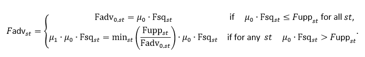

# FLBEIA

[FLBEIA (Garcia et al. 2017)](http://www.sciencedirect.com/science/article/pii/S2352711017300171) is a bio-economic simulation model that follows the management strategy approach. It is multi-stock and multifleet and uncertainty is introduced using montecarlo approach. The stocks can be described using different stocks dynamics, in biomass or age structured. In turn the activity of the fleets is divided in métiers that share the same catch profile.  The main steps of the management process are modeled explicitly. Hence, the performance of the stock assessment models and the harvest control rules as part of the management process can be tested.
In DrumFish we have added new elements to the model in order to facilitate the evaluation of management procedures in a data limited and mixed fisheries context. 

## SPiCT and a4a
Wrappers of a4a [(Jardim et al. 2015)](https://academic.oup.com/icesjms/article/72/1/232/2804293) and SPicT [(Pedersen and Berg 2017)](http://onlinelibrary.wiley.com/doi/10.1111/faf.12174/abstract) models have been developed and incorporated to the FLBEIA R package.  Now, these models can be used within the management procedure to produce estimates of the real stock abundance and exploitation rate simulated in the Operating Model. The models can be combined with observation errors and Harvest control rules to carry out an integrate evaluation of the performance of the management procedures.

## MultiStock Harvest Control Rule
A multistock HCR (Garcia et al. 2016) have been defined and incorporated to the library. This HCR produces simultaneous management advice for the stocks selected. The main aim of the HCR is to maximize fishing opportunities while ensuring sustainability of the stocks. To achieve it we imposed the restrictions below:
1. Produce compatible catch advice among the stocks.
2. Take the most out of fishing opportunities.
3. Result in fishing mortality levels compatible with MSY ranges.

### 1. Compatible catch advice
If we assume a linear relationship between fishing mortality and Effort, with catchability (q), the proportionality parameter i.e F = q x Effort. For a compatible fishing mortality advice, it is enough to multiply the current fishing mortalities, i.e the status quo fishing mortalities Fsq, by the same parameter, μ. Mathematically:

Fadvst= μ∙Fsqst

Where st denotes the subscript for stock and Fadv the fishing mortality that will correspond with the TAC advice. Now the problem is how to define μ to fulfill the second and third properties.
	
### 2 Uses most out of fishing opportunities
If the Fadvice for all the stocks is equal or higher than the corresponding Fmsy, all fishing opportunities corresponding with MSY framework will be used. Then, μ0 is defined as:

Fadvst = μ0∙Fsqst =maxst (Fmsyst/Fsqst)∙Fsqst

A more conservative approach can be obtained using the mean instead of the maximum in the equation above, i.e:

Fadvst= μ0∙Fsqst =meanst (Fmsyst/Fsqst )∙Fsqst

### 3 Compatible with MSY ranges
The F advice in the previous step could be higher than the upper bound of the fishing mortality range of some stocks. Hence, a second multiplier is applied to ensure that Fadvice falls within the ranges for all the stocks, i.e:
If for any st:

where Fupp is the upper bound of fishing mortality range.

In a TAC management system  Fadvst is translated afterwards in catch using the corresponding catch production function (i.e Baranov catch equation). 

### 4 Stocks without analytical assessment.
For stocks without analytical stock assessment the TAC can be generated using a mathematical relationship between the catch of the stock and the catch of the stock(s) with analytical assessment based on historical catch data.  
  
## Conditioning of the Operating Model
The key ingredient in the evaluation of the performance of management procedures is the conditioning of the operating model (OM). To get reliable results, the conditioning of the operating model should produce a good representation of the system including the inherent uncertainty [(Punt et al. 2016)](http://onlinelibrary.wiley.com/doi/10.1111/faf.12104/abstract). To ease the conditioning of the stocks we have defined three alternative ways to condition data limited stocks which depend on the data used and the structure of the stocks.

### Biomass Dynamic Stocks
Data limited stocks are usually assessed using production models [(Polacheck et al. 1993)](http://www.nrcresearchpress.com/doi/abs/10.1139/f93-284). They are not very data demanding and are easy to apply. One of the main problems in the fit of this type of models is the correlation between the parameter estimates. Hence if we want to condition an OM using a biomass dynamic model based on a production model fit we should incorporate the uncertainty inherent in the parameter estimates. We can do it easily in two steps making use of the variance covariance matrix of the stocks: 

1. Generate a random sample of parameters using a multi-variate normal distribution using the logarithm of the estimates of the parameters and their variance-covariance matrix.
2. Reconstruct the historical population using the sampled parameters. Here there are two alternatives, use the mathematical formulas or refit SPiCT model fixing the parameters.

An example of the application of this approach to red mulled, including R code, can be found in the FLR web page (http://www.flr-project.org/doc/Data_Poor_MSE_in_FLBEIA.html) or DrumFish mid-term report.

### Conditioning of Age Structured Stocks based on life history data
Simulating stocks using a biomass model is an over- simplification of the reality because populations, independently of what we know about them, are age structured. Furthermore, the performance of stock assessment models and HCRs in the management procedure should be done using OMs that are more biologically complex than the structure used in the management procedure.  Based on the work by (Carruthers, Punt et al. 2014) we use life history parameters to reconstruct the stocks. 
1. Collect:
 a. The biological data available in working groups, fishbase…
 b. Catch and length frequency distribution data.

2. Stock  and spawning per recruit gives an intuitive frame to build sensible scenarios.
 a. Steepness corresponds with the proportion of recruits produced by 20% of the virgin spawning stock. It determines the slope of the SRR in the origin. High steepness value is indicative of a resilient population.
 b. Virgin biomass
 c. Spawning per recruit. 

3. Growth and maturity. Usually Von Bertalanffy growth, length weight relationship and maturity parameters are available in the literature. These relationships can be combined to produce maturity at age ogives and weight at age values.  

4. Natural Mortality. There are several methods that relate life history parameters with natural mortality. Many of them are collected in the M.empirical function in fishmethods R package (https://cran.r-project.org/web/packages/fishmethods/index.html). In our example we calculate M for all the methods for which we have the necessary data and use the mean of the values obtained to condition natural mortality in the simulations. The estimates could also be used to condition a probability distribution like triangle distribution in triangle package. The parameters of this function are the ends of the range and the mean.

5. Catch at age. Catch or landing length frequency data can be transformed into age data using a knife edge assumption for age-length relationship or for example using the growth function available in FLa4a R package. This function allows introducing uncertainty in the age-length relationship using the variance-covariance matrix of the Von Bertalanffy parameters.

6. Initial Biomass. If the stock was unfished, or nearly, in the start of the catch time series, the initial biomass could be assumed equal to pristine biomass and could be calculated using the exponential survival equation, the stock recruitment relationship and the natural mortality. Otherwise different fractions of pristine biomass can be taken as initial states. 

7. The historical stock abundance and exploitation rate is finally calculated projecting the initial biomass forward using, the exponential survival equation, the stock recruitment relationship, the natural mortality and the catch at age obtained in step 5. If catch at age is not available for the whole projection period, an assumption about the distribution of the catch or the selectivity pattern at age should be done.
An example of the application of this approach to red mulled, including R code, can be found in the FLR web page (http://www.flr-project.org/doc/Data_Poor_MSE_in_FLBEIA.html) or DrumFish mid-term report.

For some initial values the approach described above does not work because some of the age classes, or the whole population, extinguish before the end of the projection. Hence, the initial values and the production of the stock should be high enough to support the observed historical catch. To avoid this problem, we developed an alternative approach using the Bayesian approach. The approach consists in applying the same approach described above but adding in each year and iteration some random noise to the yearly recruitment and yearly catches, so the population can be projected until the end of the time series. The model is a simplification of the model described in [(Fernandez et al. 2010)](https://academic.oup.com/icesjms/article/67/6/1185/737306). In this case we did not use any abundance index and we did not estimate discards. Furthermore, to generate recruitment we use the stock recruitment relationship in step 2.

## References
Carruthers, T. R., A. E. Punt, et al. (2014) "Evaluating methods for setting catch limits in data-limited fisheries." Fisheries Research 153: 48-68.

Fernandez, C., S. Cerviño, et al. (2010) "Stock assessment and projections incorporating discard estimates in some years: an application to the hake stock in ICES Divisions VIIIc and IXa 10.1093/icesjms/fsq029." ICES Journal of Marine Science 67(6): 1185-1197.

Garcia, D., R. Prellezo, et al. (2016) "A multi-stock harvest control rule as a step towards an ecosystem based fisheries management." Working Document presented to the ICES WKMIXFISH working group, October 2016 and in the ICES annual scientific conference, Riga (2016).

Garcia, D., S. Sánchez, et al. (2017) "FLBEIA: A simulation model to conduct Bio-Economic evaluation of fisheries management strategies." SoftwareX 6: 141-147.

Jardim, E., C. P. Millar, et al. (2015) "What if stock assessment is as simple as a linear model? The a4a initiative." ICES Journal of Marine Science 72: 232-236.

Pedersen, M. W. and C. W. Berg (2017) "A stochastic surplus production model in continuous time." Fish and Fisheries 18(2): 226-243.

Polacheck, T., R. Hilborn, et al. (1993) "Fitting Surplus Production Models: Comparing Methods and Measuring Uncertainty." Canadian Journal of fisheries and Aquatic Sciences 50: 2597-2607.

Punt, A. E., D. S. Butterworth, et al. (2016) "Management strategy evaluation: best practices." Fish and Fisheries 17(2): 303-334.

## Funding
The DRuMFISH project was funded under EU Service Contract N° EASME/EMFF/2014/1.3.2.4/SI2.721116. Ownership of all results is by EASME, the Contracting Authority.

The information and views set out in this webpage are those of the author(s) and do not necessarily reflect the official opinion of the Executive Agency for Small- and Medium-sized Enterprises (EASME) or of the European Commission. Neither EASME, nor the Commission can guarantee the accuracy of the data included in this webpage. Neither EASME, nor the Commission or any person acting on their behalf may be held responsible for the use which may be made of the information contained therein.

